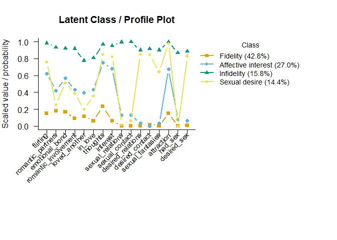

# mixtureEM

[](https://lifecycle.r-lib.org/articles/stages.html#experimental)
[](https://github.com/pdvalencia/mixtureEM/actions/workflows/R-CMD-check.yaml)

**mixtureEM** is latent class and latent profile analysis for applied
researchers: find the hidden subgroups in your data, describe them, and
relate them to other variables — with methodologically sound defaults at
every step, in pure base R with no dependencies.

If you have ever run an LCA, assigned everyone to their most likely
class, and then run chi-squares on the labels, this package exists for
you: the step that is easiest to get wrong (relating classes to external
variables) is the one mixtureEM automates correctly, using the
bias-adjusted three-step estimators from the methodological literature
(Vermunt, 2010; Bakk, Oberski, & Vermunt, 2014).

## Installation

``` r
# install.packages("remotes")
remotes::install_github("pdvalencia/mixtureEM")
```

## A complete analysis in a handful of calls

Using the bundled `ventura_leon` data — 16 yes/no infidelity items from
400 young adults (Ventura-León et al., 2025):

``` r
library(mixtureEM)

items <- ventura_leon[, 7:22]   # the 16 infidelity items

# 1. How many classes? Fit a range and compare.
selection <- compare_mixtures(items, k_range = 1:5, n_init = 10)
#> Running Model Selection across K = 1 to 5...
#> 
#> Fitting 1-class model...
#> Fitting 2-class model...
#> Fitting 3-class model...
#> Fitting 4-class model...
#> Fitting 5-class model...
#> 
#> === Model Selection Summary ===
#>   Classes        LL Params      AIC      BIC    SABIC Entropy
#> 1       1 -3905.807     16 7843.615 7907.478 7856.709   1.000
#> 2       2 -2900.075     33 5866.151 5997.869 5893.158   0.948
#> 3       3 -2654.565     50 5409.131 5608.704 5450.051   0.934
#> 4       4 -2531.136     67 5196.271 5463.699 5251.104   0.907
#> 5       5 -2474.479     84 5116.957 5452.240 5185.703   0.928
#> 
#> -> Best model according to BIC: 5 classes

# 2. Fit the chosen model and look at it. BIC keeps creeping down past 4
#    classes, as it often does in LCA; we keep 4 on conceptual grounds,
#    following the original study's well-interpretable typology.
fit <- fit_mixture(items, n_classes = 4, n_init = 20, random_state = 1)
class_sizes(fit)
#>   class proportion n_expected n_modal
#> 1     1  0.4279122  171.16487     173
#> 2     2  0.2697511  107.90043     106
#> 3     3  0.1579645   63.18579      63
#> 4     4  0.1443723   57.74891      58
```

The item-class conditional probabilities — the table applied papers
report — come from `measurement_summary()`, which prints them and also
returns them as a data frame:

``` r
params <- measurement_summary(fit)
#> =========================================================
#>              MEASUREMENT MODEL PARAMETERS                
#> =========================================================
#> 
#> CATEGORICAL PROBABILITIES
#> Indicator            | Class 1 | Class 2 | Class 3 | Class 4
#> ------------------------------------------------------------ 
#> flirting             |   0.151 |   0.622 |   0.982 |   0.760
#> romantic_partners    |   0.180 |   0.421 |   0.934 |   0.254
#> emotional_bond       |   0.170 |   0.567 |   0.919 |   0.514
#> romantic_involvement |   0.094 |   0.431 |   0.918 |   0.388
#> loved_another        |   0.115 |   0.397 |   0.775 |   0.200
#> in_love              |   0.064 |   0.429 |   0.807 |   0.360
#> thoughts             |   0.231 |   0.753 |   0.967 |   0.848
#> interest             |   0.062 |   0.681 |   0.951 |   0.826
#> sexual_relations     |   0.000 |   0.129 |   0.996 |   0.018
#> sexual_contact       |   0.000 |   0.131 |   0.997 |   0.065
#> desired_relations    |   0.003 |   0.033 |   0.900 |   0.848
#> desired_contact      |   0.012 |   0.002 |   0.915 |   0.845
#> sexual_fantasies     |   0.000 |   0.034 |   0.900 |   0.646
#> attraction           |   0.153 |   0.677 |   0.998 |   0.981
#> had_sex              |   0.004 |   0.077 |   0.869 |   0.001
#> desired_sex          |   0.011 |   0.066 |   0.886 |   0.831
#> =========================================================
```

``` r
plot(fit, class_labels = c("Fidelity", "Affective interest",
                           "Infidelity", "Sexual desire"))
```



``` r
# 3. Who ends up in which class? Bias-adjusted 3-step, on this exact fit.
fit_cov <- add_covariates(fit, ventura_leon[, c("sex", "age")])
summary(fit_cov)
#> =========================================================
#>              STRUCTURAL MODEL SUMMARY                    
#> =========================================================
#> 
#> CATEGORICAL LATENT VARIABLE REGRESSION (CLASS PREDICTORS)
#> Reference Class: 1
#> Standard errors: Bakk-Oberski-Vermunt corrected (robust step 3, hessian step 1)
#> ---------------------------------------------------------
#>                               OR         [95% CI]         P-Value
#> 
#> Class 2 ON
#>   Intercept                1.212  [    0.234,     6.269]     0.819
#>   sex.Female               2.684  [    1.109,     6.493]     0.029
#>   age                      0.940  [    0.881,     1.003]     0.061
#> 
#> Class 3 ON
#>   Intercept                0.315  [    0.104,     0.952]     0.041
#>   sex.Female               0.342  [    0.183,     0.639]    < .001
#>   age                      1.033  [    0.997,     1.071]     0.074
#> 
#> Class 4 ON
#>   Intercept                0.248  [    0.078,     0.782]     0.017
#>   sex.Female               0.656  [    0.331,     1.301]     0.228
#>   age                      1.024  [    0.985,     1.064]     0.233
#> 
#> OMNIBUS TEST PER COVARIATE (effect across all classes)
#> ---------------------------------------------------------
#>                          Wald Chi2   df  P-Value
#>   sex                       23.071    3    < .001
#>   age                        9.647    3     0.022
#>   Note: a non-significant test beside large coefficients can be the
#>         Hauck-Donner effect; confirm with wald_omnibus_test().
#> =========================================================
```

(A reading note for the table above: a covariate can be significant on
its omnibus test while none of its printed rows are — the omnibus asks
whether the covariate distinguishes *any* pair of classes, while each
row only compares one class against the chosen reference class.
Re-reference with `summary(fit_cov, ref_class = 2)` to see the remaining
contrasts.)

`add_outcome(fit, y)` asks the complementary question — how the classes
differ on an outcome.

## What it covers

| Analysis | Function | Worked example |
|----|----|----|
| Latent class analysis (binary / categorical / count items) | `fit_mixture()` | `vignette("ventura_leon")` |
| Latent profile analysis (continuous items), missing data, multiple groups | `fit_mixture()` | `vignette("janousch")` |
| Choosing the number of classes (ICs, BLRT, fit diagnostics) | `compare_mixtures()`, `blrt()` | `vignette("class_enumeration")` |
| Predictors of class membership (3-step ML) | `add_covariates()` | `vignette("ventura_leon")` |
| Distal outcomes (BCH / ML) | `add_outcome()` | `vignette("ventura_leon")` |
| Repeated-measures LCA (trajectory classes) | `fit_rmlca()` | `vignette("rmlca")` |
| Latent transition analysis, mover-stayer models | `fit_lta()` | `vignette("lta")` |
| Latent class growth analysis, growth mixture models | `fit_lcga()`, `fit_gmm()` | `vignette("growth_mixture")` |
| Complex survey designs (weights, strata, clusters) | every model | `vignette("survey_lca")` |

Also included: mixed measurement models (binary + continuous + count
indicators in one model), full-information missing-data handling
everywhere, absolute and local fit diagnostics (`absolute_fit()`,
`bivariate_residuals()`), classification diagnostics, and standard
errors that account for the classes being estimated rather than observed
(`?covariate_se`).

## Design principles

- **Conceptual workflow.** Choose a model, *then* examine covariates and
  outcomes on that fitted model — `add_covariates(fit, ...)` and
  `add_outcome(fit, ...)` never re-estimate the classes you already
  inspected.
- **Sound defaults.** Stepwise analyses apply the recommended bias
  correction and uncertainty-aware standard errors unless you say
  otherwise; where a default has a literature, the default follows it.
- **Readable output, reusable numbers.** Summaries print as formatted
  tables *and* return tidy data frames.
- **No dependency stack.** Base R only, so it installs anywhere R does.

## Citation

If you use mixtureEM in published research, please cite it as:

    Valencia, P. D. (2026). mixtureEM: Latent class and profile analysis via
    mixture modelling (Version 0.2.0) [R package].
    https://github.com/pdvalencia/mixtureEM

## Acknowledgements

**mixtureEM** draws strong inspiration from the Python package
[**StepMix**](https://github.com/Labo-Lacourse/stepmix), which pioneered
open-source, bias-adjusted multi-step estimation of generalised mixture
models with external variables. If you make use of these methods, please
also consider citing the StepMix paper:

> Morin, S., Legault, R., Laliberte, F., Bakk, Z., Giguère, C.-E., de la
> Sablonnière, R., & Lacourse, E. (2025). StepMix: A Python package for
> pseudo-likelihood estimation of generalised mixture models with
> external variables. *Journal of Statistical Software*, *113*(8), 1–39.
> <https://doi.org/10.18637/jss.v113.i08>

## References

Bakk, Z., Oberski, D. L., & Vermunt, J. K. (2014). Relating latent class
assignments to external variables: Standard errors for correct
inference. *Political Analysis*, *22*(4), 520–540.
<https://doi.org/10.1093/pan/mpu003>

Vermunt, J. K. (2010). Latent class modeling with covariates: Two
improved three-step approaches. *Political Analysis*, *18*(4), 450–469.
<https://doi.org/10.1093/pan/mpq025>
