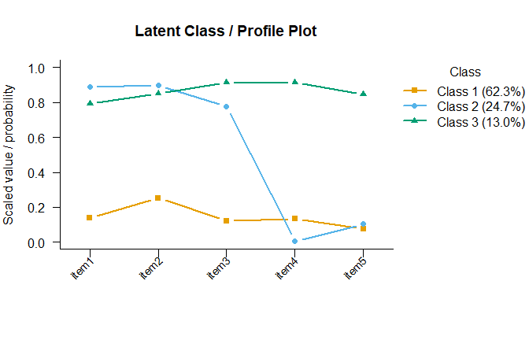

# mixtureEM 

[](https://lifecycle.r-lib.org/articles/stages.html#experimental)
[](https://github.com/pdvalencia/mixtureEM/actions/workflows/R-CMD-check.yaml)

**mixtureEM** is an R package for person-centred mixture modelling. It
provides a unified, flexible interface for **latent class analysis
(LCA)** and **latent profile analysis (LPA)**, supporting a wide range
of measurement models, structural models, and multi-step estimation
strategies.

The core idea behind these models is that an unobserved (latent)
categorical variable—the *class* or *profile*—explains patterns of
similarity among observed indicators. LCA is used when indicators are
binary or categorical; LPA is used when they are continuous.

## Features

- **Measurement models:** Binary, categorical (ordinal/polytomous), and
  continuous indicators, including full-information missing-data
  variants.
- **Mixed measurement models:** Combine binary, polytomous, and
  continuous indicators in a single model.
- **Structural models:** Covariate **predictors** of class membership,
  and distal **outcomes** (continuous or categorical, with pooled or
  class-specific covariate slopes).
- **Missing data:** Indicators, predictors, and outcomes can all contain
  missing values; every case is retained automatically, with no extra
  arguments.
- **Multi-step estimation:** 1-step (simultaneous), 2-step, and 3-step
  with **BCH** or **ML** bias correction.
- **Complex survey designs:** Sampling weights, stratification, and
  clustering, with design-based (linearization) standard errors.
- **Model selection:** AIC, BIC, SABIC, and relative entropy across a
  range of class counts.
- **Bootstrap Likelihood Ratio Test (BLRT)** for deciding how many
  classes to keep.
- **Inference for predictors:** Analytical Wald tests, bootstrap
  standard errors, and confidence intervals for odds ratios.
- **Visualization:** A one-line `plot()` profile plot, using only base
  graphics and a colour-blind-friendly palette.

## Installation

``` r
# install.packages("pak")
pak::pak("pdvalencia/mixtureEM")
```

## Quick start

### Binary LCA

The most common use case: binary (0/1) indicator items, such as symptom
checklists or yes/no questionnaire responses. The first argument,
`indicators`, is the matrix (or data frame) of items that define the
classes.

``` r
library(mixtureEM)

# Simulate binary data from a 3-class population
set.seed(42)
probs <- list(
  c(0.1, 0.2, 0.1, 0.1, 0.1),  # Class 1: low on all items
  c(0.9, 0.8, 0.7, 0.1, 0.1),  # Class 2: high on items 1-3
  c(0.8, 0.8, 0.7, 0.9, 0.9)   # Class 3: high on all items
)
weights <- c(0.6, 0.3, 0.1)
n       <- 300
classes <- sample(1:3, n, replace = TRUE, prob = weights)
X       <- t(sapply(classes, function(k) rbinom(5, 1, probs[[k]])))
colnames(X) <- paste0("item", 1:5)

# Fit a 3-class LCA
fit <- fit_mixture(X,
                   n_classes   = 3,
                   measurement = "binary",
                   n_init      = 5,
                   random_state = 42)
print(fit)
#> =========================================================
#>                   LATENT MIXTURE MODEL                   
#> =========================================================
#> Classes Estimated  : 3
#> Estimation Method  : 1-step
#> Converged          : TRUE (in 11 iterations)
#> ---------------------------------------------------------
#>   Log-Likelihood : -777.57
#>   Rel. Entropy   : 0.8236
#> ---------------------------------------------------------
#> Class Weights (Sizes):
#>   Class 1: 62.28%
#>   Class 2: 24.67%
#>   Class 3: 13.05%
#> =========================================================
#> Type summary(model) for structural parameters or measurement_summary(model) for item parameters.
```

**A quick note on `n_init` and `random_state`:** If you are new to
mixture modeling, you might wonder what these arguments do. Finding the
best latent classes is a complex mathematical puzzle, and sometimes the
algorithm can get stuck in a “local optimum” (a good solution, but not
the *best* possible one).

- **`n_init`** tells the package to try multiple random starting points
  (in this case, 5) and keep the best overall result. For final
  publication models, it is good practice to increase this number (e.g.,
  20 or 50) to ensure you have found the true best fit.
- **`random_state`** is simply a random seed (like `set.seed()`).
  Because the starting points are random, setting this ensures your code
  is exactly reproducible every time you run it.

``` r
# Item-response probabilities for each class: the probability of endorsing
# each item given class membership.
measurement_summary(fit)
#> =========================================================
#>              MEASUREMENT MODEL PARAMETERS                
#> =========================================================
#> 
#> CATEGORICAL PROBABILITIES
#> Indicator            | Class 1 | Class 2 | Class 3
#> -------------------------------------------------- 
#> item1                |   0.140 |   0.888 |   0.793
#> item2                |   0.253 |   0.899 |   0.850
#> item3                |   0.123 |   0.774 |   0.915
#> item4                |   0.133 |   0.006 |   0.912
#> item5                |   0.076 |   0.104 |   0.847
#> =========================================================
```

``` r
# Average posterior probabilities. Diagonal values near 1 indicate
# well-separated, clearly assigned classes.
classification_diagnostics(fit)
#> =========================================================
#>           AVERAGE POSTERIOR PROBABILITIES (AvePP)        
#> =========================================================
#> Rows: Modal Assignment | Columns: Mean Probability
#> 
#>                  Prob C 1 Prob C 2 Prob C 3
#> Assigned Class 1    0.971    0.024    0.005
#> Assigned Class 2    0.141    0.824    0.034
#> Assigned Class 3    0.039    0.010    0.951
#> =========================================================
```

### Visualizing the classes

`plot()` draws a profile plot: one line per class across the indicators.
For binary items the y-axis is the endorsement probability; continuous
items are min-max scaled and polytomous items are summarised by their
(scaled) expected category, so that everything shares a common 0–1 axis.
Rescaled items are flagged with `*`.

``` r
plot(fit)
```



### Choosing the number of classes

In practice the number of classes is unknown. `compare_mixtures()` fits
models across a range of class counts and reports standard fit indices.
**BIC** is the most widely used criterion: lower is better, and you look
for the point where BIC stops meaningfully decreasing.

``` r
sel <- compare_mixtures(X,
                        k_range     = 1:4,
                        measurement = "binary",
                        n_init      = 5)
#> Running Model Selection across K = 1 to 4...
#> 
#> Fitting 1-class model...
#> Fitting 2-class model...
#> Fitting 3-class model...
#> Fitting 4-class model...
#> 
#> === Model Selection Summary ===
#>   Classes       LL Params      AIC      BIC    SABIC Entropy
#> 1       1 -905.532      5 1821.063 1839.582 1823.725   1.000
#> 2       2 -805.043     11 1632.086 1672.828 1637.942   0.769
#> 3       3 -777.566     17 1589.133 1652.097 1598.183   0.824
#> 4       4 -775.649     23 1597.298 1682.485 1609.542   0.764
#> 
#> -> Best model according to BIC: 3 classes

# sel$best_k    -- the K with the lowest BIC
# sel$models    -- the fitted models, indexed "K1", "K2", ...
# sel$fit_table -- LL, AIC, BIC, SABIC, and Entropy for each K
```

For a formal test of *K* vs. *K* − 1 classes, see the [Bootstrap
Likelihood Ratio Test](#bootstrap-likelihood-ratio-test-blrt) below.

### Latent Profile Analysis (LPA)

For continuous indicators (e.g. scale scores, physiological measures),
set `measurement = "continuous"`. The model estimates a mean and a
variance for each indicator within each profile; `measurement_summary()`
prints the means to help characterise the profiles.

``` r
set.seed(1)
n1 <- 180; n2 <- 120
X_cont <- rbind(
  matrix(rnorm(n1 * 4, mean = c( 2,  2, -2, -2), sd = 1), nrow = n1, byrow = TRUE),
  matrix(rnorm(n2 * 4, mean = c(-2, -2,  2,  2), sd = 1), nrow = n2, byrow = TRUE)
)

fit_lpa <- fit_mixture(X_cont,
                       n_classes   = 2,
                       measurement = "continuous",
                       n_init      = 5,
                       random_state = 1)
print(fit_lpa)
#> =========================================================
#>                   LATENT MIXTURE MODEL                   
#> =========================================================
#> Classes Estimated  : 2
#> Estimation Method  : 1-step
#> Converged          : TRUE (in 3 iterations)
#> ---------------------------------------------------------
#>   Log-Likelihood : -1935.52
#>   Rel. Entropy   : 1.0000
#> ---------------------------------------------------------
#> Class Weights (Sizes):
#>   Class 1: 59.97%
#>   Class 2: 40.03%
#> =========================================================
#> Type summary(model) for structural parameters or measurement_summary(model) for item parameters.

measurement_summary(fit_lpa)
#> =========================================================
#>              MEASUREMENT MODEL PARAMETERS                
#> =========================================================
#> 
#> CONTINUOUS MEANS
#> Indicator            | Class 1 | Class 2
#> ---------------------------------------- 
#> Item_1               |   1.920 |  -2.014
#> Item_2               |   2.036 |  -2.076
#> Item_3               |  -1.997 |   2.015
#> Item_4               |  -2.025 |   1.942
#> =========================================================
```

### Polytomous (ordinal) indicators

For items with more than two ordered categories—severity ratings, Likert
responses—use `measurement = "categorical"`. Categories must be
integer-coded (1, 2, 3, …). `measurement_summary()` reports the
probability of each response category within each class, labelled by
your item names.

``` r
set.seed(5)
cls <- sample(1:2, 300, replace = TRUE)
X_poly <- t(sapply(cls, function(k)
  if (k == 1) sample(1:3, 4, TRUE, c(0.6, 0.3, 0.1))
  else        sample(1:3, 4, TRUE, c(0.1, 0.3, 0.6))))
colnames(X_poly) <- c("mood", "sleep", "appetite", "energy")

fit_poly <- fit_mixture(X_poly,
                        n_classes   = 2,
                        measurement = "categorical",
                        n_init      = 5,
                        random_state = 5)
measurement_summary(fit_poly)
#> =========================================================
#>              MEASUREMENT MODEL PARAMETERS                
#> =========================================================
#> 
#> CATEGORICAL PROBABILITIES
#> Indicator            | Class 1 | Class 2
#> ---------------------------------------- 
#> mood (Cat 1)         |   0.584 |   0.121
#> mood (Cat 2)         |   0.284 |   0.268
#> mood (Cat 3)         |   0.132 |   0.610
#> sleep (Cat 1)        |   0.537 |   0.125
#> sleep (Cat 2)        |   0.360 |   0.296
#> sleep (Cat 3)        |   0.103 |   0.580
#> appetite (Cat 1)     |   0.574 |   0.069
#> appetite (Cat 2)     |   0.299 |   0.366
#> appetite (Cat 3)     |   0.128 |   0.566
#> energy (Cat 1)       |   0.597 |   0.056
#> energy (Cat 2)       |   0.322 |   0.297
#> energy (Cat 3)       |   0.081 |   0.647
#> =========================================================
```

### Mixed measurement models

Real studies often combine different kinds of indicators. Pass
`measurement` a **named list** mapping each measurement type to the
indicators it governs—by column name or by index. `plot()` and
`measurement_summary()` work just as before; on the profile plot the
continuous and ordinal items appear on the same scaled axis (marked
`*`).

``` r
set.seed(8)
clm  <- sample(1:2, 300, replace = TRUE)
bin  <- t(sapply(clm, function(k) rbinom(3, 1, if (k == 1) 0.25 else 0.80)))
cont <- t(sapply(clm, function(k) rnorm(2, if (k == 1) c(0, 0) else c(3, 3))))
poly <- t(sapply(clm, function(k)
  sample(1:4, 2, TRUE, if (k == 1) c(.5, .3, .15, .05) else c(.05, .15, .3, .5))))

dat <- cbind(bin, cont, poly)
colnames(dat) <- c("q1", "q2", "q3", "scaleA", "scaleB", "severity", "impairment")

fit_mixed <- fit_mixture(dat,
                         n_classes   = 2,
                         measurement = list(
                           binary      = c("q1", "q2", "q3"),
                           continuous  = c("scaleA", "scaleB"),
                           categorical = c("severity", "impairment")
                         ),
                         n_init      = 5,
                         random_state = 8)
measurement_summary(fit_mixed)
#> =========================================================
#>              MEASUREMENT MODEL PARAMETERS                
#> =========================================================
#> 
#> Categorical Probabilities: BINARY
#> Indicator            | Class 1 | Class 2
#> ---------------------------------------- 
#> q1                   |   0.808 |   0.253
#> q2                   |   0.820 |   0.261
#> q3                   |   0.794 |   0.226
#> 
#> Continuous Means: CONTINUOUS
#> Indicator            | Class 1 | Class 2
#> ---------------------------------------- 
#> scaleA               |   3.025 |  -0.019
#> scaleB               |   3.094 |   0.088
#> 
#> Categorical Probabilities: CATEGORICAL
#> Indicator            | Class 1 | Class 2
#> ---------------------------------------- 
#> severity (Cat 1)     |   0.066 |   0.446
#> severity (Cat 2)     |   0.159 |   0.377
#> severity (Cat 3)     |   0.330 |   0.127
#> severity (Cat 4)     |   0.445 |   0.050
#> impairment (Cat 1)   |   0.047 |   0.501
#> impairment (Cat 2)   |   0.199 |   0.292
#> impairment (Cat 3)   |   0.285 |   0.162
#> impairment (Cat 4)   |   0.469 |   0.045
#> =========================================================
```

## Relating classes to external variables

Once a class solution is established, you typically want to relate it to
variables that are *not* part of the measurement model: predictors of
membership, or outcomes the classes affect. **mixtureEM** uses the
**3-step approach**, which first fixes the class solution from the
indicators, then links it to external variables while correcting for
classification error—so the predictors or outcomes never distort the
meaning of the classes.

When you supply `predictors` or an `outcome`, the package defaults to
3-step estimation with the recommended bias correction (ML for
predictors and categorical outcomes, BCH for continuous outcomes). You
can override `n_steps` and `correction` at any time.

In practice your indicators and external variables live together in a
single data frame. We will use one throughout this section—the five
items plus a few covariates of different types and two distal
outcomes—and simply select the relevant columns for each model.

``` r
set.seed(7)
study <- as.data.frame(X)                       # the five binary items
study$age       <- round(ifelse(classes == 1, rnorm(n, 45, 10),
                         ifelse(classes == 2, rnorm(n, 32, 10),
                                              rnorm(n, 38, 10))))            # numeric
study$sex       <- factor(ifelse(rbinom(n, 1, ifelse(classes == 2, .7, .4)) == 1,
                                 "male", "female"), levels = c("female", "male"))  # binary
study$educ <- factor(sapply(classes, function(k)
                     sample(c("HS", "College", "Graduate"), 1,
                            prob = if (k == 1) c(.2, .5, .3)
                                   else if (k == 2) c(.5, .4, .1)
                                   else c(.3, .4, .3))),
                          levels = c("HS", "College", "Graduate"))          # multicategory
study$bmi       <- ifelse(classes == 1, rnorm(n, 27, 4),
                   ifelse(classes == 2, rnorm(n, 31, 4),
                                        rnorm(n, 24, 4)))                    # distal (continuous)
study$relapse   <- factor(ifelse(rbinom(n, 1, plogis(ifelse(classes == 1, -1,
                            ifelse(classes == 2, 1.5, 0)))) == 1, "yes", "no"),
                          levels = c("no", "yes"))                          # distal (categorical)

head(study[, c(paste0("item", 1:3), "age", "sex", "educ")])
#>   item1 item2 item3 age    sex     educ
#> 1     1     1     1  26 female       HS
#> 2     0     1     1  39   male       HS
#> 3     0     1     0  38 female  College
#> 4     0     1     1  28 female       HS
#> 5     1     1     1  28   male Graduate
#> 6     1     0     0  36 female  College
```

### Predicting class membership

Supply `predictors` to regress class membership on one or more
covariates. Numeric predictors are used as-is; factors are dummy-coded
automatically, with the first level as the reference. Here we use three
predictor types at once—numeric (`age`), binary (`sex`), and
multicategory (`educ`)—simply by selecting those columns.

``` r
fit_cov <- fit_mixture(
  indicators  = study[, paste0("item", 1:5)],
  n_classes   = 3,
  measurement = "binary",
  predictors  = study[, c("age", "sex", "educ")],
  n_init      = 5,
  random_state = 7
)

# Odds ratios relative to Class 1 (the reference, OR = 1).
# Factor terms appear as "sex.male", "educ.College", "educ.Graduate",
# each contrasted against its reference level (female; HS).
summary(fit_cov)
#> =========================================================
#>              STRUCTURAL MODEL SUMMARY                    
#> =========================================================
#> 
#> CATEGORICAL LATENT VARIABLE REGRESSION (CLASS PREDICTORS)
#> Reference Class: 1
#> ---------------------------------------------------------
#>                      OR       [95% CI]        P-Value
#> 
#> Class 2 ON
#>   Intercept       120.828  [48.387, 301.719]    < .001
#>   age               0.880  [ 0.858,  0.903]    < .001
#>   sex.male          1.934  [ 0.973,  3.847]     0.060
#>   educ.College      0.121  [ 0.060,  0.243]    < .001
#>   educ.Graduate     0.091  [ 0.034,  0.240]    < .001
#> 
#> Class 3 ON
#>   Intercept        15.871  [ 2.876, 87.594]     0.002
#>   age               0.919  [ 0.885,  0.955]    < .001
#>   sex.male          0.721  [ 0.345,  1.510]     0.386
#>   educ.College      0.281  [ 0.120,  0.661]     0.004
#>   educ.Graduate     0.412  [ 0.157,  1.079]     0.071
#> =========================================================
```

Re-express the contrasts against a different reference class with
`ref_class`:

``` r
summary(fit_cov, ref_class = 3)
#> =========================================================
#>              STRUCTURAL MODEL SUMMARY                    
#> =========================================================
#> 
#> CATEGORICAL LATENT VARIABLE REGRESSION (CLASS PREDICTORS)
#> Reference Class: 3
#> ---------------------------------------------------------
#>                      OR       [95% CI]        P-Value
#> 
#> Class 1 ON
#>   Intercept         0.063  [ 0.011,  0.348]     0.002
#>   age               1.088  [ 1.047,  1.130]    < .001
#>   sex.male          1.386  [ 0.662,  2.902]     0.386
#>   educ.College      3.556  [ 1.514,  8.353]     0.004
#>   educ.Graduate     2.428  [ 0.927,  6.362]     0.071
#> 
#> Class 2 ON
#>   Intercept         7.613  [ 3.059, 18.949]    < .001
#>   age               0.957  [ 0.929,  0.985]     0.003
#>   sex.male          2.682  [ 1.206,  5.962]     0.016
#>   educ.College      0.430  [ 0.181,  1.022]     0.056
#>   educ.Graduate     0.220  [ 0.071,  0.688]     0.009
#> =========================================================
```

### Distal outcomes

A **distal outcome** is a variable *caused by* the classes (e.g. a later
health or behavioural measure). Supply it via `outcome`; the type
(continuous vs. categorical) is detected automatically, or set
`outcome_type` explicitly.

``` r
fit_distal <- fit_mixture(study[, paste0("item", 1:5)],
                          n_classes   = 3,
                          measurement = "binary",
                          outcome     = study$bmi,
                          n_init      = 5,
                          random_state = 21)

# Class-specific means with 95% CIs and robust standard errors
summary(fit_distal)
#> =========================================================
#>              STRUCTURAL MODEL SUMMARY                    
#> =========================================================
#> 
#> CONTINUOUS DISTAL OUTCOME (MEANS)
#> ---------------------------------------------------------
#> 
#> Omnibus test (class differences): Wald chi^2(2) = 56.86, p  < .001
#> 
#>                  Mean       [95% CI]        SE
#>   Class 1       27.187  [26.549, 27.824]     0.325
#>   Class 2       31.769  [30.702, 32.837]     0.545
#>   Class 3       26.049  [24.522, 27.576]     0.779
#> =========================================================
```

#### Adjusting for a covariate

Add `outcome_covariates` to adjust the outcome for one or more
covariates. Use `slopes = "pooled"` for a single covariate effect shared
across classes (parsimonious), or `slopes = "class_specific"` to let the
covariate effect differ by class (i.e. the covariate moderates the
class–outcome relationship).

``` r
fit_distal_mod <- fit_mixture(study[, paste0("item", 1:5)],
                              n_classes          = 3,
                              measurement        = "binary",
                              outcome            = study$bmi,
                              outcome_covariates = study$age,
                              slopes             = "class_specific",
                              n_init             = 5,
                              random_state       = 21)

# Class-specific intercepts and slopes
summary(fit_distal_mod)
#> =========================================================
#>              STRUCTURAL MODEL SUMMARY                    
#> =========================================================
#> 
#> CONTINUOUS DISTAL REGRESSION (Y ~ Z * Class)
#> ---------------------------------------------------------
#> 
#> Omnibus test (class differences (at covariate zero)): Wald chi^2(2) = 1.13, p   0.569
#> 
#> Class 1:
#>                  Estimate   [95% CI]        P-Value
#>   Intercept      27.502  [24.778, 30.225]    < .001
#>   age            -0.007  [-0.067,  0.053]     0.816
#> 
#> Class 2:
#>                  Estimate   [95% CI]        P-Value
#>   Intercept      29.807  [26.532, 33.082]    < .001
#>   age             0.062  [-0.037,  0.160]     0.220
#> 
#> Class 3:
#>                  Estimate   [95% CI]        P-Value
#>   Intercept      28.551  [23.707, 33.394]    < .001
#>   age            -0.069  [-0.197,  0.059]     0.293
#> 
#> ---------------------------------------------------------
#> Wald tests (equality of slopes across classes):
#>                   Wald(chi^2(2))  P-Value
#>   age                 2.67             0.264
#> =========================================================
```

A categorical outcome works the same way—pass a factor (or
integer-coded) `outcome`. `summary()` then reports class-specific
predicted probabilities and pairwise odds ratios.

``` r
fit_cat <- fit_mixture(study[, paste0("item", 1:5)],
                       n_classes          = 3,
                       measurement        = "binary",
                       outcome            = study$relapse,
                       outcome_covariates = study$age,
                       slopes             = "pooled",
                       n_init             = 5,
                       random_state       = 33)
summary(fit_cat)
#> =========================================================
#>              STRUCTURAL MODEL SUMMARY                    
#> =========================================================
#> 
#> CATEGORICAL DISTAL OUTCOME (POOLED SLOPES)
#> ---------------------------------------------------------
#> 
#> Omnibus test (class differences): Wald chi^2(2) = 35.02, p  < .001
#> 
#> Predicted Probabilities (covariates held at zero):
#>                Cat 1    Cat 2   
#>   Class 1        0.545    0.455 
#>   Class 2        0.085    0.915 
#>   Class 3        0.265    0.735 
#> 
#> Pairwise Odds Ratios (Reference: Class 1)
#>                      OR       [95% CI]        P-Value
#> 
#> Outcome Category 2 (vs Category 1) ON
#>   Latent Class:
#>     Class 2         12.824  [ 5.306, 30.996]    < .001
#>     Class 3          3.322  [ 1.517,  7.273]     0.003
#>   Covariates (Pooled Slope):
#>     Z1              0.978  [ 0.952,  1.006]     0.118
#> =========================================================
```

To decide between a pooled and a class-specific specification, compare
them on `fit$metrics$bic` (lower is better).

## Handling missing data

Missing values are routine in applied data—a skipped survey item,
attrition on a covariate—and **mixtureEM** handles them automatically
wherever they occur, with no extra arguments and no need to drop
incomplete cases yourself.

- **Missing indicator items** are accommodated with a full-information
  likelihood that uses every observed response under a missing-at-random
  assumption.
- **Missing predictors, outcome covariates, or the outcome itself** are
  handled the same way: every case is kept, and missing values are
  filled in using each person’s other observed information rather than
  being dropped or replaced with the sample average.

``` r
set.seed(99)

# A few missing items, plus some missing values on the "age" predictor
X_miss <- X
X_miss[sample(length(X_miss), 40)] <- NA

study_miss <- study
study_miss$age[sample(n, 30)] <- NA

fit_miss <- fit_mixture(
  indicators  = X_miss,
  n_classes   = 3,
  measurement = "binary",
  predictors  = study_miss[, c("age", "sex", "educ")],
  n_init      = 5,
  random_state = 99
)
print(fit_miss)
#> =========================================================
#>                   LATENT MIXTURE MODEL                   
#> =========================================================
#> Classes Estimated  : 3
#> Estimation Method  : 3-step
#> Correction Method  : ML
#> Converged          : TRUE (in 10 iterations)
#> Missing Data       : 40 / 1500 cells (2.7%) in 5 items — FIML (MAR assumption)
#> ---------------------------------------------------------
#>   Log-Likelihood (Step 1) : -753.77
#>   Rel. Entropy   (Step 1) : 0.8287
#> ---------------------------------------------------------
#> Class Weights (Sizes):
#>   Class 1: 62.98%
#>   Class 2: 23.86%
#>   Class 3: 13.16%
#> =========================================================
#> Type summary(model) for structural parameters or measurement_summary(model) for item parameters.

summary(fit_miss)
#> =========================================================
#>              STRUCTURAL MODEL SUMMARY                    
#> =========================================================
#> 
#> CATEGORICAL LATENT VARIABLE REGRESSION (CLASS PREDICTORS)
#> Reference Class: 1
#> ---------------------------------------------------------
#>                      OR       [95% CI]        P-Value
#> 
#> Class 2 ON
#>   Intercept        56.463  [22.104, 144.229]    < .001
#>   age               0.894  [ 0.871,  0.918]    < .001
#>   sex.male          2.030  [ 1.045,  3.944]     0.037
#>   educ.College      0.168  [ 0.085,  0.332]    < .001
#>   educ.Graduate     0.093  [ 0.034,  0.255]    < .001
#> 
#> Class 3 ON
#>   Intercept         8.891  [ 1.661, 47.594]     0.011
#>   age               0.931  [ 0.896,  0.967]    < .001
#>   sex.male          0.771  [ 0.375,  1.585]     0.480
#>   educ.College      0.325  [ 0.142,  0.745]     0.008
#>   educ.Graduate     0.443  [ 0.173,  1.136]     0.090
#> =========================================================
```

`fit_miss$missing_data` records how much was missing and how it was
handled—handy for reporting in a methods section.

## Complex survey designs

When data come from a complex sample, supply any combination of sampling
`weights`, `strata`, and `cluster` (PSU) identifiers—again selected from
your data frame. Estimation uses the weights as pseudo-likelihood
weights, and standard errors for the structural model are computed with
a **design-based (Taylor linearization) sandwich estimator**, protecting
inference against both clustering and non-normality. Singleton strata
are handled automatically.

``` r
set.seed(11)
study$psu     <- rep(1:60, each = 5)                    # 60 PSUs, 5 per cluster
study$stratum <- rep(1:4, length.out = 60)[study$psu]   # 4 strata
study$wt      <- runif(n, 0.5, 2)                        # sampling weights

fit_svy <- fit_mixture(
  indicators  = study[, paste0("item", 1:5)],
  n_classes   = 3,
  measurement = "binary",
  predictors  = study[, c("age", "sex", "educ")],
  weights     = study$wt,
  strata      = study$stratum,
  cluster     = study$psu,
  n_init      = 5,
  random_state = 7
)

# Confidence intervals and Wald tests now use design-based standard errors
confint(fit_svy)
#> =========================================================
#>         CONFIDENCE INTERVALS FOR ODDS RATIOS             
#> =========================================================
#> Reference Class : 1
#> Level           : 95%   Method: Survey-robust (linearization)
#> ---------------------------------------------------------
#>                          OR    Lower    Upper
#> 
#> Intercept
#>   Class 1 (Ref)       1.000        -        -
#>   Class 2            76.476   27.101  215.811
#>   Class 3            17.872    4.966   64.326
#> 
#> age
#>   Class 1 (Ref)       1.000        -        -
#>   Class 2             0.885    0.866    0.905
#>   Class 3             0.915    0.892    0.939
#> 
#> sex.male
#>   Class 1 (Ref)       1.000        -        -
#>   Class 2             1.903    1.178    3.076
#>   Class 3             0.682    0.366    1.269
#> 
#> educ.College
#>   Class 1 (Ref)       1.000        -        -
#>   Class 2             0.130    0.078    0.216
#>   Class 3             0.287    0.141    0.586
#> 
#> educ.Graduate
#>   Class 1 (Ref)       1.000        -        -
#>   Class 2             0.057    0.032    0.103
#>   Class 3             0.529    0.254    1.101
#> =========================================================
analytical_wald_test(fit_svy, "age")
#> =========================================================
#>                  WALD TEST (COVARIATE)                   
#> =========================================================
#>   Covariate : age
#>   Method    : Survey-robust
#> ---------------------------------------------------------
#>   Wald χ²(2) = 131.746,  p < .001
#> =========================================================
```

The same `weights`/`strata`/`cluster` arguments apply to distal-outcome
models.

## Bootstrap Likelihood Ratio Test (BLRT)

The BLRT tests whether a *K*-class model fits significantly better than
a (*K* − 1)-class model. Because the usual chi-squared approximation is
invalid for mixture models, `blrt()` builds the reference distribution
by parametric bootstrap. It returns an object with a clean summary and a
`plot()` method for the null distribution.

``` r
res <- blrt(X,
            k_small     = 2,
            k_large     = 3,
            measurement = "binary",
            n_reps      = 100)
res
#> =========================================================
#>        BOOTSTRAP LIKELIHOOD RATIO TEST (BLRT)            
#> =========================================================
#>   Comparison       : 2 vs 3 classes
#>   Log-Likelihoods  : -805.04 (2-class) -> -777.56 (3-class)
#>   LR statistic     : 54.96
#>   Bootstrap draws  : 100
#> ---------------------------------------------------------
#>   Bootstrap p      : p = 0.010
#>   Conclusion       : the 3-class model fits significantly better.
#> =========================================================
```

You can still pull out `res$p_value`, `res$obs_diff`, or the full
`res$null_dist` for custom reporting, and `plot(res)` shows the
bootstrap null distribution with the observed statistic marked.

## Function reference

| Function | Description |
|----|----|
| `fit_mixture()` | Fit an LCA / LPA model, optionally with predictors or a distal outcome |
| `compare_mixtures()` | Fit across a range of class counts and compare fit indices |
| `print()` | Compact model summary |
| `summary()` | Structural-model results (odds ratios, distal means, regression coefficients) |
| `measurement_summary()` | Item-response probabilities or profile means per class |
| `plot()` | Profile plot of the classes across indicators |
| `classification_diagnostics()` | Average posterior probability (AvePP) matrix |
| `coef()` | Odds ratios from a class-membership model |
| `confint()` | Confidence intervals for odds ratios (analytical, design-based, or bootstrap) |
| `analytical_wald_test()` | Wald chi-squared test for a predictor |
| `bootstrap_covariates()` | Bootstrap standard errors for predictor parameters |
| `wald_omnibus_test()` | Bootstrap Wald omnibus test for a predictor |
| `blrt()` | Bootstrap Likelihood Ratio Test for class enumeration |

## Supported measurement types

| `measurement =` | Indicator type |
|----|----|
| `"binary"` | Binary (0/1) |
| `"binary_nan"` | Binary with missing data |
| `"categorical"` | Ordinal / polytomous (integer-coded) |
| `"categorical_nan"` | Ordinal with missing data |
| `"continuous"` | Continuous (estimates within-class variance) |
| `"continuous_nan"` | Continuous with missing data |
| `"gaussian"` | Continuous (unit variance fixed to 1) |
| Named list | Mixed model, e.g. `list(binary = 1:5, continuous = 6:8)` |

> The `"*_nan"` forms are listed for completeness; you rarely need to
> name them yourself—any indicator, predictor, or outcome column
> containing `NA` is detected and handled automatically (see [Handling
> missing data](#handling-missing-data)).

## Relating classes to external variables: argument guide

| Goal | Key arguments |
|----|----|
| Describe the classes only | `indicators`, `measurement` |
| Predict class membership | `predictors` |
| Outcome differs by class | `outcome` |
| Outcome by class, covariate-adjusted (shared effect) | `outcome`, `outcome_covariates`, `slopes = "pooled"` |
| Outcome by class, class-specific covariate effects | `outcome`, `outcome_covariates`, `slopes = "class_specific"` |

> All external-variable models default to 3-step estimation with the
> recommended bias correction (ML for predictors and categorical
> outcomes, BCH for continuous outcomes). Set `n_steps` and `correction`
> to override, and `outcome_type` to force a continuous or categorical
> outcome.

## Acknowledgements

**mixtureEM** draws strong inspiration from the Python package
[**StepMix**](https://github.com/Labo-Lacourse/stepmix) (Morin et al.,
2025), which pioneered open-source, bias-adjusted multi-step estimation
of generalised mixture models with external variables. The design of the
stepwise estimators, BCH and ML corrections, and the overall modular
measurement–structural architecture follow the framework laid out in
StepMix. If you make use of these methods, please also consider citing
the StepMix paper:

> Morin, S., Legault, R., Laliberte, F., Bakk, Z., Giguère, C.-E., de la
> Sablonnière, R., & Lacourse, E. (2025). StepMix: A Python package for
> pseudo-likelihood estimation of generalised mixture models with
> external variables. *Journal of Statistical Software*, *113*(8), 1-39.
> <https://doi.org/10.18637/jss.v113.i08>

## Citation

If you use mixtureEM in published research, please cite it as:

    Valencia, P. D. (2026). mixtureEM: Latent Class and Profile Analysis in R.
    R package. https://github.com/pdvalencia/mixtureEM
