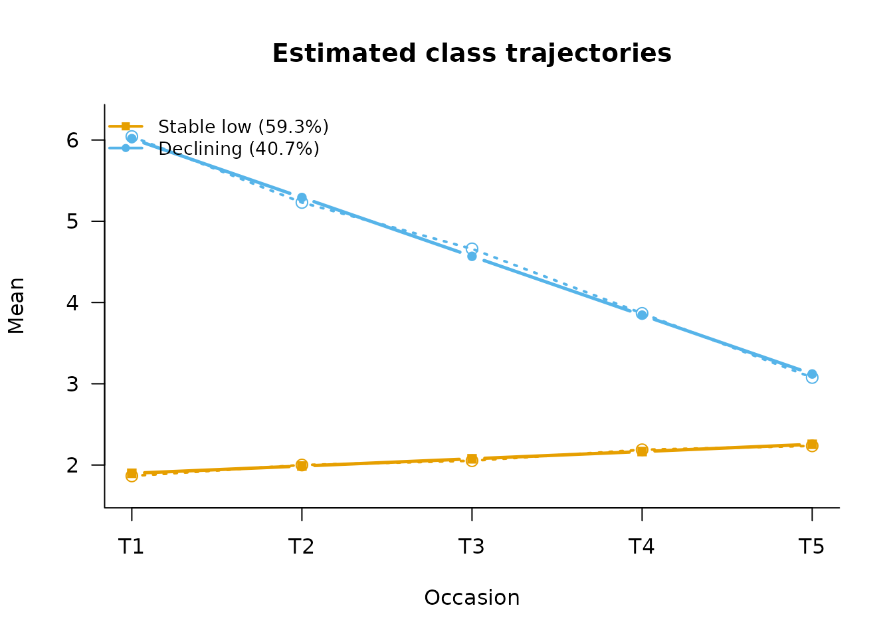

# Trajectory Classes: LCGA and Growth Mixture Models

``` r

library(mixtureEM)
```

When a continuous outcome is measured repeatedly, two related models
group cases by the *shape* of their trajectory over time, rather than by
a single score:

- **Latent class growth analysis (LCGA)** sorts cases into classes that
  each follow one shared curve — everyone in a class is assumed to
  follow essentially the same trajectory, give or take measurement noise
  (Jung & Wickrama, 2008).
- **Growth mixture models (GMM)** relax that assumption: cases still
  belong to a class with its own typical curve, but each person is
  allowed to start a bit higher or lower, and rise or fall a bit faster
  or slower, than their class’s average (Muthén & Shedden, 1999). LCGA
  is the special case where that person-to-person wiggle room is fixed
  at zero.

The practical difference: because LCGA has no other way to absorb
within-class differences, it tends to need *more*, narrower classes to
fit the same data; a GMM can often describe it with fewer, broader ones.

## Simulated example: five-wave symptom scores

We simulate 700 cases in two known trajectory classes — a stable-low
class and a declining class — with genuine within-class variation in
both intercept and slope, i.e. GMM-type data:

``` r

set.seed(2026)
n     <- 700
cls   <- rbinom(n, 1, 0.4)                       # 1 = Declining (40%)
icept <- ifelse(cls == 1, 6.0, 2.0) + rnorm(n, 0, 0.9)
slope <- ifelse(cls == 1, -0.7, 0.05) + rnorm(n, 0, 0.25)
waves <- 0:4
Y <- outer(icept, rep(1, 5)) + outer(slope, waves) +
  matrix(rnorm(n * 5, 0, 0.8), n, 5)
colnames(Y) <- paste0("score_t", 1:5)
```

## LCGA first

An LCGA with a linear curve per class:

``` r

fit_lcga2 <- fit_lcga(Y, times = 5, n_classes = 2, family = "gaussian",
                      degree = 1, n_init = 15, random_state = 5)
fit_lcga2
#> 
#> =========================================================
#>            LATENT CLASS GROWTH ANALYSIS
#> =========================================================
#> Occasions          : 5 (time scores 0, 1, 2, 3, 4)
#> Trajectory         : linear, identity link
#> 
#> GROWTH COEFFICIENTS (link scale)
#>         intercept linear
#> Class 1     1.825  0.037
#> Class 2     5.768 -0.592
#> 
#> FITTED TRAJECTORY (mean)
#>            T1    T2    T3    T4    T5
#> Class 1 1.825 1.862 1.899 1.936 1.973
#> Class 2 5.768 5.176 4.583 3.991 3.399
#> 
#> RESIDUAL VARIANCE (within class, constant over occasions)
#>          Class 1 Class 2
#> Variance   1.513   1.753
#> =========================================================
#>                   LATENT MIXTURE MODEL                   
#> =========================================================
#> Classes Estimated  : 2
#> Estimation Method  : 1-step
#> Converged          : TRUE (in 11 iterations)
#> ---------------------------------------------------------
#>   Log-Likelihood : -6245.41
#>   Parameters     : 7
#>   AIC            : 12504.83
#>   BIC            : 12536.69
#>   SABIC          : 12514.46
#>   Rel. Entropy   : 0.9175
#>   Best solution  : found by 15 of 15 starts
#> ---------------------------------------------------------
#> Class Weights (Sizes):
#>   Class 1: 55.66%
#>   Class 2: 44.34%
#> =========================================================
#> Type summary(model) for structural parameters or measurement_summary(model) for item parameters.
```

## The GMM

[`fit_gmm()`](https://pdvalencia.github.io/mixtureEM/reference/fit_gmm.md)
adds random intercepts and slopes (the default,
`random_effects = "intercept_slope"`):

``` r

fit_gmm2 <- fit_gmm(Y, times = 5, n_classes = 2, n_init = 15,
                    random_state = 5)
fit_gmm2
#> 
#> =========================================================
#>              GROWTH MIXTURE MODEL
#> =========================================================
#> Occasions          : 5 (time scores 0, 1, 2, 3, 4)
#> Trajectory         : linear
#> Random effects     : intercept, linear
#> 
#> GROWTH FACTOR MEANS
#>         intercept linear
#> Class 1     1.897  0.089
#> Class 2     6.015 -0.724
#> 
#> GROWTH FACTOR (CO)VARIANCE (held equal across classes)
#>           intercept linear
#> intercept     0.766  0.008
#> linear        0.008  0.056
#> 
#> RESIDUAL VARIANCE (held equal across classes)
#>             T1    T2    T3    T4    T5
#> Variance 0.676 0.655 0.653 0.579 0.655
#> 
#> FITTED TRAJECTORY (mean)
#>            T1    T2    T3    T4    T5
#> Class 1 1.897 1.987 2.076 2.165 2.254
#> Class 2 6.015 5.291 4.567 3.843 3.119
#> =========================================================
#>                   LATENT MIXTURE MODEL                   
#> =========================================================
#> Classes Estimated  : 2
#> Estimation Method  : 1-step
#> Converged          : TRUE (in 39 iterations)
#> ---------------------------------------------------------
#>   Log-Likelihood : -5570.91
#>   Parameters     : 13
#>   AIC            : 11167.82
#>   BIC            : 11226.98
#>   SABIC          : 11185.71
#>   Rel. Entropy   : 0.9113
#>   Best solution  : found by 4 of 4 starts that ran to convergence (of 15 requested)
#> ---------------------------------------------------------
#> Class Weights (Sizes):
#>   Class 1: 59.29%
#>   Class 2: 40.71%
#> =========================================================
#> Type summary(model) for structural parameters or measurement_summary(model) for item parameters.
```

Because LCGA is nested in the GMM, the information criteria say directly
whether the random effects are earning their parameters — here they are,
by a wide margin, as simulated:

``` r

data.frame(
  model = c("LCGA (2 classes)", "GMM (2 classes)"),
  ll    = c(fit_lcga2$metrics$ll, fit_gmm2$metrics$ll),
  bic   = c(fit_lcga2$metrics$bic, fit_gmm2$metrics$bic)
)
#>              model        ll      bic
#> 1 LCGA (2 classes) -6245.414 12536.69
#> 2  GMM (2 classes) -5570.910 11226.98
```

[`plot()`](https://rdrr.io/r/graphics/plot.default.html) overlays the
observed class means on the estimated curves — the check that a class
describes a real subgroup rather than an artifact of splitting one cloud
in half:

``` r

plot(fit_gmm2, class_labels = c("Stable low", "Declining"))
```



## Covariates, two different questions

Two kinds of covariate enter a growth mixture model, and they answer
different questions:

- **Who is in which class?** — class-membership predictors, through the
  usual stepwise workflow:

``` r

x_member <- rnorm(n, mean = 0.7 * cls)
fit_cov  <- add_covariates(fit_gmm2, x_member)
#> Using 'ML' bias correction (set `correction` to override).
results  <- summary(fit_cov)
#> =========================================================
#>              STRUCTURAL MODEL SUMMARY                    
#> =========================================================
#> 
#> CATEGORICAL LATENT VARIABLE REGRESSION (CLASS PREDICTORS)
#> Reference Class: 1
#> Standard errors: Step-3 sandwich (robust); step-1 correction unavailable for this measurement model
#> ---------------------------------------------------------
#>                               OR         [95% CI]         P-Value
#> 
#> Class 2 ON
#>   Intercept                0.562  [    0.472,     0.671]    < .001
#>   x_member                 1.817  [    1.537,     2.148]    < .001
#> =========================================================
```

- **Who, within a class, starts higher or declines faster?** —
  covariates on the growth factors themselves, which are part of the
  measurement model and therefore supplied to
  [`fit_gmm()`](https://pdvalencia.github.io/mixtureEM/reference/fit_gmm.md)
  directly:

``` r

x_growth <- rnorm(n)
fit_gp   <- fit_gmm(Y, times = 5, n_classes = 2,
                    growth_predictors = x_growth,
                    n_init = 15, random_state = 5)
print(fit_gp)
#> 
#> =========================================================
#>              GROWTH MIXTURE MODEL
#> =========================================================
#> Occasions          : 5 (time scores 0, 1, 2, 3, 4)
#> Trajectory         : linear
#> Random effects     : intercept, linear
#> 
#> GROWTH FACTOR INTERCEPTS
#>         intercept linear
#> Class 1     1.898  0.089
#> Class 2     6.012 -0.723
#> 
#> GROWTH FACTORS ON COVARIATES (held equal across classes)
#>           x_growth
#> intercept   -0.037
#> linear       0.011
#> 
#> GROWTH FACTOR (CO)VARIANCE (held equal across classes)
#>           intercept linear
#> intercept     0.766  0.010
#> linear        0.010  0.056
#> 
#> RESIDUAL VARIANCE (held equal across classes)
#>             T1    T2    T3    T4    T5
#> Variance 0.678 0.655 0.653 0.579 0.656
#> 
#> FITTED TRAJECTORY (at the mean of the covariates)
#>            T1    T2    T3    T4    T5
#> Class 1 1.898 1.988 2.077 2.167 2.256
#> Class 2 6.012 5.288 4.565 3.842 3.118
#> =========================================================
#>                   LATENT MIXTURE MODEL                   
#> =========================================================
#> Classes Estimated  : 2
#> Estimation Method  : 1-step
#> Converged          : TRUE (in 48 iterations)
#> ---------------------------------------------------------
#>   Log-Likelihood : -5570.48
#>   Parameters     : 15
#>   AIC            : 11170.97
#>   BIC            : 11239.23
#>   SABIC          : 11191.61
#>   Rel. Entropy   : 0.9110
#>   Best solution  : found by 4 of 4 starts that ran to convergence (of 15 requested)
#> ---------------------------------------------------------
#> Class Weights (Sizes):
#>   Class 1: 59.25%
#>   Class 2: 40.75%
#> =========================================================
#> Type summary(model) for structural parameters or measurement_summary(model) for item parameters.
```

## Reporting the model

[`measurement_summary()`](https://pdvalencia.github.io/mixtureEM/reference/measurement_summary.md)
returns the growth parameters as a tidy data frame — the growth-factor
means, their variances and covariances, the residual variances and the
fitted trajectory, one row per parameter and class — so the numbers can
go into a table without being retyped from the printed output:

``` r

params <- measurement_summary(fit_gmm2)
#> =========================================================
#>              MEASUREMENT MODEL PARAMETERS                
#> =========================================================
#> 
#> GROWTH FACTOR MEANS
#> Parameter            | Class 1 | Class 2
#> ---------------------------------------- 
#> intercept            |   1.897 |   6.015
#> linear               |   0.089 |  -0.724
#> 
#> GROWTH FACTOR VARIANCES (held equal across classes)
#> Parameter            | Class 1 | Class 2
#> ---------------------------------------- 
#> intercept            |   0.766 |   0.766
#> linear               |   0.056 |   0.056
#> 
#> GROWTH FACTOR COVARIANCES (held equal across classes)
#> Parameter             | Class 1 | Class 2
#> ----------------------------------------- 
#> intercept with linear |   0.008 |   0.008
#> 
#> RESIDUAL VARIANCE (held equal across classes)
#> Parameter            | Class 1 | Class 2
#> ---------------------------------------- 
#> T1                   |   0.676 |   0.676
#> T2                   |   0.655 |   0.655
#> T3                   |   0.653 |   0.653
#> T4                   |   0.579 |   0.579
#> T5                   |   0.655 |   0.655
#> 
#> FITTED TRAJECTORY
#> Parameter            | Class 1 | Class 2
#> ---------------------------------------- 
#> T1                   |   1.897 |   6.015
#> T2                   |   1.987 |   5.291
#> T3                   |   2.076 |   4.567
#> T4                   |   2.165 |   3.843
#> T5                   |   2.254 |   3.119
#> =========================================================
head(params[params$parameter == "growth_mean", ])
#>   block   parameter      item category class    estimate overall
#> 1  <NA> growth_mean intercept       NA     1  1.89749427      NA
#> 2  <NA> growth_mean intercept       NA     2  6.01535071      NA
#> 3  <NA> growth_mean    linear       NA     1  0.08903508      NA
#> 4  <NA> growth_mean    linear       NA     2 -0.72405220      NA
```

Class enumeration has its own two functions.
[`compare_longitudinal()`](https://pdvalencia.github.io/mixtureEM/reference/compare_longitudinal.md)
fits a range of class counts with one specification and tabulates the
criteria, and for a growth model its default range starts at one class —
the ordinary latent growth curve model, which is the benchmark the class
solutions have to beat:

``` r

compare_longitudinal(Y, model = "gmm", times = 5, k_range = 1:3,
                     n_init = 15, random_state = 5)
```

[`blrt()`](https://pdvalencia.github.io/mixtureEM/reference/blrt.md)
takes the fitted model itself, so the bootstrapped comparison is run on
the same time design and covariance structure rather than on a
re-specified model:

``` r

blrt(k_small = 2, k_large = 3, from_fit = fit_gmm2, n_reps = 100)
```

## Practical cautions

- A GMM whose data cannot support its covariance structure does not fail
  loudly — it drives a variance towards zero. mixtureEM warns when a
  residual variance or a class’s growth-factor variation has collapsed
  relative to the observed variance of the outcome; treat that as a sign
  to simplify (`psi = "equal"`, `random_effects = "intercept"`, fewer
  classes, or LCGA). Two things about that warning are worth taking
  literally. The collapsed solution is usually the one with the *best*
  BIC, because a variance heading for zero inflates the likelihood
  without bound, so BIC cannot be used to choose between it and a clean
  fit. And it is not a convergence failure, so raising `n_init` will not
  fix it: more starts means more chances of finding the spike, and a
  solution that only one start in fifty reaches is evidence about the
  specification rather than about the search (Hipp & Bauer, 2006).
- **A lower log-likelihood is not always a worse answer.** The
  growth-factor covariance is constrained here to be positive
  semi-definite, and the residual variances to be positive. Software
  that does not impose those constraints can report a negative variance,
  or variances that are each positive while implying a correlation
  greater than one in absolute value — and the likelihood it prints for
  such a solution is evaluated outside the parameter space, so it is not
  comparable with one that is inside it. When mixtureEM reports a lower
  likelihood than another program on the same model, check the other
  program’s covariance matrix before concluding anything: an admissible
  solution with a smaller likelihood is the reportable one. The right
  response to a model that cannot produce a proper solution is Berlin,
  Parra and Williams’s (2014): to report that no reasonable and proper
  solution was found, and to simplify the specification.
- Class enumeration is harder than in cross-sectional LCA: BIC, the
  plotted trajectories against observed means, and substantive
  interpretability should all agree before a solution is reported
  (Nylund et al., 2007). Checklists for reporting a trajectory study
  (van de Schoot et al., 2017) ask for the one-class solution, the
  criteria at every class count, the class sizes and the classification
  diagnostics;
  [`compare_longitudinal()`](https://pdvalencia.github.io/mixtureEM/reference/compare_longitudinal.md),
  [`class_sizes()`](https://pdvalencia.github.io/mixtureEM/reference/class_sizes.md)
  and
  [`classification_diagnostics()`](https://pdvalencia.github.io/mixtureEM/reference/classification_diagnostics.md)
  supply them.

## References

Berlin, K. S., Parra, G. R., & Williams, N. A. (2014). An introduction
to latent variable mixture modeling (part 2): Longitudinal latent class
growth analysis and growth mixture models. *Journal of Pediatric
Psychology*, *39*(2), 188–203. <https://doi.org/10.1093/jpepsy/jst085>

Hipp, J. R., & Bauer, D. J. (2006). Local solutions in the estimation of
growth mixture models. *Psychological Methods*, *11*(1), 36–53.
<https://doi.org/10.1037/1082-989X.11.1.36>

Jung, T., & Wickrama, K. A. S. (2008). An introduction to latent class
growth analysis and growth mixture modeling. *Social and Personality
Psychology Compass*, *2*(1), 302–317.
<https://doi.org/10.1111/j.1751-9004.2007.00054.x>

Lee, T. K., Wickrama, K. A. S., & O’Neal, C. W. (2023). An introduction
to growth mixture models (GMM). In *International Encyclopedia of
Education* (4th ed., Vol. 14, pp. 646–655). Elsevier.
<https://doi.org/10.1016/B978-0-12-818630-5.10076-4>

Muthén, B., & Shedden, K. (1999). Finite mixture modeling with mixture
outcomes using the EM algorithm. *Biometrics*, *55*(2), 463–469.
<https://doi.org/10.1111/j.0006-341X.1999.00463.x>

Ram, N., & Grimm, K. J. (2009). Growth mixture modeling: A method for
identifying differences in longitudinal change among unobserved groups.
*International Journal of Behavioral Development*, *33*(6), 565–576.
<https://doi.org/10.1177/0165025409343765>

Nylund, K. L., Asparouhov, T., & Muthén, B. O. (2007). Deciding on the
number of classes in latent class analysis and growth mixture modeling:
A Monte Carlo simulation study. *Structural Equation Modeling*, *14*(4),
535–569. <https://doi.org/10.1080/10705510701575396>

van de Schoot, R., Sijbrandij, M., Winter, S. D., Depaoli, S., &
Vermunt, J. K. (2017). The GRoLTS-checklist: Guidelines for reporting on
latent trajectory studies. *Structural Equation Modeling*, *24*(3),
451–467. <https://doi.org/10.1080/10705511.2016.1247646>
