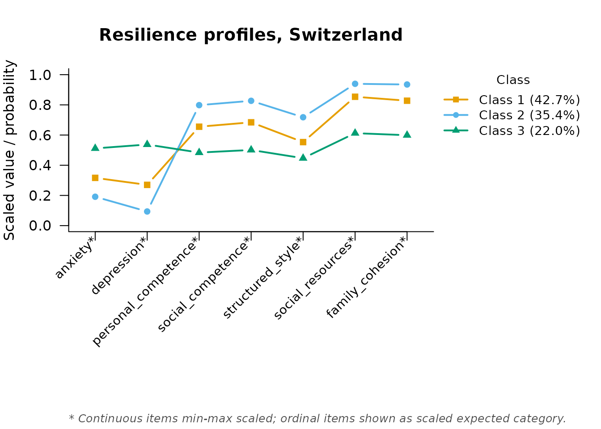

# Resilience Profiles Across Countries: Multi-Group LPA and Measurement Invariance

``` r

library(mixtureEM)
```

## Background

This vignette walks through Janousch et al. (2022), *“Resilience
Profiles Across Context: A Latent Profile Analysis in a German, Greek,
and Swiss Sample of Adolescents,”* PLOS ONE, 17(1):e0263089
(<https://doi.org/10.1371/journal.pone.0263089>), using the `janousch`
dataset bundled with mixtureEM
([`?janousch`](https://pdvalencia.github.io/mixtureEM/reference/janousch.md);
CC BY 4.0, figshare).

The study measured 1,160 seventh-graders from Germany, Greece, and
Switzerland on two symptom indicators (anxiety, depression) and five
protective-factor subscales from the Resilience Scale for Adolescents
(personal competence, social competence, structured style, social
resources, family cohesion). It then asked two questions we replicate
here: (1) how many resilience profiles best describe each country’s
data, and (2) are those profiles *measurement-invariant* across
countries — that is, do the same profile labels mean the same thing (the
same underlying symptom/protective-factor levels) in each country?

The original analysis handled the substantial item-level missingness
with a full-information ML estimator rather than deleting incomplete
cases, and so do we — without having to ask for it.
[`fit_mixture()`](https://pdvalencia.github.io/mixtureEM/reference/fit_mixture.md)
detects the missing values and models them directly;
`measurement = "continuous"` is all that is needed. In practical terms:
instead of dropping an adolescent who skipped one item — which is what
listwise deletion, the default in many packages, would do — the model
uses every answer that adolescent *did* give.

## The data

``` r

data(janousch)
str(janousch)
#> 'data.frame':    1160 obs. of  11 variables:
#>  $ country             : Factor w/ 3 levels "Switzerland",..: 1 1 1 1 1 1 1 1 1 1 ...
#>  $ gender              : Factor w/ 3 levels "Male","Female",..: 1 1 2 1 2 1 2 2 1 2 ...
#>  $ age                 : num  13 14 13 13 12 13 13 13 13 13 ...
#>  $ migration_background: Factor w/ 2 levels "Native","Migration background": 1 2 2 2 2 2 2 1 2 2 ...
#>  $ anxiety             : num  1.9 1.6 2.1 1.8 NA 1.2 2.6 1.7 1.3 1.5 ...
#>  $ depression          : num  2.21 1 1.93 1.79 1.43 ...
#>  $ personal_competence : num  3 4.88 3.25 4.12 4.12 ...
#>  $ social_competence   : num  2.2 4.2 4.2 4.2 3.8 4.8 3.8 3.6 3.6 4 ...
#>  $ structured_style    : num  3.75 4.25 4 2.75 3.75 4.25 3 3 4.25 2.25 ...
#>  $ social_resources    : num  3.4 5 4.4 4 5 5 4 4 4.8 4.8 ...
#>  $ family_cohesion     : num  2.33 5 4.5 4.67 4.83 ...
```

``` r

items <- c("anxiety", "depression", "personal_competence", "social_competence",
           "structured_style", "social_resources", "family_cohesion")
```

## Per-country profiles

The paper fit a separate LPA for each country and selected, by BIC and
interpretability, 3 profiles for Switzerland and 4 for Germany and
Greece. Finding the best solution in a model with missing continuous
indicators benefits from many random restarts (the paper itself used up
to 2,000); we use a more modest `n_init` here for speed, but recommend
increasing it for a real analysis.

``` r

set.seed(1)
fit_ch <- fit_mixture(janousch[janousch$country == "Switzerland", items],
                       n_classes = 3, measurement = "continuous",
                       n_init = 30, max_iter = 2000)
#> Warning: 14 cases had no observed value on any indicator and were removed
#> before estimation (n = 361 analysed). Rows: 28, 46, 50, 55, 90, 94, ... (8
#> more).
class_sizes(fit_ch)
#>   class proportion n_expected n_modal
#> 1     1  0.4267885  154.07065     153
#> 2     2  0.3535393  127.62768     132
#> 3     3  0.2196722   79.30167      76
```

This closely recovers the paper’s Swiss solution (Non-Resilient 22.1%,
Moderately Resilient 42.9%, Untroubled 34.9%). What the profiles *mean*
comes from the class-specific indicator means, which
[`measurement_summary()`](https://pdvalencia.github.io/mixtureEM/reference/measurement_summary.md)
prints and also returns as a data frame:

``` r

profile_ch <- measurement_summary(fit_ch)
#> =========================================================
#>              MEASUREMENT MODEL PARAMETERS                
#> =========================================================
#> 
#> CONTINUOUS MEANS
#> Indicator            | Class 1 | Class 2 | Class 3
#> -------------------------------------------------- 
#> anxiety              |   1.949 |   1.574 |   2.535
#> depression           |   1.791 |   1.274 |   2.574
#> personal_competence  |   3.837 |   4.319 |   3.258
#> social_competence    |   3.990 |   4.446 |   3.404
#> structured_style     |   3.548 |   4.083 |   3.201
#> social_resources     |   4.561 |   4.819 |   3.838
#> family_cohesion      |   4.368 |   4.762 |   3.529
#> 
#> Missing data: 143 of 2527 cells (5.7%) across 7 items, handled via FIML (MAR assumption).
#> =========================================================
```

Profiles are easier to name than to read off a table, so plot them.
[`plot()`](https://rdrr.io/r/graphics/plot.default.html) puts every
indicator on a common 0–1 axis (continuous items are min–max scaled
against their observed range, which is what the `*` marks), so the
*shape* of each line — high on the protective factors, low on the
symptoms, or the reverse — is what you interpret:

``` r

plot(fit_ch, main = "Resilience profiles, Switzerland")
```



Once you have decided what each line represents, read the profile means
off `profile_ch` to fix the class order, then pass your own names in
that order through `class_labels = c(...)`; the legend will carry them,
with each class’s size attached. Those names — “Non-Resilient”,
“Moderately Resilient”, “Untroubled” — are the paper’s, and this plot is
how they were arrived at.

``` r

set.seed(1)
fit_de <- fit_mixture(janousch[janousch$country == "Germany", items],
                       n_classes = 4, measurement = "continuous",
                       n_init = 30, max_iter = 2000)
#> Warning: 4 cases had no observed value on any indicator and were removed before
#> estimation (n = 342 analysed). Rows: 43, 113, 269, 322.
class_sizes(fit_de)
#>   class proportion n_expected n_modal
#> 1     1  0.4362630  149.20196     149
#> 2     2  0.2785360   95.25930     100
#> 3     3  0.1552926   53.11006      51
#> 4     4  0.1299084   44.42868      42
```

This closely recovers the paper’s German solution (Non-Resilient 15.7%,
Moderately Resilient 44.2%, Untroubled 27.3%, Resilient 12.7%).

``` r

set.seed(1)
fit_gr0 <- fit_mixture(janousch[janousch$country == "Greece", items],
                       n_classes = 4, measurement = "continuous",
                       n_init = 30, max_iter = 2000)
#> Warning: 17 cases had no observed value on any indicator and were removed
#> before estimation (n = 422 analysed). Rows: 7, 41, 129, 132, 148, 166, ... (11
#> more).
#> Warning: A class variance has collapsed towards zero: social_resources in class
#> 3 (variance 0.00111 vs 0.348 for the item overall; class mean at a data
#> boundary). The likelihood of a mixture of normals is unbounded in this
#> direction, so this solution can score better than any meaningful one while
#> describing a handful of near-identical cases rather than a subgroup. Do not
#> interpret it as it stands, and do not compare its BIC with a clean fit's -- it
#> is inflated by the spike. This is not a convergence failure, so raising n_init
#> will not fix it and can make it worse. Three ways out, to choose between on
#> substantive grounds: (1) hold each item's variance equal across classes with
#> variances_equal = TRUE, which bounds the likelihood so the problem cannot
#> arise; (2) fit fewer classes, since a class describing a spike rather than a
#> subgroup usually means the data do not support this many; or (3) keep the model
#> and strengthen the prior with bayes_constants = list(variances = 4) -- roughly
#> one artificial observation per class -- doubling it if the warning persists.
#> Then check that the flagged variance is no longer far below the others and that
#> its class mean has come off the floor or ceiling, and look at the distribution
#> of the named item for the floor, ceiling or spike the class latched onto.
```

That fit raises a warning: one class’s variance on `social_resources`
has collapsed towards zero. The next section explains what that means
and why it happens; the short version is that a mixture of normals with
freely estimated variances has an *unbounded* likelihood, so a class can
score well by sitting on a handful of identical answers instead of
describing a subgroup. In survey terms this is usually a **ceiling or
floor effect**: when a large block of respondents picks the very top of
the `social_resources` scale, the model can manufacture a “profile” out
of those identical scores alone. Such a solution is not interpretable,
and — importantly — more random starts will not rescue it.

> **If your variance collapses**
>
> 1.  **Read the warning.** It names the item and the class (here,
>     `social_resources` in one of the four Greek classes) and suggests
>     a starting value.
> 2.  **Look at that item.** A histogram usually shows the culprit: a
>     heavy pile of responses on the highest or lowest scale point.
> 3.  **Raise the prior, not `n_init`.** Start at the suggested
>     `bayes_constants = list(variances = ...)` and increase it a little
>     at a time until the warning goes away.
> 4.  **Re-run every model you intend to compare at the same value**, so
>     the fits stay on a common footing.

The remedy is that stronger prior holding the variances away from zero.
It is best read as a gentle statement of disbelief that any real
subgroup has exactly zero spread: `variances = 5` adds the equivalent of
five hypothetical observations, spread across the classes, whose only
job is to smooth the mathematical spike away. The warning suggests a
starting point of one artificial observation per class — `variances = 4`
for this four-class model — and says to raise it if the warning
persists, which on this data it does. A little more is enough:

``` r

set.seed(1)
fit_gr <- fit_mixture(janousch[janousch$country == "Greece", items],
                       n_classes = 4, measurement = "continuous",
                       n_init = 30, max_iter = 2000,
                       bayes_constants = list(variances = 5))
#> Warning: 17 cases had no observed value on any indicator and were removed
#> before estimation (n = 422 analysed). Rows: 7, 41, 129, 132, 148, 166, ... (11
#> more).
class_sizes(fit_gr)
#>   class proportion n_expected n_modal
#> 1     1  0.3119837  131.65711     138
#> 2     2  0.2562406  108.13353     110
#> 3     3  0.2435750  102.78863      97
#> 4     4  0.1882008   79.42073      77
```

Even with a clean fit, the Greek class sizes differ more noticeably from
the paper’s (Non-Resilient 21.0%, Moderately Resilient 30.8%, Untroubled
24.9%, Resilient 23.3%) than the Swiss and German ones did. The Greek
sample had the lowest entropy in the original study (.788, vs. .81-.84
for the other two countries), meaning its classes are less well
separated — exactly the situation where an LPA’s likelihood surface has
several close local optima and different software can land on distinct,
similarly plausible solutions. Two different things are at work here and
they call for different responses: *local optima* are a search problem,
answered by more random starts, and the printed “best solution found by
k of n starts” line tells you whether you have enough; a *collapsed
variance* is not a search problem at all, and more starts make it worse.

## Testing measurement invariance across countries

Before we can say “Greece has more Resilient adolescents than Germany”,
we have to establish that *being* Resilient means the same thing in both
places. If the profile means differ by country, the labels are attached
to different underlying patterns and the comparison is apples to
oranges. That is the question measurement invariance answers, and it is
worth settling before any cross-country claim goes into a manuscript.

Rather than three separate models, mixtureEM can fit all three countries
*jointly* as a multiple-group model, and ask directly whether a profile
means the same thing in each. Fitting the same number of classes (4,
following the paper’s own supplementary invariance analysis, which
tested the four-profile solution across all three countries), the
comparison is between two nested models:

| Model | Profile means | Indicator variances | Class sizes | Arguments |
|----|----|----|----|----|
| Invariant | pooled | pooled | free by country | `group_effects = "prevalence"` |
| Non-invariant | **free by country** | pooled | free by country | `group_effects = "both"`, `group_invariant_params = "covariances"` |

Measurement invariance is the restriction that a profile sits at the
same place on every indicator in every country. Freeing the *means* by
country is what breaks it; the indicator variances stay pooled in both
models, because they describe how tightly people cluster around a
profile rather than where the profile is, and holding them equal is what
keeps the comparison a test of the profiles themselves. This is the
standard latent-profile invariance comparison (Olivera-Aguilar & Rikoon,
2018), and it is also the smaller and better-behaved of the models
available: a fully heterogeneous alternative, which frees the variances
by country as well, is fitted at the end of this section for comparison.

Let us fit the restricted model first, exactly as one would by default:

``` r

fit_invariant <- fit_mixture(janousch[items], n_classes = 4,
                             measurement = "continuous",
                             group = janousch$country,
                             group_effects = "prevalence",
                             n_steps = 1, n_init = 50, max_iter = 2000,
                             random_state = 11)
#> Warning: 35 cases had no observed value on any indicator and were removed
#> before estimation (n = 1125 analysed). Rows: 28, 46, 50, 55, 90, 94, ... (29
#> more).
#> Warning: A class variance has collapsed towards zero: social_resources in class
#> 2 (variance 0.000304 vs 0.357 for the item overall; class mean at a data
#> boundary). The likelihood of a mixture of normals is unbounded in this
#> direction, so this solution can score better than any meaningful one while
#> describing a handful of near-identical cases rather than a subgroup. Do not
#> interpret it as it stands, and do not compare its BIC with a clean fit's -- it
#> is inflated by the spike. This is not a convergence failure, so raising n_init
#> will not fix it and can make it worse. Three ways out, to choose between on
#> substantive grounds: (1) hold each item's variance equal across classes with
#> variances_equal = TRUE, which bounds the likelihood so the problem cannot
#> arise; (2) fit fewer classes, since a class describing a spike rather than a
#> subgroup usually means the data do not support this many; or (3) keep the model
#> and strengthen the prior with bayes_constants = list(variances = 4) -- roughly
#> one artificial observation per class -- doubling it if the warning persists.
#> Then check that the flagged variance is no longer far below the others and that
#> its class mean has come off the floor or ceiling, and look at the distribution
#> of the named item for the floor, ceiling or spike the class latched onto.
```

That fit raises the same warning the Greek model did: one class’s
variance on `social_resources` has **collapsed** towards zero, with the
class mean sitting exactly at the top of the scale.

This is worth understanding rather than working around, because it is a
property of the model and not a bug in the data. A mixture of normals
with freely estimated variances has an *unbounded* likelihood: take any
class, shrink its variance on one item towards zero, and put its mean on
a few cases that happen to share a value, and the density at those cases
— and so the likelihood — grows without limit. Such a solution can score
better than any meaningful one while describing nothing but a clump of
identical answers. Here, enough adolescents report the maximum on
`social_resources` that a class can form on the ceiling alone.

Two practical consequences follow, and both cut against instinct.
Raising `n_init` does **not** help: the likelihood really is unbounded
in that direction, so a longer search finds a taller spike and reports a
better log-likelihood for a worse solution. And a flagged fit’s BIC
cannot be compared with a clean one’s, because it is inflated by that
spike.

mixtureEM guards against this with a weak prior that holds variances
away from zero. The default is deliberately mild, and as the Greek fit
showed, mild enough that it does not prevent every collapse — its job is
to keep the problem finite and *visible*, so the warning can name the
item and the class, which it does. The remedy is the same stronger
prior, at the same strength the Greek fit needed:

``` r

fit_invariant <- fit_mixture(janousch[items], n_classes = 4,
                             measurement = "continuous",
                             group = janousch$country,
                             group_effects = "prevalence",
                             n_steps = 1, n_init = 50, max_iter = 2000,
                             random_state = 11,
                             bayes_constants = list(variances = 5))
#> Warning: 35 cases had no observed value on any indicator and were removed
#> before estimation (n = 1125 analysed). Rows: 28, 46, 50, 55, 90, 94, ... (29
#> more).

fit_free_means <- fit_mixture(janousch[items], n_classes = 4,
                              measurement = "continuous",
                              group = janousch$country,
                              group_effects = "both",
                              group_invariant_params = "covariances",
                              n_steps = 1, n_init = 50, max_iter = 2000,
                              random_state = 11,
                              bayes_constants = list(variances = 5))
#> Warning: 35 cases had no observed value on any indicator and were removed
#> before estimation (n = 1125 analysed). Rows: 28, 46, 50, 55, 90, 94, ... (29
#> more).

lr_test(fit_invariant, fit_free_means)
#> 
#> Likelihood-ratio test for nested models
#> ---------------------------------------------------------
#>   Restricted : LL =   -5338.3248   parameters = 65
#>   Full       : LL =   -5261.3498   parameters = 121
#>   -2 x diff  : 153.9499   df = 56   p = 4.445e-11
#>   The restriction is rejected: the full model fits significantly better.
```

Both fits are now clean — no collapsed variances in either — and the
restriction is decisively rejected: forcing the same profile means
across countries fits significantly worse than letting each country have
its own. This matches the paper’s own conclusion (“Measurement
invariance did not hold across the three countries”) — the same four
profile *labels* (Non-Resilient, Moderately Resilient, Untroubled,
Resilient) do not correspond to the same underlying levels of symptoms
and protective factors in each country.

For the write-up, that has a concrete consequence: report and interpret
the profiles **separately within each country**, and do not pool the
three samples or compare profile prevalences across them as if the
labels were interchangeable. A statement like “the Untroubled profile is
more common in Greece than in Germany” is not supported by these data,
because “Untroubled” is not the same profile in the two countries.

One caution about the comparison itself: `bayes_constants` was raised on
*both* models, which is what makes them comparable. A likelihood-ratio
test between two fits estimated under different priors is not a test of
anything.

### If you also want the variances to differ

`group_invariant_params = "covariances"` is what holds the indicator
variances pooled while the means move. Dropping it frees everything
about the measurement model, giving each country its own profile means
*and* its own variances:

``` r

fit_configural <- fit_mixture(janousch[items], n_classes = 4,
                              measurement = "continuous",
                              group = janousch$country,
                              group_effects = "both",
                              n_steps = 1, n_init = 50, max_iter = 2000,
                              random_state = 11,
                              bayes_constants = list(variances = 5))
#> Warning: 35 cases had no observed value on any indicator and were removed
#> before estimation (n = 1125 analysed). Rows: 28, 46, 50, 55, 90, 94, ... (29
#> more).

lr_test(fit_invariant, fit_configural)
#> 
#> Likelihood-ratio test for nested models
#> ---------------------------------------------------------
#>   Restricted : LL =   -5338.3248   parameters = 65
#>   Full       : LL =   -5191.4948   parameters = 177
#>   -2 x diff  : 293.6599   df = 112   p = < 1e-16
#>   The restriction is rejected: the full model fits significantly better.
```

This rejects too, and by more, but it is answering a broader question —
“is anything about the measurement model different across countries?”
rather than “do the profiles sit in the same place?” — on twice the
degrees of freedom. Report it when heterogeneity of *spread* is itself
of interest; otherwise the means-only test above is the one that matches
the substantive claim.

It is also the harder model to fit: 177 parameters spread across three
country-specific blocks, which random starting values struggle to bring
into correspondence. mixtureEM warm-starts it from the per-country
solutions to help, but a larger `n_init` may still improve it, which
would make the statistic larger and the rejection stronger, not weaker.
[`lr_test()`](https://pdvalencia.github.io/mixtureEM/reference/lr_test.md)
warns if the search has gone badly enough to make the full model score
*below* the restricted one.

## Covariates: gender and migration background

The paper related class membership to gender and migration background
using Mplus’s R3STEP procedure — itself already a 3-step,
classification- uncertainty-aware approach (equivalent to mixtureEM’s
`correction = "ML"`). We reproduce the same kind of analysis for
Switzerland, where the paper reported no significant covariate effects,
as a check:

The Swiss model was already fit above, so
[`add_covariates()`](https://pdvalencia.github.io/mixtureEM/reference/add_covariates.md)
runs the three-step analysis on that exact solution — no
re-specification and no re-estimation of the measurement model:

``` r

ch <- janousch[janousch$country == "Switzerland", ]
fit_ch_cov <- add_covariates(fit_ch, ch[, c("gender", "migration_background")])
#> Using 'ML' bias correction (set `correction` to override).
#> prepare_covariates: dropped 1 unused level of 'gender'.
#> 14 case(s) had been removed at fitting time for having no observed indicator; the matching rows of `predictors` were dropped.
summary(fit_ch_cov)
#> =========================================================
#>              STRUCTURAL MODEL SUMMARY                    
#> =========================================================
#> 
#> CATEGORICAL LATENT VARIABLE REGRESSION (CLASS PREDICTORS)
#> Reference Class: 1
#> Standard errors: Bakk-Oberski-Vermunt corrected (robust step 3, hessian step 1)
#> ---------------------------------------------------------
#>                                       OR         [95% CI]         P-Value
#> 
#> Class 2 ON
#>   Intercept                        0.866  [    0.465,     1.611]     0.649
#>   gender.Female                    1.138  [    0.656,     1.972]     0.646
#>   migratn_bckgrnd.Mgrtnbckgrnd     0.870  [    0.467,     1.620]     0.661
#> 
#> Class 3 ON
#>   Intercept                        0.479  [    0.223,     1.028]     0.059
#>   gender.Female                    1.171  [    0.629,     2.183]     0.618
#>   migratn_bckgrnd.Mgrtnbckgrnd     0.995  [    0.457,     2.167]     0.990
#>   Abbreviated names:
#>     migratn_bckgrnd.Mgrtnbckgrnd = migration_background.Migration background
#> 
#> OMNIBUS TEST PER COVARIATE (effect across all classes)
#> ---------------------------------------------------------
#>                          Wald Chi2   df  P-Value
#>   gender                     0.311    2     0.856
#>   migration_background       0.251    2     0.882
#>   Note: a non-significant test beside large coefficients can be the
#>         Hauck-Donner effect; confirm with wald_omnibus_test().
#> =========================================================
```

Each row is one predictor level in one contrast: the class named in the
header versus the reference class (Class 1). The odds ratio says how the
odds of falling in that class rather than the reference change for that
level of the predictor, holding the other covariates fixed. A
`gender.Female` row with an odds ratio near 1 and a p-value far above
.05 therefore reads as: girls are no more or less likely than boys to
land in that profile rather than the reference one. Values above 1
favour the named class, values below 1 favour the reference class, and
only the p-value tells you whether the difference is distinguishable
from none — an odds ratio of 1.5 on a p of .6 is not evidence of
anything.

One detail worth noticing: the full dataset codes `gender` with three
levels, but no Swiss adolescent chose “Other”, so after subsetting that
level is empty. mixtureEM drops empty levels automatically (with a
message) rather than printing a degenerate coefficient row for a
category with no data — and it warns when an *observed* level rests on
only a handful of cases, whose odds ratio would be unstable.

## References

Janousch, C., Anyan, F., Kassis, W., Morote, R., Hjemdal, O., Sidler,
P., Graf, U., Rietz, C., Chouvati, R., & Govaris, C. (2022). Resilience
profiles across context: A latent profile analysis in a German, Greek,
and Swiss sample of adolescents. *PLOS ONE*, *17*(1), e0263089.
<https://doi.org/10.1371/journal.pone.0263089>

Olivera-Aguilar, M., & Rikoon, S. H. (2018). Assessing measurement
invariance in multiple-group latent profile analysis. *Structural
Equation Modeling*, *25*(3), 439–452.
<https://doi.org/10.1080/10705511.2017.1408015>
