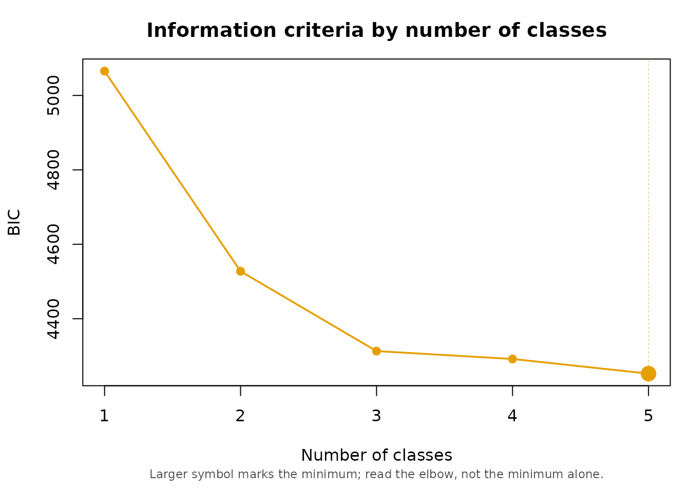
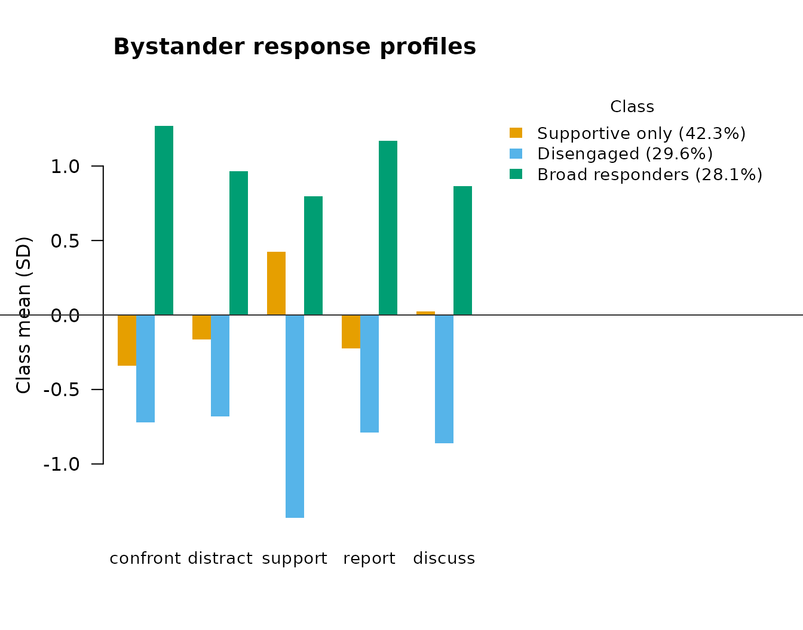

# Latent Profile Analysis: Bystander Responses to Sexual Harassment

``` r

library(mixtureEM)
```

## What this dataset is

`liang_park_sim` is simulated data. It is drawn from the published
parameters of Liang and Park’s Study 2 three-class latent profile
solution, not from actual survey responses, and it contains no real
bystander accounts. Fit statistics, standard errors and p-values
computed on it below are properties of this simulated dataset, not of
Liang and Park’s study, and should not be cited as findings about
workplace bystander behavior. The simulation reproduces the published
solution closely where the indicators are concerned — refitted profile
means land within about 0.15 of a scale point of the published ones, and
entropy comes out near the published .905 — and only approximately for
the covariates, for the reason given in the covariate section below.

Two columns exist only because the data are synthetic and no real
dataset would carry them: `class_true`, the profile each case was
actually drawn from, and `boundary`, which flags cases drawn from a
blend of two profiles rather than one. This vignette deliberately does
not look at either column until the very end, fitting the model exactly
as an applied researcher would on real data.

``` r

data(liang_park_sim)
str(liang_park_sim)
#> 'data.frame':    300 obs. of  19 variables:
#>  $ id                   : int  1 2 3 4 5 6 7 8 9 10 ...
#>  $ age                  : int  30 44 31 28 30 24 30 19 18 35 ...
#>  $ male                 : int  0 0 0 0 1 1 0 0 0 1 ...
#>  $ org_intolerance_sh   : num  4 2.67 5 4.67 4 ...
#>  $ masc_job_context     : num  0.53 0.1 0.31 0.61 0.5 0.85 0.65 0.62 0.2 0.83 ...
#>  $ sh_experience        : num  2.07 1 1.04 1.43 1.36 ...
#>  $ anger                : num  4.67 5 4 5 4.67 ...
#>  $ empathy              : num  4.33 4.67 4 4.33 4.33 ...
#>  $ curb_expectancy      : num  3.5 4.25 4 4.25 3 2.75 4.5 4.75 3.75 4.25 ...
#>  $ confront             : num  1 4.67 1.33 4.33 3.33 ...
#>  $ distract             : num  1.5 3.75 2.75 4 2.75 2.25 1 4 1.75 4 ...
#>  $ support              : num  4.75 5 3.75 4.5 5 4 4 3.25 3.75 5 ...
#>  $ report               : num  1 4.67 1 4.33 2.67 ...
#>  $ discuss              : num  1.5 3.25 2.5 1 3 5 2.25 2.5 1.5 3.25 ...
#>  $ harasser_aggression  : int  1 2 3 4 1 3 2 2 3 3 ...
#>  $ target_gratitude     : int  3 2 3 5 3 2 4 3 4 3 ...
#>  $ third_party_elevation: num  3.25 2 4 3 1.5 2 1.5 3.5 3.25 2.25 ...
#>  $ class_true           : int  1 3 1 3 3 1 1 3 3 3 ...
#>  $ boundary             : logi  TRUE FALSE FALSE FALSE TRUE FALSE ...
```

The five latent profile indicators are bystander actions in response to
witnessing sexual harassment at work: `confront` (direct confrontation
of the harasser), `distract` (distraction or interruption), `support`
(emotional support to the target), `report` (reporting to an authority),
and `discuss` (speaking with the target afterwards).

## How many profiles?

Equal (class-invariant) variances first — this is what the original
study fitted and what
[`fit_mixture()`](https://pdvalencia.github.io/mixtureEM/reference/fit_mixture.md)
defaults to.

``` r

ind <- liang_park_sim[, c("confront", "distract", "support", "report", "discuss")]
set.seed(1)
comp <- compare_mixtures(ind, k_range = 1:5, measurement = "continuous",
                         variances_equal = TRUE, n_init = 20)
#> Running Model Selection across K = 1 to 5...
#> 
#> Fitting 1-class model...
#> Fitting 2-class model...
#> Fitting 3-class model...
#> Fitting 4-class model...
#> Fitting 5-class model...
#> 
#> === Model Selection Summary ===
#>   Classes        LL Params      AIC      BIC     CAIC     AIC3      ICL
#> 1       1 -2504.138     10 5028.276 5065.314 5075.314 5038.276 5065.314
#> 2       2 -2218.115     16 4468.231 4527.491 4543.491 4484.231 4578.576
#> 3       3 -2093.758     22 4231.516 4312.999 4334.999 4253.516 4378.826
#> 4       4 -2066.064     28 4188.127 4291.833 4319.833 4216.127 4399.884
#> 5       5 -2029.260     34 4126.521 4252.449 4286.449 4160.521 4370.798
#>      SABIC Entropy Unreplicated
#> 1 5033.600   1.000        FALSE
#> 2 4476.749   0.877        FALSE
#> 3 4243.228   0.900        FALSE
#> 4 4203.034   0.870        FALSE
#> 5 4144.621   0.877        FALSE
#> 
#> -> Best model according to BIC: 5 classes
plot(comp)
```



BIC keeps improving out to five classes here, which is common with
information criteria on a modest sample: the criterion never turns a
corner and instead trades off against a solution getting harder to
interpret and to replicate. The published analysis specified three
profiles, and the section below carries that forward.

## What happens when you free the variances

``` r

set.seed(2)
free_v <- fit_mixture(ind, n_classes = 3, measurement = "continuous",
                      variances_equal = FALSE, n_init = 30)
#> Warning: A class variance has collapsed towards the boundary: report in class 2
#> (variance 0.0101 vs 1.96 for the item overall). These estimates are not
#> interpretable, and this fit's BIC cannot be compared with a clean fit's. Ways
#> out, to choose between on substantive grounds: (1) variances_equal = TRUE; (2)
#> fewer classes; or (3) a stronger variance prior, bayes_constants =
#> list(variances = 3). See ?fit_mixture for why, and what to check afterwards.
```

Freeing the residual variances lets a class shrink onto a handful of
cases and drive its own variance toward zero, which sends the likelihood
to infinity and makes the solution uninterpretable; the package warns
exactly this happened above. The prior on the variances (default
strength 1) stops this from happening when set stronger:

``` r

set.seed(2)
free_v_fixed <- fit_mixture(ind, n_classes = 3, measurement = "continuous",
                            variances_equal = FALSE, n_init = 30,
                            bayes_constants = list(variances = 3))
free_v_fixed
#> =========================================================
#>                   LATENT MIXTURE MODEL                   
#> =========================================================
#> Classes Estimated  : 3
#> Estimation Method  : 1-step
#> Converged          : TRUE (in 40 iterations)
#> ---------------------------------------------------------
#>   Log-Likelihood : -1929.58
#>   Parameters     : 32
#>   AIC            : 3923.17
#>   BIC            : 4041.69
#>   SABIC          : 3940.20
#>   Rel. Entropy   : 0.8733
#>   Best solution  : found by 26 of 30 starts
#> ---------------------------------------------------------
#> Class Weights (Sizes):
#>   Class 1: 41.20%
#>   Class 2: 30.11%
#>   Class 3: 28.70%
#> =========================================================
#> Type summary(model) for structural parameters or measurement_summary(model) for item parameters.
```

Setting the prior’s strength to the number of classes is the setting
that behaves the same way whatever K is. Even so, the equal-variance
model is the one this vignette carries forward: it is what the published
analysis specified, and parsimony is a real argument here, not a
consolation prize for the free model being illegitimate.

## The three-profile solution

``` r

fit <- fit_mixture(ind, n_classes = 3, measurement = "continuous",
                   variances_equal = TRUE, n_init = 20, random_state = 7)
fit
#> =========================================================
#>                   LATENT MIXTURE MODEL                   
#> =========================================================
#> Classes Estimated  : 3
#> Estimation Method  : 1-step
#> Converged          : TRUE (in 13 iterations)
#> ---------------------------------------------------------
#>   Log-Likelihood : -2093.76
#>   Parameters     : 22
#>   AIC            : 4231.52
#>   BIC            : 4313.00
#>   SABIC          : 4243.23
#>   Rel. Entropy   : 0.9001
#>   Best solution  : found by 20 of 20 starts
#> ---------------------------------------------------------
#> Class Weights (Sizes):
#>   Class 1: 42.27%
#>   Class 2: 29.59%
#>   Class 3: 28.14%
#> =========================================================
#> Type summary(model) for structural parameters or measurement_summary(model) for item parameters.
params <- measurement_summary(fit)
#> =========================================================
#>              MEASUREMENT MODEL PARAMETERS                
#> =========================================================
#> 
#> CONTINUOUS MEANS
#> Indicator            | Overall | Class 1 | Class 2 | Class 3
#> ------------------------------------------------------------ 
#> confront             |   2.228 |   1.816 |   1.350 |   3.770
#> distract             |   2.524 |   2.327 |   1.706 |   3.682
#> support              |   3.615 |   4.217 |   1.672 |   4.753
#> report               |   2.330 |   2.015 |   1.228 |   3.963
#> discuss              |   2.483 |   2.514 |   1.448 |   3.527
#> =========================================================
```

Classes come out sorted by size. Reading `params`: class 1 is high on
`support` and unremarkable elsewhere, class 2 is low on all five
indicators, and class 3 is high on all five. That is *supportive only*,
*disengaged*, and *broad responders*, in that order:

``` r

plot(fit, type = "bar",
     class_labels = c("Supportive only", "Disengaged", "Broad responders"),
     main = "Bystander response profiles")
```



These three labels are this vignette’s, chosen to describe the response
pattern. Liang and Park name the same three profiles after the level of
personal risk each one involves: what is called *Supportive only* here
is their **low-risk intervention** profile, *Broad responders* is their
**active intervention** profile, and *Disengaged* is their **no/limited
intervention** profile. The profiles are the same; only the names
differ. Use theirs when reporting against the paper.

## Who ends up in which profile? (covariates)

``` r

covs <- add_covariates(
  fit,
  ~ age + male + sh_experience + org_intolerance_sh + masc_job_context +
    anger + empathy + curb_expectancy,
  data = liang_park_sim
)
#> Using 'ML' bias correction (set `correction` to override).
summary(covs)
#> =========================================================
#>              STRUCTURAL MODEL SUMMARY                    
#> =========================================================
#> 
#> CATEGORICAL LATENT VARIABLE REGRESSION (CLASS PREDICTORS)
#> Reference Class: 1
#> Standard errors: Bakk-Oberski-Vermunt corrected (robust step 3, hessian step 1)
#> ---------------------------------------------------------
#>                               OR         [95% CI]         P-Value
#> 
#> Class 2 ON
#>   Intercept               15.245  [    0.459,   506.777]     0.128
#>   age                      0.987  [    0.955,     1.020]     0.446
#>   male                     4.509  [    2.253,     9.025]    < .001
#>   sh_experience            0.538  [    0.239,     1.213]     0.135
#>   org_intolerance_sh       1.823  [    1.111,     2.990]     0.017
#>   masc_job_context         0.630  [    0.154,     2.577]     0.521
#>   anger                    0.577  [    0.333,     1.000]     0.050
#>   empathy                  0.874  [    0.489,     1.563]     0.650
#>   curb_expectancy          0.608  [    0.385,     0.959]     0.032
#> 
#> Class 3 ON
#>   Intercept                0.000  [    0.000,     0.059]     0.002
#>   age                      0.968  [    0.935,     1.001]     0.059
#>   male                     1.413  [    0.659,     3.028]     0.374
#>   sh_experience            1.637  [    0.891,     3.007]     0.112
#>   org_intolerance_sh       1.576  [    1.053,     2.359]     0.027
#>   masc_job_context         0.339  [    0.085,     1.356]     0.126
#>   anger                    2.778  [    1.234,     6.252]     0.014
#>   empathy                  1.125  [    0.605,     2.093]     0.710
#>   curb_expectancy          1.346  [    0.797,     2.274]     0.266
#> 
#> OMNIBUS TEST PER COVARIATE (effect across all classes)
#> ---------------------------------------------------------
#>                          Wald Chi2   df  P-Value
#>   age                        3.583    2     0.167
#>   male                      18.906    2    < .001
#>   sh_experience              6.416    2     0.040
#>   org_intolerance_sh         8.666    2     0.013
#>   masc_job_context           2.354    2     0.308
#>   anger                     14.485    2    < .001
#>   empathy                    0.563    2     0.755
#>   curb_expectancy            8.449    2     0.015
#>   Note: a non-significant test beside large coefficients can be the
#>         Hauck-Donner effect; confirm with wald_omnibus_test().
#> =========================================================
```

This is the three-step approach: the measurement model above is not
re-estimated when the covariates go in, and the classification error
from step three is corrected for. The reference class is class 1
(“Supportive only”), the default; the coefficients above read as the
log-odds (and odds ratios) of landing in class 2 or 3 rather than
class 1. Men are considerably more likely than women to be classified
into the “Disengaged” profile rather than “Supportive only”, and higher
perceived organizational intolerance of harassment and higher anger both
shift the odds toward the more active profiles.

These coefficients are approximate even as a reproduction of the
published study, because the simulated covariates were generated from
class-conditional marginal moments while the published logits are
mutually adjusted. Signs and rough magnitudes reproduce for the
covariates that were significant in the original; `age` and
`masc_job_context` were not significant there and their signs here are
noise.

## What follows from the profile? (distal outcomes)

``` r

summary(add_outcome(fit, liang_park_sim$harasser_aggression,
                    outcome_type = "continuous"))
#> Using 'BCH' bias correction (set `correction` to override).
#> =========================================================
#>              STRUCTURAL MODEL SUMMARY                    
#> =========================================================
#> 
#> CONTINUOUS DISTAL OUTCOME (MEANS)
#> ---------------------------------------------------------
#> 
#> Omnibus test (class differences): Wald chi^2(2) = 218.90, p  < .001
#> 
#>                  Mean       [95% CI]        SE
#>   Class 1        2.622  [ 2.414,  2.831]     0.106
#>   Class 2        1.346  [ 1.204,  1.489]     0.073
#>   Class 3        3.150  [ 2.931,  3.369]     0.112
#> 
#> Pairwise class differences:
#>                     Difference       [95% CI]        P-Value
#>   Class 2 vs 1        -1.276  [-1.535, -1.017]    < .001
#>   Class 3 vs 1         0.528  [ 0.219,  0.836]    < .001
#>   Class 3 vs 2         1.804  [ 1.543,  2.065]    < .001
#> =========================================================
summary(add_outcome(fit, liang_park_sim$target_gratitude,
                    outcome_type = "continuous"))
#> Using 'BCH' bias correction (set `correction` to override).
#> =========================================================
#>              STRUCTURAL MODEL SUMMARY                    
#> =========================================================
#> 
#> CONTINUOUS DISTAL OUTCOME (MEANS)
#> ---------------------------------------------------------
#> 
#> Omnibus test (class differences): Wald chi^2(2) = 94.62, p  < .001
#> 
#>                  Mean       [95% CI]        SE
#>   Class 1        3.179  [ 2.980,  3.377]     0.101
#>   Class 2        1.942  [ 1.696,  2.188]     0.126
#>   Class 3        3.591  [ 3.339,  3.843]     0.129
#> 
#> Pairwise class differences:
#>                     Difference       [95% CI]        P-Value
#>   Class 2 vs 1        -1.237  [-1.558, -0.916]    < .001
#>   Class 3 vs 1         0.413  [ 0.083,  0.743]     0.014
#>   Class 3 vs 2         1.649  [ 1.297,  2.002]    < .001
#> =========================================================
summary(add_outcome(fit, liang_park_sim$third_party_elevation,
                    outcome_type = "continuous"))
#> Using 'BCH' bias correction (set `correction` to override).
#> =========================================================
#>              STRUCTURAL MODEL SUMMARY                    
#> =========================================================
#> 
#> CONTINUOUS DISTAL OUTCOME (MEANS)
#> ---------------------------------------------------------
#> 
#> Omnibus test (class differences): Wald chi^2(2) = 84.18, p  < .001
#> 
#>                  Mean       [95% CI]        SE
#>   Class 1        2.385  [ 2.215,  2.556]     0.087
#>   Class 2        1.651  [ 1.435,  1.866]     0.110
#>   Class 3        3.072  [ 2.857,  3.286]     0.109
#> 
#> Pairwise class differences:
#>                     Difference       [95% CI]        P-Value
#>   Class 2 vs 1        -0.735  [-1.014, -0.455]    < .001
#>   Class 3 vs 1         0.686  [ 0.404,  0.969]    < .001
#>   Class 3 vs 2         1.421  [ 1.117,  1.725]    < .001
#> =========================================================
```

Across all three outcomes the pattern is the same shape as the profiles
themselves: the “Disengaged” class scores lowest and “Broad responders”
scores highest, with “Supportive only” in between, and every pairwise
contrast is significant. Confronting or reporting a harasser draws more
aggression from them, but it is also what earns the target’s gratitude
and what elevates third parties’ view of the situation — the active
profiles pay a real cost and get a real benefit. These are BCH-corrected
means, not plain averages within the modal-assigned class, so the
classification error in step three is already accounted for.

## A closing check the reader could not do with real data

``` r

table(class_assignments(fit), liang_park_sim$class_true)
#>    
#>       1   2   3
#>   1 102   8  17
#>   2   7  80   2
#>   3   6   4  74
```

About 85% of cases are assigned to the profile they were actually
simulated from. That is the realistic figure, not a shortfall: the
generating design deliberately includes genuinely ambiguous respondents
(the `boundary` column, ignored everywhere above) so that entropy lands
near the published value of about 0.90 rather than the artificially
sharp separation you get by simulating from a correctly specified model
with no overlap. A real analysis has no `class_true` to check against,
which is exactly what
[`classification_diagnostics()`](https://pdvalencia.github.io/mixtureEM/reference/classification_diagnostics.md)
is for.

``` r

classification_diagnostics(fit)
#> =========================================================
#>           AVERAGE POSTERIOR PROBABILITIES (AvePP)        
#> =========================================================
#> Rows: Modal Assignment | Columns: Mean Probability
#> 
#>                  Prob C 1 Prob C 2 Prob C 3
#> Assigned Class 1    0.947    0.019    0.034
#> Assigned Class 2    0.034    0.966    0.000
#> Assigned Class 3    0.043    0.004    0.953
#> =========================================================
#> 
#> =========================================================
#>                CLASSIFICATION TABLE                      
#> =========================================================
#> Rows: model-expected membership | Columns: modal assignment
#> 
#>          Modal 1 Modal 2 Modal 3    Total
#> Class 1 120.2806  3.0031  3.6092 126.8929
#> Class 2   2.4429 85.9750  0.3330  88.7509
#> Class 3   4.2765  0.0219 80.0578  84.3562
#> Total   127.0000 89.0000 84.0000 300.0000
#> 
#> Classification error: 0.0456 (4.56% of 300 cases)
#> =========================================================
```

## References

Liang, Y., & Park, Y. (2025). A spectrum of bystander actions: Latent
profile analysis of sexual harassment intervention behavior at work.
*Journal of Applied Psychology*. Advance online publication.
<https://dx.doi.org/10.1037/apl0001280>.
