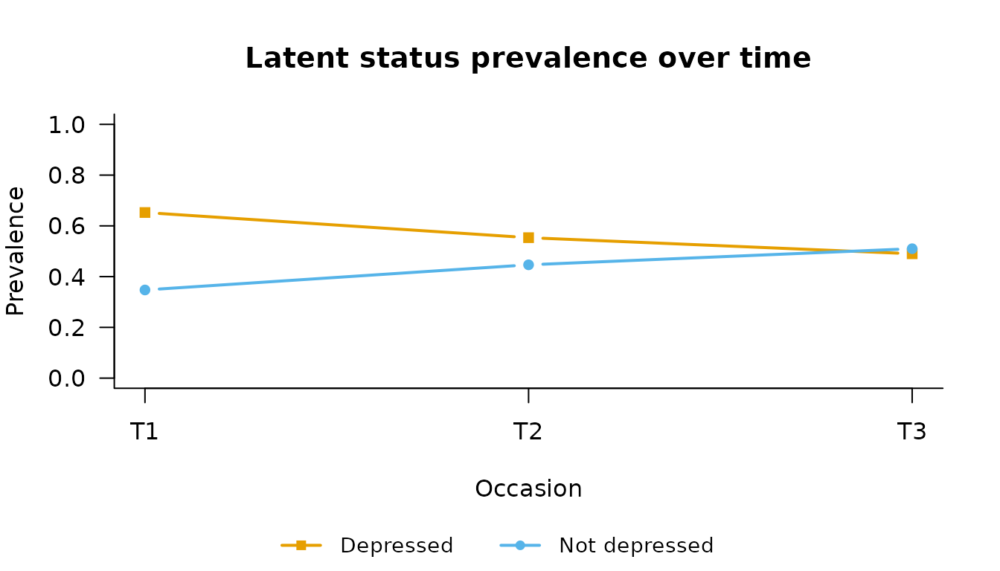

# Latent Transition Analysis: Movement Between Statuses

``` r

library(mixtureEM)
```

Latent transition analysis (LTA) is the longitudinal extension of LCA in
which cases can *move*: at each occasion every case occupies a latent
status, and the model estimates both what the statuses look like
(measurement) and the probabilities of moving between them from one
occasion to the next (transitions) (Collins & Lanza, 2010, ch. 7–8).

## Simulated example: depression status across three assessments

We simulate 1,000 adults assessed three times on four binary symptom
indicators. The truth has two statuses — *Depressed* and *Not depressed*
— with most people staying where they are between assessments, and
remission (Depressed → Not depressed) more common than onset:

``` r

set.seed(2026)
n   <- 1000
rho <- c(Depressed = 0.85, `Not depressed` = 0.15)  # P(symptom | status)
tau <- matrix(c(0.80, 0.20,    # Depressed    -> (Depressed, Not)
                0.10, 0.90),   # Not depressed-> (Depressed, Not)
              2, 2, byrow = TRUE)

status <- matrix(0L, n, 3)
status[, 1] <- rbinom(n, 1, 0.35) + 1L           # 1 = Depressed, 2 = Not
for (t in 2:3)
  status[, t] <- ifelse(runif(n) < tau[status[, t - 1], 1], 1L, 2L)

sym <- matrix(0L, n, 12)
for (t in 1:3) for (j in 1:4)
  sym[, (t - 1) * 4 + j] <- rbinom(n, 1, rho[status[, t]])
colnames(sym) <- paste0("sym", 1:4, "_t", rep(1:3, each = 4))
```

## Fitting the LTA

[`fit_lta()`](https://pdvalencia.github.io/mixtureEM/reference/fit_lta.md)
needs the number of statuses and how the columns divide into occasions.
By default the item-response probabilities are held equal across
occasions (`measurement_invariance = "full"`), which is what makes “the
same status at different times” a meaningful phrase:

``` r

fit <- fit_lta(sym, n_statuses = 2, times = 3, measurement = "binary",
               n_init = 20, random_state = 3)
fit
#> 
#> =========================================================
#>              LATENT TRANSITION ANALYSIS
#> =========================================================
#> Latent statuses    : 2
#> Items x Occasions  : 4 x 3
#> Item parameters    : binary, held equal across occasions
#> Transitions        : 2 tables, one per pair of occasions
#> Converged          : TRUE (in 8 iterations)
#> ---------------------------------------------------------
#>   Log-Likelihood : -6438.55
#>   Parameters     : 13
#>   BIC            : 12966.90
#>   Rel. Entropy   : 0.8846
#> ---------------------------------------------------------
#> Latent status prevalences by occasion:
#>    Status 1 Status 2
#> T1   0.6526   0.3474
#> T2   0.5535   0.4465
#> T3   0.4901   0.5099
#> =========================================================
#> Type summary(model) for transitions, measurement_summary(model) for items.
```

The two core quantities of an LTA are the status prevalences at each
occasion and the transition matrices:

``` r

status_prevalences(fit)
#>     Status 1  Status 2
#> T1 0.6525939 0.3474061
#> T2 0.5534904 0.4465096
#> T3 0.4900659 0.5099341
transition_matrix(fit)
#> $`T1 -> T2`
#>           to
#> from         Status 1  Status 2
#>   Status 1 0.80524682 0.1947532
#>   Status 2 0.08057212 0.9194279
#> 
#> $`T2 -> T3`
#>           to
#> from        Status 1  Status 2
#>   Status 1 0.7947163 0.2052837
#>   Status 2 0.1124232 0.8875768
```

The recovered transitions sit close to the generating matrix: strong
diagonal (stability), with the Depressed → Not depressed cell larger
than its mirror image.
[`plot()`](https://rdrr.io/r/graphics/plot.default.html) shows both:

``` r

plot(fit, type = "prevalence", status_labels = c("Depressed", "Not depressed"))
```



## Is the transition process the same at every interval?

`transition_invariance = "full"` forces one transition matrix for all
intervals; comparing it against the unrestricted model is a likelihood-
ratio test of a time-homogeneous process:

``` r

fit_hom <- fit_lta(sym, n_statuses = 2, times = 3, measurement = "binary",
                   transition_invariance = "full", n_init = 20,
                   random_state = 3)
longitudinal_lrt(fit_hom, fit)
#> 
#> Likelihood-ratio test for nested longitudinal models
#> ---------------------------------------------------------
#>   Restricted : LL =   -6439.2904   parameters = 11
#>   Full       : LL =   -6438.5480   parameters = 13
#>   -2 x diff  : 1.4848   df = 2   p = 0.476
#>   The restriction is not rejected; prefer the more parsimonious model.
```

As simulated (one matrix generated both intervals), the restriction is
not rejected, and the more parsimonious homogeneous model is preferable.

## A mover-stayer model

A *mover-stayer* model (Vermunt, 2004) adds a latent class **above** the
chain: one group transitions freely (the movers) while the other is
locked in place (the stayers). It answers a question a single chain
cannot: is apparent stability just slow movement, or is there a
genuinely immobile group?

``` r

fit_ms <- fit_lta(sym, n_statuses = 2, times = 3, measurement = "binary",
                  mover_stayer = TRUE, n_init = 20, random_state = 3,
                  max_iter = 2000)
fit_ms
#> 
#> =========================================================
#>              LATENT TRANSITION ANALYSIS
#> =========================================================
#> Latent statuses    : 2
#> Latent classes     : 2, the last restricted to no change (mover-stayer)
#> Items x Occasions  : 4 x 3
#> Item parameters    : binary, held equal across occasions
#> Transitions        : 2 tables, one per pair of occasions
#> Converged          : TRUE (in 1230 iterations)
#> ---------------------------------------------------------
#>   Log-Likelihood : -6439.02
#>   Parameters     : 15
#>   BIC            : 12981.66
#>   Rel. Entropy   : 0.8844 (status)
#>                    0.5944 (class)
#> ---------------------------------------------------------
#> Latent class sizes:
#>  Class 1 (mover) Class 2 (stayer) 
#>           0.9066           0.0934 
#> 
#> Latent status prevalences by occasion (whole sample):
#>    Status 1 Status 2
#> T1   0.6526   0.3474
#> T2   0.5533   0.4467
#> T3   0.4902   0.5098
#> 
#> Note: standard errors are not available for a mixture over chains.
#>       Every parameter here is a point estimate.
#> =========================================================
#> Type summary(model) for transitions, measurement_summary(model) for items.
```

On these data the mover-stayer model offers no improvement — the data
were generated from a single chain, and the fitted stayer class is
essentially redundant. On real data, comparing the two BICs (single
chain vs. mover-stayer) is the standard way to decide.

## References

Collins, L. M., & Lanza, S. T. (2010). *Latent class and latent
transition analysis: With applications in the social, behavioral, and
health sciences*. Wiley.

Vermunt, J. K. (2004). Mover-stayer models. In M. S. Lewis-Beck, A.
Bryman, & T. F. Liao (Eds.), *The SAGE encyclopedia of social science
research methods* (Vol. 3, p. 666). SAGE Publications.
<https://doi.org/10.4135/9781412950589.n583>
