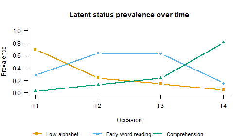

# Latent Transition Analysis: Movement Between Statuses

``` r

library(mixtureEM)
```

Latent transition analysis (LTA) is the longitudinal extension of LCA in
which cases can *move*: at each occasion every case occupies a latent
status, and the model estimates both what the statuses look like
(measurement) and the probabilities of moving between them from one
occasion to the next (transitions) (Collins & Lanza, 2010, ch. 7–8).

## The data: learning to read, kindergarten to first grade

`ecls_reading` holds 3,575 children from the Early Childhood
Longitudinal Study, Kindergarten Class of 1998–99 (ECLS-K), assessed
four times — the fall and spring of kindergarten and the fall and spring
of first grade — on whether they had mastered five reading skills:
letter recognition, beginning sounds, ending sounds, sight words and
words in context. The skills are acquired roughly in that order, which
is what makes these data a textbook case for a *stage-sequential* LTA
(Kaplan, 2008): the latent statuses are stages of learning to read, and
children are expected to move forward through them.

``` r

data(ecls_reading)
items <- ecls_reading[, -1]          # the 20 indicators; column 1 is poverty
round(colMeans(items), 2)
#>   letters_t1 beginning_t1    ending_t1     sight_t1   context_t1   letters_t2 
#>         0.64         0.32         0.18         0.03         0.01         0.90 
#> beginning_t2    ending_t2     sight_t2   context_t2   letters_t3 beginning_t3 
#>         0.73         0.53         0.15         0.05         0.93         0.82 
#>    ending_t3     sight_t3   context_t3   letters_t4 beginning_t4    ending_t4 
#>         0.68         0.27         0.10         0.97         0.93         0.90 
#>     sight_t4   context_t4 
#>         0.81         0.45
```

Mastery of every skill rises from occasion to occasion, and at any one
occasion the skills are ordered: almost everyone knows their letters by
the spring of kindergarten, while reading words in context is still rare
a year later. The indicator columns are already in the wide,
occasion-major layout
[`fit_lta()`](https://pdvalencia.github.io/mixtureEM/reference/fit_lta.md)
expects — the five items at `t1`, then the five at `t2`, and so on.

## Fitting the LTA

[`fit_lta()`](https://pdvalencia.github.io/mixtureEM/reference/fit_lta.md)
needs the number of statuses and how the columns divide into occasions.
Three statuses is the choice the published analyses of these data settle
on, and
[`compare_longitudinal()`](https://pdvalencia.github.io/mixtureEM/reference/compare_longitudinal.md)
can be used to check it. By default the item-response probabilities are
held equal across occasions (`measurement_invariance = "full"`), which
is what makes “the same status at different times” a meaningful phrase:

``` r

fit <- fit_lta(items, n_statuses = 3, times = 4, measurement = "binary",
               n_init = 50, random_state = 7)
fit
#> 
#> =========================================================
#>              LATENT TRANSITION ANALYSIS
#> =========================================================
#> Latent statuses    : 3
#> Items x Occasions  : 5 x 4
#> Item parameters    : binary, held equal across occasions
#> Transitions        : 3 tables, one per pair of occasions
#> Converged          : TRUE (in 31 iterations)
#> ---------------------------------------------------------
#>   Log-Likelihood : -21794.40
#>   Parameters     : 35
#>   AIC            : 43658.80
#>   BIC            : 43875.16
#>   SABIC          : 43763.95
#>   Rel. Entropy   : 0.9038
#>   Best solution  : found by 50 of 50 starts
#> ---------------------------------------------------------
#> Latent status prevalences by occasion:
#>    Status 1 Status 2 Status 3
#> T1   0.6940   0.2832   0.0228
#> T2   0.2350   0.6349   0.1301
#> T3   0.1419   0.6261   0.2320
#> T4   0.0407   0.1540   0.8053
#> =========================================================
#> Type summary(model) for transitions, measurement_summary(model) for items.
```

Latent transition models have many local maxima, and the `Best solution`
line — every one of the 50 starts reached this one — is the evidence
that this is not one of them. When that count is low, raise `n_init`;
see
[`vignette("estimation")`](https://pdvalencia.github.io/mixtureEM/articles/estimation.md).

### What the statuses are

Status numbers are arbitrary labels. Read the item-response
probabilities before naming them:

``` r

measurement_summary(fit)
#> 
#> =========================================================
#>         MEASUREMENT MODEL PARAMETERS (by occasion)
#> =========================================================
#> Held equal across occasions; one set shown.
#> =========================================================
#>              MEASUREMENT MODEL PARAMETERS                
#> =========================================================
#> 
#> CATEGORICAL PROBABILITIES
#> Indicator            | Overall | Class 1 | Class 2 | Class 3
#> ------------------------------------------------------------ 
#> letters@T1           |   0.860 |   0.505 |   0.994 |   1.000
#> beginning@T1         |   0.700 |   0.066 |   0.917 |   0.984
#> ending@T1            |   0.573 |   0.013 |   0.661 |   0.972
#> sight@T1             |   0.315 |   0.000 |   0.051 |   0.984
#> context@T1           |   0.152 |   0.000 |   0.001 |   0.509
#> 
#> At the boundary: letters@T1 in class 3; sight@T1 in class 1; context@T1 in class 1. These probabilities have run to 0 or 1, so the class is defined partly by an item every case in it gives the same answer to, and their standard errors are not interpretable. There are two ways on: read it substantively, since an item every member of a class answers identically is often the finding rather than a fault; or, if that parameter needs a standard error, refit with a stronger prior than the default of 1 - `bayes_constants = list(categorical = 2)` - which holds the estimate off the edge at the cost of shrinking it slightly toward the item's marginal.
#> =========================================================
```

The three statuses are three stages of learning to read:

- **Low alphabet knowledge** — about half know their letters and almost
  nothing beyond;
- **Early word reading** — letters and beginning sounds mastered, ending
  sounds coming, sight words not yet;
- **Early reading comprehension** — everything mastered except, for
  about half of them, words in context.

The `At the boundary` note is worth reading rather than fearing. Nobody
in the low-alphabet stage reads sight words or words in context, and
everyone in the comprehension stage knows their letters: those
probabilities are 0 and 1 because that is what the stages *are*, not
because the estimation went wrong. The note only matters if a standard
error for one of those cells is needed, and says what to do then.

[`fit_lta()`](https://pdvalencia.github.io/mixtureEM/reference/fit_lta.md)
labels the statuses from most to least prevalent at the first occasion,
which here coincides with the developmental order, so status 1 is the
earliest stage and status 3 the latest.

### Prevalences and transitions

The two core quantities of an LTA are the status prevalences at each
occasion and the transition matrices:

``` r

status_prevalences(fit)
#>      Status 1  Status 2   Status 3
#> T1 0.69397743 0.2832291 0.02279346
#> T2 0.23497126 0.6348937 0.13013503
#> T3 0.14192716 0.6260530 0.23201987
#> T4 0.04074088 0.1539600 0.80529915
transition_matrix(fit)
#> $`T1 -> T2`
#>           to
#> from           Status 1    Status 2  Status 3
#>   Status 1 0.3382361420 0.649245556 0.0125183
#>   Status 2 0.0007471057 0.650705904 0.3485470
#>   Status 3 0.0013780845 0.001451571 0.9971703
#> 
#> $`T2 -> T3`
#>           to
#> from          Status 1    Status 2    Status 3
#>   Status 1 0.596435684 0.401041254 0.002523062
#>   Status 2 0.002270869 0.836826166 0.160902965
#>   Status 3 0.002613873 0.004027645 0.993358482
#> 
#> $`T3 -> T4`
#>           to
#> from          Status 1     Status 2  Status 3
#>   Status 1 0.262684467 0.5045190889 0.2327964
#>   Status 2 0.005134317 0.1314941111 0.8633716
#>   Status 3 0.001053633 0.0001410571 0.9988053
```

Rows are where children start, columns where they end up, so the
diagonal holds the probability of staying put. Seven in ten enter
kindergarten in the low-alphabet stage; by the spring of first grade
eight in ten are in the comprehension stage. Movement is almost entirely
forward — the cells below the diagonal are all near zero — and the
interval with the least movement is the middle one, the summer between
kindergarten and first grade, where 60% of the low-alphabet children and
84% of the early-word readers stay where they were.
[`plot()`](https://rdrr.io/r/graphics/plot.default.html) shows both
views:

``` r

labs <- c("Low alphabet", "Early word reading", "Comprehension")
plot(fit, type = "prevalence", status_labels = labs)
```



plot of chunk plot

## Is the transition process the same at every interval?

`transition_invariance = "full"` forces one transition matrix for all
intervals; comparing it against the unrestricted model is a
likelihood-ratio test of a time-homogeneous process:

``` r

fit_hom <- fit_lta(items, n_statuses = 3, times = 4, measurement = "binary",
                   transition_invariance = "full", n_init = 50,
                   random_state = 7)
lr_test(fit_hom, fit)
#> 
#> Likelihood-ratio test for nested models
#> ---------------------------------------------------------
#>   Restricted : LL =  -22935.6514   parameters = 23
#>   Full       : LL =  -21794.4016   parameters = 35
#>   -2 x diff  : 2282.4995   df = 12   p = < 1e-16
#>   The restriction is rejected: the full model fits significantly better.
```

It is rejected decisively. That is the summer: a school year moves
children forward at a rate a vacation does not, and one shared matrix
cannot express it.

## A stage-sequential restriction

If the stages are truly ordered, backward moves are impossible by design
and can be fixed at zero with `forbidden_transitions`, which also saves
their parameters:

``` r

forward_only <- matrix(c(0, 0, 0,     # from Low alphabet: anything allowed
                         1, 0, 0,     # from Early word:   no return to Low
                         1, 1, 0),    # from Comprehension: no return at all
                       3, 3, byrow = TRUE)
fit_fwd <- fit_lta(items, n_statuses = 3, times = 4, measurement = "binary",
                   forbidden_transitions = forward_only, n_init = 50,
                   random_state = 7)
c(unrestricted = fit$metrics$bic, forward_only = fit_fwd$metrics$bic)
#> unrestricted forward_only 
#>     43875.16     43879.93
```

The two BICs are almost tied, and the unrestricted fit is 40
log-likelihood units better for its nine extra parameters. The backward
transitions it estimates are tiny, but with a sample this size a handful
of children who look as though they slipped back is enough for the model
to want them. Whether those slips are real regression or measurement
noise — a child who knew ending sounds in the spring and missed the item
in the fall — is a question regular LTA cannot answer, because it has no
way to represent a stable difference between children that is not a
stage. That is what a random intercept adds; see
[`vignette("rilta")`](https://pdvalencia.github.io/mixtureEM/articles/rilta.md).

## A mover-stayer model

A *mover-stayer* model (Vermunt, 2004) adds a latent class **above** the
chain: one group transitions freely (the movers) while the other is
locked in place (the stayers). It asks whether there is a genuinely
immobile group — here, children who do not progress at all across the
two years:

``` r

fit_ms <- fit_lta(items, n_statuses = 3, times = 4, measurement = "binary",
                  mover_stayer = TRUE, n_init = 20, random_state = 7,
                  max_iter = 2000)
c(single_chain = fit$metrics$bic, mover_stayer = fit_ms$metrics$bic)
#> single_chain mover_stayer 
#>     43875.16     43894.49
```

The stayer class is small (about 6%) and buys too little likelihood for
its three parameters: BIC prefers the single chain. On these data nearly
everyone moves.

## Poverty as a covariate

Covariates can predict the status children start in
(`predictors_initial`) and the transitions they make
(`predictors_transition`). One slope per covariate is shared across
origin statuses within each interval (`transition_effects = "common"`),
which is the well-behaved specification; the alternative, a separate
regression per origin, is saturated and fails to converge usefully when
transitions are sparse.

``` r

fit_pov <- fit_lta(items, n_statuses = 3, times = 4, measurement = "binary",
                   predictors_initial = ecls_reading["poverty"],
                   predictors_transition = ecls_reading["poverty"],
                   n_init = 20, random_state = 7)
c(no_covariate = fit$metrics$bic, poverty = fit_pov$metrics$bic)
#> no_covariate      poverty 
#>     43875.16     43521.08
```

Poverty improves BIC by some 350 points. One thing to check before
reading the coefficients: once covariates index the statuses,
[`fit_lta()`](https://pdvalencia.github.io/mixtureEM/reference/fit_lta.md)
no longer relabels them by prevalence, so the numbering may differ from
the fit above.
[`status_prevalences()`](https://pdvalencia.github.io/mixtureEM/reference/status_prevalences.md)
says which is which —

``` r

round(status_prevalences(fit_pov), 3)
#>    Status 1 Status 2 Status 3
#> T1    0.023    0.285    0.692
#> T2    0.133    0.643    0.223
#> T3    0.232    0.644    0.125
#> T4    0.819    0.147    0.034
```

— here status 3 is the low-alphabet stage (the one 69% start in), status
2 early word reading and status 1 comprehension. The coefficients are
multinomial logits against the last status, so with this labelling every
contrast is *relative to the low-alphabet stage*:

``` r

lta_covariate_summary(fit_pov)
#> 
#> =========================================================
#>    LATENT TRANSITION MODEL - COVARIATE EFFECTS (logits)
#> =========================================================
#> Reference status: 3. Coefficients are contrasts against it;
#> exp(coefficient) is an odds ratio.
#> 
#> PREDICTING LATENT STATUS AT THE FIRST OCCASION
#>    Status      Term Estimate    SE      z        p    OR
#>  Status 1 Intercept   -3.169 0.115 -27.47  < 1e-16 0.042
#>  Status 1   poverty   -2.091 0.574  -3.65 0.000267 0.124
#>  Status 2 Intercept   -0.677 0.040 -16.95  < 1e-16 0.508
#>  Status 2   poverty   -1.462 0.131 -11.17  < 1e-16 0.232
#> 
#> PREDICTING TRANSITIONS
#> 
#>   [occasion 1 -> 2]
#>       Status      Term Estimate     SE      z        p          OR
#>  to Status 1 Intercept   -3.065  0.194 -15.84  < 1e-16 4.70000e-02
#>  to Status 1    from:1   25.000 27.479   0.91 0.362944 7.20049e+10
#>  to Status 1    from:2    9.311  1.204   7.73 1.04e-14 1.10580e+04
#>  to Status 1   poverty   -0.775  0.231  -3.36 0.000789 4.61000e-01
#>  to Status 2 Intercept    0.979  0.052  18.73  < 1e-16 2.66300e+00
#>  to Status 2    from:1   -1.253 32.634  -0.04 0.969370 2.86000e-01
#>  to Status 2    from:2    5.931  1.190   4.99 6.19e-07 3.76578e+02
#>  to Status 2   poverty   -1.186  0.097 -12.27  < 1e-16 3.05000e-01
#> 
#>   [occasion 2 -> 3]
#>       Status      Term Estimate    SE     z        p         OR
#>  to Status 1 Intercept   -5.132 0.784 -6.55 5.88e-11      0.006
#>  to Status 1    from:1   11.714 1.248  9.39  < 1e-16 122263.675
#>  to Status 1    from:2    9.578 0.888 10.79  < 1e-16  14441.144
#>  to Status 1   poverty   -2.156 0.285 -7.57 3.60e-14      0.116
#>  to Status 2 Intercept   -0.030 0.089 -0.34    0.732      0.970
#>  to Status 2    from:1    0.593 1.299  0.46    0.648      1.810
#>  to Status 2    from:2    6.016 0.422 14.25  < 1e-16    409.880
#>  to Status 2   poverty   -0.919 0.149 -6.18 6.49e-10      0.399
#> 
#>   [occasion 3 -> 4]
#>       Status      Term Estimate     SE     z        p       OR
#>  to Status 1 Intercept    0.276  0.161  1.71   0.0880    1.317
#>  to Status 1    from:1    8.336  3.487  2.39   0.0168 4171.490
#>  to Status 1    from:2    5.004  0.316 15.83  < 1e-16  148.938
#>  to Status 1   poverty   -0.927  0.210 -4.42 9.76e-06    0.396
#>  to Status 2 Intercept    0.695  0.152  4.58 4.62e-06    2.003
#>  to Status 2    from:1  -14.230 17.057 -0.83   0.4041    0.000
#>  to Status 2    from:2    2.543  0.314  8.10 5.37e-16   12.719
#>  to Status 2   poverty   -0.106  0.198 -0.54   0.5924    0.899
#> 
#> =========================================================
```

Poverty lowers the odds of starting kindergarten beyond the low-alphabet
stage (OR 0.23 for early word reading, 0.12 for comprehension), and
lowers the odds of reaching comprehension in every interval. The effect
is sharpest over the summer, where a child in poverty has 0.40 times the
odds of reaching early word reading and 0.12 times the odds of reaching
comprehension, relative to staying in low alphabet. The `from:` terms
are the origin-status intercepts and are not of interest in themselves;
the ones with enormous standard errors belong to cells almost nobody
occupies.

### The same question in three steps

In the fit above the covariate and the statuses are estimated together,
so poverty has a say in what the statuses *are*: a status is partly
defined by who is poor. Usually that pull is small, but nothing
guarantees it, and it means adding or dropping a covariate can quietly
change the statuses whose prevalences you are comparing. The stepwise
estimators remove it. With `n_steps = 3` (Vermunt, 2010; Nylund-Gibson
et al., 2014)
[`fit_lta()`](https://pdvalencia.github.io/mixtureEM/reference/fit_lta.md)
first fits the LTA with no covariates, then assigns every child a status
at every occasion, and finally regresses those assigned statuses on
poverty while correcting for the children the assignment gets wrong. The
statuses are fixed before poverty is ever looked at.

``` r

fit_pov3 <- fit_lta(items, n_statuses = 3, times = 4, measurement = "binary",
                    predictors_initial = ecls_reading["poverty"],
                    predictors_transition = ecls_reading["poverty"],
                    n_steps = 3, n_init = 20, random_state = 7)
round(status_prevalences(fit_pov3), 3)
#>    Status 1 Status 2 Status 3
#> T1    0.683    0.296    0.021
#> T2    0.220    0.635    0.144
#> T3    0.118    0.646    0.235
#> T4    0.033    0.146    0.821
```

Here status 1 is the low-alphabet stage, status 2 early word reading and
status 3 comprehension, so the contrasts below are all against
comprehension:

``` r

lta_covariate_summary(fit_pov3)
#> 
#> =========================================================
#>    LATENT TRANSITION MODEL - COVARIATE EFFECTS (logits)
#> =========================================================
#> Reference status: 3. Coefficients are contrasts against it;
#> exp(coefficient) is an odds ratio.
#> 
#> PREDICTING LATENT STATUS AT THE FIRST OCCASION
#>    Status      Term Estimate    SE     z       p     OR
#>  Status 1 Intercept    3.254 0.152 21.41 < 1e-16 25.903
#>  Status 1   poverty    1.939 0.711  2.73 0.00637  6.951
#>  Status 2 Intercept    2.626 0.158 16.60 < 1e-16 13.813
#>  Status 2   poverty    0.535 0.735  0.73 0.46649  1.708
#> 
#> PREDICTING TRANSITIONS
#> 
#>   [occasion 1 -> 2]
#>       Status      Term Estimate     SE     z        p          OR
#>  to Status 1 Intercept  -11.062 32.721 -0.34   0.7353       0.000
#>  to Status 1    from:1   15.235 32.735  0.47   0.6416 4133670.860
#>  to Status 1    from:2  -14.736  2.576 -5.72 1.06e-08       0.000
#>  to Status 1   poverty    0.747  0.350  2.14   0.0326       2.111
#>  to Status 2 Intercept  -10.599 29.549 -0.36   0.7198       0.000
#>  to Status 2    from:1   15.761 29.565  0.53   0.5940 7000123.656
#>  to Status 2    from:2   11.060 29.550  0.37   0.7082   63557.209
#>  to Status 2   poverty   -0.435  0.326 -1.33   0.1824       0.647
#> 
#>   [occasion 2 -> 3]
#>       Status      Term Estimate     SE     z        p           OR
#>  to Status 1 Intercept  -11.779 13.722 -0.86   0.3906 0.000000e+00
#>  to Status 1    from:1   21.082 17.537  1.20   0.2293 1.431535e+09
#>  to Status 1    from:2  -12.879  2.959 -4.35 1.35e-05 0.000000e+00
#>  to Status 1   poverty    2.269  0.526  4.31 1.61e-05 9.674000e+00
#>  to Status 2 Intercept  -11.293 18.886 -0.60   0.5499 0.000000e+00
#>  to Status 2    from:1   20.617 21.850  0.94   0.3454 8.989199e+08
#>  to Status 2    from:2   12.911 18.886  0.68   0.4942 4.046625e+05
#>  to Status 2   poverty    1.338  0.485  2.76   0.0058 3.813000e+00
#> 
#>   [occasion 3 -> 4]
#>       Status      Term Estimate    SE      z        p          OR
#>  to Status 1 Intercept   -6.651 1.198  -5.55 2.82e-08       0.001
#>  to Status 1    from:1    6.497 1.212   5.36 8.38e-08     662.942
#>  to Status 1    from:2    0.658 1.507   0.44 0.662152       1.932
#>  to Status 1   poverty    0.914 0.252   3.63 0.000289       2.494
#>  to Status 2 Intercept  -15.345 1.521 -10.09  < 1e-16       0.000
#>  to Status 2    from:1   15.845 1.524  10.39  < 1e-16 7608607.358
#>  to Status 2    from:2   13.321 1.522   8.75  < 1e-16  609671.298
#>  to Status 2   poverty    0.803 0.151   5.34 9.48e-08       2.233
#> 
#> Standard errors are the three-step (pseudo-maximum-likelihood) ones:
#> the curvature of step 3's likelihood in these coefficients, plus the
#> sampling uncertainty of the step-1 estimates the classification
#> error was computed from. See `?fit_lta`.
#> 
#> =========================================================
```

Turned around to be against low alphabet, as above, the answer barely
moves. A child in poverty has 0.25 times the odds of starting
kindergarten in early word reading (0.23 in one step) and 0.15 times the
odds of starting in comprehension (0.12). Over the summer those odds are
0.39 and 0.10 (0.40 and 0.12). The poverty effect was not an artefact of
letting poverty shape the statuses. When the two routes disagree, the
three-step answer is the one to trust about the covariate, because its
statuses are the ones the indicators alone define.

The standard errors account both for the assignments being uncertain and
for the first step’s estimates being estimates. Other stepwise options
work the same way: `correction = "BCH"` reweights the cases instead of
modelling the misassignment, `n_steps = 2` holds the step-1 measurement
model fixed and fits the covariates on the full likelihood, and
`distal =` (with `assignment = "modal"`) adds an outcome measured after
the last occasion, modelled by the status reached there.
[`?fit_lta`](https://pdvalencia.github.io/mixtureEM/reference/fit_lta.md)
has the details.

Whether the poverty effect on the *transitions* survives once stable
between-child differences in reading readiness are modelled directly is
the question
[`vignette("rilta")`](https://pdvalencia.github.io/mixtureEM/articles/rilta.md)
takes up.

## References

Collins, L. M., & Lanza, S. T. (2010). *Latent class and latent
transition analysis: With applications in the social, behavioral, and
health sciences*. Wiley.

Kaplan, D. (2008). An overview of Markov chain methods for the study of
stage-sequential developmental processes. *Developmental Psychology*,
*44*(2), 457–467. <https://doi.org/10.1037/0012-1649.44.2.457>

Nylund-Gibson, K., Grimm, R., Quirk, M., & Furlong, M. (2014). A latent
transition mixture model using the three-step specification. *Structural
Equation Modeling*, *21*(3), 439–454.
<https://doi.org/10.1080/10705511.2014.915375>

Vermunt, J. K. (2004). Mover-stayer models. In M. S. Lewis-Beck, A.
Bryman, & T. F. Liao (Eds.), *The SAGE encyclopedia of social science
research methods* (Vol. 3, p. 666). SAGE Publications.
<https://doi.org/10.4135/9781412950589.n583>

Vermunt, J. K. (2010). Latent class modeling with covariates: Two
improved three-step approaches. *Political Analysis*, *18*(4), 450–469.
<https://doi.org/10.1093/pan/mpq025>
