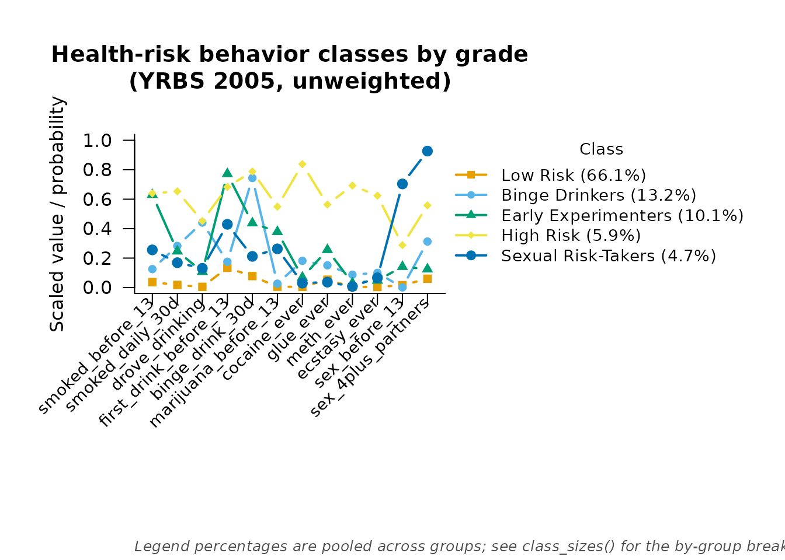

# Multiple-Group LCA: Do the Classes Differ by Grade?

``` r

library(mixtureEM)
```

## The question

A latent class model assumes the classes mean the same thing to every
case in the data. When the data span groups — here, four grades of high
school — that assumption is worth checking rather than taking for
granted, and it splits into two questions that have to be asked in that
order. First, *measurement invariance*: do the twelve health-risk items
mean the same thing to a ninth-grader as to a twelfth-grader, in the
sense that the same class membership implies the same item-response
probabilities regardless of grade? Second, and only once the first is
settled, *prevalence*: are the risk classes more common in some grades
than others? A prevalence comparison between groups whose items do not
function the same way is comparing different things.

Clogg and Goodman (1985) introduced the simultaneous — multiple-group —
latent structure model, and set out the three models as a ladder. Their
vocabulary is worth having, because it is the vocabulary the literature
uses:

| The model | `group_effects` | Clogg and Goodman’s name |
|----|----|----|
| items and class sizes both free by grade | `"both"` | heterogeneous, unrestricted |
| items pooled, class sizes free by grade | `"prevalence"` | partially homogeneous |
| items and class sizes both pooled | `"none"` | homogeneous |

The middle rung is the one that carries the invariance assumption: in
it, as Kankaraš, Moors and Vermunt (2011) put it, “the relationships
between indicator items and the latent variable are identical across
groups so that the class memberships have the same meaning in all
groups.” So the pipeline below fits all three models, tests the middle
rung against the top one first, and only then tests the bottom rung
against the middle.

The worked example is Collins and Lanza’s (2010, ch. 5). It uses the
same `yrbs2005` data as
[`vignette("survey_lca")`](https://pdvalencia.github.io/mixtureEM/articles/survey_lca.md),
but unweighted, matching how they present it; see that vignette for the
same items analysed with the sampling design in play.

## Data

`grade` is a factor with levels 9 through 12, with no missing values in
the bundled sample:

``` r

data(yrbs2005)
items <- yrbs2005[, 3:14]
grade <- yrbs2005$grade
table(grade)
#> grade
#>    9   10   11   12 
#> 3332 3470 3529 3509
```

## Step 1: do the items mean the same thing in every grade?

The invariant model first. `group_effects = "prevalence"` pools the
item-response probabilities across grades — that pooling *is* the
measurement-invariance assumption — while letting each grade have its
own class sizes:

``` r

set.seed(1)
m_free <- fit_mixture(items, n_classes = 5, measurement = "binary",
                      group = grade, group_effects = "prevalence",
                      n_init = 20, max_iter = 2000, n_steps = 1)
m_free
#> =========================================================
#>                   LATENT MIXTURE MODEL                   
#> =========================================================
#> Classes Estimated  : 5
#> Estimation Method  : 1-step
#> Converged          : TRUE (in 74 iterations)
#> Missing Data       : 7186 / 166080 cells (4.3%) in 12 items — FIML (MAR assumption)
#> ---------------------------------------------------------
#>   Log-Likelihood : -48032.87
#>   Parameters     : 76
#>   AIC            : 96217.73
#>   BIC            : 96790.42
#>   SABIC          : 96548.90
#>   Rel. Entropy   : 0.8046
#>   Best solution  : found by 6 of 20 starts
#>   (Comparing with software that counts the grouping variable's own proportions? Use metrics$ll_knownclass = -67215.74 and metrics$n_params_knownclass = 79.)
#> ---------------------------------------------------------
#> Class Weights (Sizes):
#>   Class 1: 66.06%
#>   Class 2: 13.17%
#>   Class 3: 10.13%
#>   Class 4: 5.91%
#>   Class 5: 4.73%
#> =========================================================
#> Type summary(model) for structural parameters or measurement_summary(model) for item parameters.
```

A four-group, five-class fit on this many cases is materially more
expensive per start than the package’s other vignettes; the solution
above replicated across 6 of the 20 starts.

`group_effects = "both"` frees the item-response probabilities by grade
as well as the class sizes, and comparing the two by likelihood ratio
tests exactly the assumption the invariant model is making:

``` r

set.seed(1)
m_both <- fit_mixture(items, n_classes = 5, measurement = "binary",
                      group = grade, group_effects = "both",
                      n_init = 20, max_iter = 2000, n_steps = 1)
#> Warning: The reported solution was found by 1 of 21 starts that ran to
#> convergence, out of 20 requested. EM climbs the peak it starts nearest, so a
#> maximum seen once may be the best of a small sample of the likelihood surface
#> rather than the best there is: refit with n_init = 100 before reporting.
lr_test(m_free, m_both)
#> 
#> Likelihood-ratio test for nested models
#> ---------------------------------------------------------
#>   Restricted : LL =  -48032.8661   parameters = 76
#>   Full       : LL =  -47528.9757   parameters = 256
#>   -2 x diff  : 1007.7807   df = 180   p = < 1e-16
#>   The restriction is rejected: the full model fits significantly better.
```

[`lr_test()`](https://pdvalencia.github.io/mixtureEM/reference/lr_test.md)
takes the restricted model first and the full model second — reversing
the order is an error.

`m_both` carries a warning worth repeating rather than hiding: only 1 of
the 20 requested starts converged to the log-likelihood reported above,
so this solution has not been shown to be the global optimum the way
`m_free`’s was. 256 parameters spread across five classes and four
grades is a much harder surface to search than the models later in this
vignette, and `n_init = 20` is not enough to be confident of it here —
the package’s own advice is to refit with `n_init = 100` before
reporting this specific comparison as a finding rather than an
illustration.

With N in the thousands, a likelihood-ratio test like this one also has
power to detect even a trivially small departure from invariance, so a
rejection on its own does not settle the question. Kankaraš, Moors and
Vermunt (2011) make the point directly: “when sample sizes are large,
likelihood-ratio tests tend to be too conservative, indicating misfit
even for minimal differences between two models”, and “since they also
control for sample size, BIC and CAIC are preferred fit statistics in
situations when sample size is large.” Here the test rejects invariance
decisively, which on its own would be unsurprising at this sample size.
But the two information criteria disagree about which model is
preferable: AIC favours the fully group-varying model (it is smaller for
`m_both`), while BIC — which penalises the 180 extra parameters more
heavily — favours the invariant `m_free`. That split is itself
informative: the departures from invariance are real enough for the
likelihood-ratio test to see them at this N, but not so large that a
criterion penalising complexity thinks they are worth the extra
parameters.

`m_free` is therefore the model the rest of this vignette carries
forward. A researcher would want to look at *which* items differ by
grade — and would want the better-replicated fit — before treating the
invariant model as settled rather than as good enough to interpret.

## The five classes

``` r

measurement_summary(m_free)
#> =========================================================
#>              MEASUREMENT MODEL PARAMETERS                
#> =========================================================
#> 
#> CATEGORICAL PROBABILITIES
#> Indicator             | Overall | Class 1 | Class 2 | Class 3 | Class 4 | Class 5
#> --------------------------------------------------------------------------------- 
#> smoked_before_13      |   0.154 |   0.037 |   0.125 |   0.630 |   0.639 |   0.256
#> smoked_daily_30d      |   0.120 |   0.018 |   0.282 |   0.246 |   0.653 |   0.169
#> drove_drinking        |   0.105 |   0.005 |   0.442 |   0.107 |   0.452 |   0.131
#> first_drink_before_13 |   0.255 |   0.134 |   0.175 |   0.772 |   0.683 |   0.429
#> binge_drink_30d       |   0.247 |   0.078 |   0.744 |   0.438 |   0.788 |   0.212
#> marijuana_before_13   |   0.089 |   0.005 |   0.026 |   0.379 |   0.549 |   0.263
#> cocaine_ever          |   0.083 |   0.004 |   0.181 |   0.069 |   0.838 |   0.030
#> glue_ever             |   0.116 |   0.053 |   0.151 |   0.256 |   0.564 |   0.037
#> meth_ever             |   0.058 |   0.004 |   0.087 |   0.030 |   0.692 |   0.008
#> ecstasy_ever          |   0.061 |   0.004 |   0.100 |   0.048 |   0.624 |   0.066
#> sex_before_13         |   0.074 |   0.016 |   0.001 |   0.141 |   0.288 |   0.704
#> sex_4plus_partners    |   0.170 |   0.060 |   0.312 |   0.125 |   0.558 |   0.927
#> 
#> Missing data: 7186 of 166080 cells (4.3%) across 12 items, handled via FIML (MAR assumption).
#> 
#> At the boundary: sex_before_13 in class 2. These probabilities have run to 0 or 1, so the class is defined partly by an item every case in it gives the same answer to, and their standard errors are not interpretable. There are two ways on: read it substantively, since an item every member of a class answers identically is often the finding rather than a fault; or, if that parameter needs a standard error, refit with a stronger prior than the default of 1 - `bayes_constants = list(categorical = 2)` - which holds the estimate off the edge at the cost of shrinking it slightly toward the item's marginal.
#> =========================================================
```

This fit is unweighted and grouped, and its classes do not read the same
way
[`vignette("survey_lca")`](https://pdvalencia.github.io/mixtureEM/articles/survey_lca.md)’s
do — which is precisely the point of comparing them. That fit had one
class high on essentially every item; this one splits that pattern in
two: class 4 is where the hard-drug items (`cocaine_ever`, `glue_ever`,
`meth_ever`, `ecstasy_ever`) and the smoking items peak, while class 5
is instead the class where the two sexual-risk items (`sex_before_13`,
`sex_4plus_partners`) are far higher than in any other class, at
moderate levels of everything else. There is no single “high risk across
everything” class in this solution. In size order, the five classes are
**Low Risk, Binge Drinkers, Early Experimenters, High Risk,** and
**Sexual Risk-Takers**:

``` r

class_labels <- c("Low Risk", "Binge Drinkers", "Early Experimenters",
                  "High Risk", "Sexual Risk-Takers")
plot(m_free, class_labels = class_labels,
     main = "Health-risk behavior classes by grade (YRBS 2005, unweighted)")
```



Class 2 (Binge Drinkers) stands out on `drove_drinking` and
`binge_drink_30d` specifically; class 3 (Early Experimenters) stands out
on the two early-onset items, `smoked_before_13` and
`first_drink_before_13`, more than on the items that come later in
adolescence. High Risk and Sexual Risk-Takers replace the single “High
risk” class from the weighted fit because the hard-drug cluster and the
sexual-risk cluster no longer travel together in one class here.

## Step 2: are the classes more common in some grades than others?

Fitting the same model with `group_effects = "none"` forces every grade
to share the same class sizes as well, which is the null hypothesis that
prevalence does not differ by grade at all — Clogg and Goodman’s
homogeneous model:

``` r

set.seed(1)
m_none <- fit_mixture(items, n_classes = 5, measurement = "binary",
                      group = grade, group_effects = "none",
                      n_init = 5, max_iter = 2000, n_steps = 1)
lr_test(m_none, m_free)
#> 
#> Likelihood-ratio test for nested models
#> ---------------------------------------------------------
#>   Restricted : LL =  -48345.2591   parameters = 64
#>   Full       : LL =  -48032.8661   parameters = 76
#>   -2 x diff  : 624.7859   df = 12   p = < 1e-16
#>   The restriction is rejected: the full model fits significantly better.
```

With four grades and five classes there are (4 - 1) x (5 - 1) = 12 free
prevalence contrasts between the two models, and the printed `df` above
confirms it. The restriction is rejected: class prevalence does differ
by grade. This reproduces the “all five latent classes” comparison from
Collins and Lanza’s prevalence-differences table.

Because `group = grade` is supplied, `m_free` and `m_none` also report a
log-likelihood on the known-class scale, `metrics$ll_knownclass` — that
is the number that lines up with what other programs print for this kind
of model, as opposed to `metrics$ll`, which is on this package’s own
1-step scale.

``` r

m_free$metrics$ll_knownclass
#> [1] -67215.74
m_none$metrics$ll_knownclass
#> [1] -67528.13
```

## Step 3: which class’s prevalence differs by grade?

The omnibus test says prevalence differs by grade somewhere among the
five classes. Collins and Lanza go further and ask the question
separately for each class: hold Low Risk’s share fixed across grades
while the other four float and renormalise, refit, and see how much
likelihood that costs. Repeated five times, this reproduces their Table
5.24. `group_prevalence_equal` fits exactly this restriction — pass it
the index of the class to freeze and it holds that column of the
per-grade class probabilities to one shared value while the rest adjust
freely.

Two things about the restriction are worth knowing before reading the
table.

**It is tested by likelihood ratio, not by a Wald test on the
class-membership regression’s group coefficients, and that is
deliberate.** A Wald test on a group dummy asks whether one class’s
log-odds relative to the reference class departs from the reference
group’s — a comparison relative to the group average, not “is this
class’s share literally the same in every grade” — and the two questions
can disagree. Clogg and Goodman single this restriction out as one
needing “special treatment”: for a restriction of exactly this form,
they note, “the group sizes must be taken into account in order to
obtain the correct restrictions and the appropriate likelihood
equations.”
[`lr_test()`](https://pdvalencia.github.io/mixtureEM/reference/lr_test.md)
against the unrestricted fit is the exact test of the question actually
being asked.

**Each restricted fit has to be anchored to the unrestricted solution,
so the random restarts are switched off.** A mixture model’s classes are
named only by their own parameters, and “class *k* has the same
prevalence in every grade” is a restriction on a *named* class: permute
the labels and the frozen slot lands on a different substantive class at
exactly the same likelihood. The restricted model’s *global* maximum is
therefore one and the same number whichever class is named — whichever
class is cheapest to freeze — and a search reports that number every
time, for every k. What the question asks for is the maximum near the
unrestricted solution, where class *k* still means what it means in
`m_free`. `start_from = m_free` supplies exactly that: it seeds each fit
at `m_free`’s own item-response probabilities and per-grade class sizes
and runs no other start. This is the one place in the package where a
starting value replaces the search rather than joining it, and other
latent-class software arrives at the same arrangement from the other
side — the restriction is expressed there by supplying the unrestricted
solution as starting values, and supplying starting values makes the
random-start option unavailable in the same call.

``` r

per_class <- lapply(1:5, function(k)
  lr_test(fit_mixture(items, n_classes = 5, measurement = "binary",
                      group = grade, group_effects = "prevalence",
                      group_prevalence_equal = k, start_from = m_free,
                      n_steps = 1, max_iter = 2000),
          m_free))
data.frame(class = class_labels,
           dG2 = vapply(per_class, function(t) t$statistic, numeric(1)),
           df = vapply(per_class, function(t) t$df, numeric(1)),
           p_value = vapply(per_class, function(t) t$p_value, numeric(1)))
#>                 class         dG2 df       p_value
#> 1            Low Risk  61.2464552  3  3.183513e-13
#> 2      Binge Drinkers 468.0697346  3 3.962496e-101
#> 3 Early Experimenters 176.4318330  3  5.199765e-38
#> 4           High Risk   0.4150451  3  9.371173e-01
#> 5  Sexual Risk-Takers   5.6799906  3  1.282609e-01
```

Each row matches Collins and Lanza’s Table 5.24 to about one decimal
(61.3, 468.5, 176.6, 0.4 and 5.7, in the same class order as above), and
the pattern makes substantive sense against the item plot above: Binge
Drinkers, the class whose share changes most across grades in that plot,
is the most expensive to force flat by a wide margin, while High Risk
barely moves across grades and costs almost nothing to freeze. The
all-classes restriction from the previous section (dG2 = 624.8, df = 12,
against the book’s 625.5) is the sum of a similar idea applied to every
class’s share at once, not to each one separately.

## References

Clogg, C. C., & Goodman, L. A. (1985). Simultaneous latent structure
analysis in several groups. *Sociological Methodology*, *15*, 81-110.

Collins, L. M., & Lanza, S. T. (2010). *Latent class and latent
transition analysis: With applications in the social, behavioral, and
health sciences*. Wiley.

Kankaraš, M., Moors, G., & Vermunt, J. K. (2011). Testing for
measurement invariance with latent class analysis. In E. Davidov, P.
Schmidt, & J. Billiet (Eds.), *Cross-cultural analysis: Methods and
applications* (pp. 359-384). Routledge.
