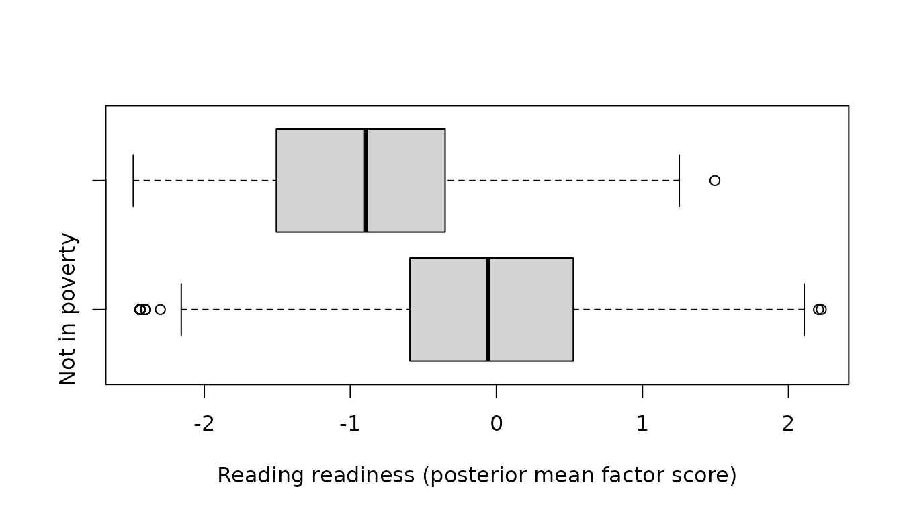

# Random-Intercept LTA: Separating Traits from Transitions

``` r

library(mixtureEM)
```

## The problem with ordinary LTA

Latent transition analysis puts every person in a latent status at each
occasion and estimates how they move between statuses. It assumes that,
within a status, people are exchangeable: two children in the *early
word reading* stage are equally likely to know their ending sounds, and
any difference between them is noise.

That assumption is usually false. People differ in stable, trait-like
ways that are not stages at all: a child with a generally high
propensity to endorse the items will look “further along” at every
occasion, and an ordinary LTA has only one way to represent that — as a
status. The consequences are systematic (Muthén & Asparouhov, 2022):

- **Stability is overstated.** A child who scores high at every occasion
  because of a stable trait is recorded as *staying* in an advanced
  status, so the diagonal of the transition matrix inflates.
- **Statuses absorb the trait.** Item-response probabilities are pushed
  towards 0 and 1, statuses look more distinct than they are, and BIC
  can ask for extra statuses that are really levels of the trait.
- **Covariate effects are misattributed.** A covariate that predicts the
  trait shows up as predicting transitions.

Random-intercept LTA (RI-LTA) adds a person-level factor to the
measurement model — a random intercept shared by every indicator at
every occasion — so that stable between-person differences have
somewhere to go other than the statuses. What is left in the transition
matrices is then *within-person* change.

This vignette walks through the pipeline an applied analysis needs:
ordinary LTA as a baseline, the random intercept, model comparison, and
covariates. It uses the reading-proficiency data introduced in
[`vignette("lta")`](https://pdvalencia.github.io/mixtureEM/articles/lta.md);
read that first for what the data are and how the ordinary model is
interpreted.

## Setup

``` r

data(ecls_reading)
items <- ecls_reading[, -1]
```

Two arguments appear on every fit below.
[`fit_lta()`](https://pdvalencia.github.io/mixtureEM/reference/fit_lta.md)’s
defaults put a light prior on the status and transition probabilities
(`smoothing = 1`) and on the item probabilities (`bayes_constants`),
which keeps estimates off the boundary and is the right default for
exploratory work. Here they are switched off so the fits are plain
maximum likelihood, which is what the published analyses of these data
report and what the numbers below can be checked against. On a sample
this size the difference is about one log-likelihood unit and no change
in interpretation.

``` r

ml <- list(smoothing = 0, bayes_constants = list(categorical = 0))
```

Every fit is also run at `standard_errors = FALSE` until the final
model, because the standard errors are the slow part and are not needed
to compare models.

## Step 1: the ordinary LTA

``` r

fit_lta0 <- fit_lta(items, n_statuses = 3, times = 4, n_init = 50,
                    random_state = 7, standard_errors = FALSE,
                    smoothing = ml$smoothing, bayes_constants = ml$bayes_constants)
fit_lta0
#> 
#> =========================================================
#>              LATENT TRANSITION ANALYSIS
#> =========================================================
#> Latent statuses    : 3
#> Items x Occasions  : 5 x 4
#> Item parameters    : binary, held equal across occasions
#> Transitions        : 3 tables, one per pair of occasions
#> Converged          : TRUE (in 34 iterations)
#> ---------------------------------------------------------
#>   Log-Likelihood : -21793.17
#>   Parameters     : 35
#>   AIC            : 43656.34
#>   BIC            : 43872.70
#>   SABIC          : 43761.49
#>   Rel. Entropy   : 0.9042
#>   Best solution  : found by 48 of 50 starts
#> ---------------------------------------------------------
#> Latent status prevalences by occasion:
#>    Status 1 Status 2 Status 3
#> T1   0.6937   0.2836   0.0227
#> T2   0.2348   0.6353   0.1299
#> T3   0.1417   0.6266   0.2318
#> T4   0.0406   0.1542   0.8052
#> 
#> Note: 3 transition(s) estimated at the zero boundary; see $boundary.
#> =========================================================
#> Type summary(model) for transitions, measurement_summary(model) for items.
```

Three stages of learning to read — *low alphabet knowledge*, *early word
reading*, *early reading comprehension* — with 69% of children in the
first at the start of kindergarten and 81% in the third by the end of
first grade. (The item probabilities, and the note about the ones at the
boundary, are in
[`vignette("lta")`](https://pdvalencia.github.io/mixtureEM/articles/lta.md).)
Keep the transition matrices in mind:

``` r

transition_matrix(fit_lta0)
#> $`T1 -> T2`
#>           to
#> from           Status 1     Status 2   Status 3
#>   Status 1 3.382748e-01 6.493184e-01 0.01240686
#>   Status 2 5.390649e-04 6.517036e-01 0.34775735
#>   Status 3 1.388794e-11 1.388794e-11 1.00000000
#> 
#> $`T2 -> T3`
#>           to
#> from          Status 1   Status 2    Status 3
#>   Status 1 0.596264013 0.40147254 0.002263452
#>   Status 2 0.002124324 0.83720306 0.160672614
#>   Status 3 0.002361944 0.00347309 0.994164966
#> 
#> $`T3 -> T4`
#>           to
#> from           Status 1     Status 2  Status 3
#>   Status 1 0.2626498893 5.050921e-01 0.2322580
#>   Status 2 0.0051735930 1.318729e-01 0.8629535
#>   Status 3 0.0006931915 9.999485e-13 0.9993068
```

## Step 2: add a continuous random intercept

`random_intercept = "continuous"` adds a normally distributed factor
with one loading per indicator, held equal across occasions — if the
loadings changed over time, the factor would not be a stable trait. The
factor is integrated out numerically, and `n_quadrature` sets how
finely: 30 nodes is the setting the published analyses of these data
used, and is checked below.

``` r

fit_ri <- fit_lta(items, n_statuses = 3, times = 4, n_init = 20,
                  random_intercept = "continuous", n_quadrature = 30,
                  random_state = 7, standard_errors = FALSE,
                  smoothing = ml$smoothing, bayes_constants = ml$bayes_constants)
#> Warning: A response probability has collapsed towards the boundary: context in
#> class 1 (logit -10.87, p = 1.9e-05); sight in class 1 (logit -8.55, p =
#> 0.000194); letters in class 3 (logit +8.08, p = 1). These estimates are not
#> interpretable, and this fit's BIC cannot be compared with a clean fit's. Ways
#> out, to choose between on substantive grounds: (1) fewer classes; or (2) a
#> stronger categorical prior, bayes_constants = list(categorical = 3). See
#> ?fit_mixture for why, and what to check afterwards.
fit_ri
#> 
#> =========================================================
#>              LATENT TRANSITION ANALYSIS
#> =========================================================
#> Latent statuses    : 3
#> Items x Occasions  : 5 x 4
#> Item parameters    : binary, held equal across occasions
#> Transitions        : 3 tables, one per pair of occasions
#> Converged          : TRUE (in 270 iterations)
#> ---------------------------------------------------------
#>   Log-Likelihood : -20328.51
#>   Parameters     : 40
#>   AIC            : 40737.02
#>   BIC            : 40984.29
#>   SABIC          : 40857.19
#>   Rel. Entropy   : 0.8544
#>   Best solution  : found by 3 of 3 starts that ran to convergence (of 20 requested)
#> ---------------------------------------------------------
#> Latent status prevalences by occasion:
#>    Status 1 Status 2 Status 3
#> T1   0.9481   0.0489   0.0031
#> T2   0.1612   0.8168   0.0220
#> T3   0.0407   0.8789   0.0804
#> T4   0.0109   0.0167   0.9725
#> 
#> Note: 6 transition(s) estimated at the zero boundary; see $boundary.
#> =========================================================
#> Type summary(model) for transitions, measurement_summary(model) for items.
```

Two things before the numbers. The warning is the same substantive zero
the ordinary model has — nobody in the low-alphabet stage reads words in
context — now stated on the logit scale the random-intercept model works
on, where a probability of zero is a logit of minus infinity. It is
worth reading once; it recurs on every fit below for the same reason and
is silenced from here on. And
`Best solution: found by 3 of 3 starts that ran to convergence (of 20 requested)`
is how the random-intercept search reports: the twenty starts are ranked
cheaply and only the best few are run to convergence, so replication is
counted among those.

``` r

knitr::opts_chunk$set(warning = FALSE)
```

The fit line to read is the log-likelihood: −20,329 against −21,793, for
five more parameters (the loadings). A BIC drop of almost three thousand
is not a subtle improvement. **Do not turn this into a likelihood-ratio
test**: the ordinary LTA is the random-intercept model with every
loading at zero, which is on the boundary of the parameter space, so the
usual chi-squared reference does not apply. Compare by BIC.

### The loadings

``` r

random_intercept_loadings(fit_ri)
#>        item  loading se  z
#> 1   letters 3.489279 NA NA
#> 2 beginning 2.740160 NA NA
#> 3    ending 2.569065 NA NA
#> 4     sight 3.752312 NA NA
#> 5   context 3.724026 NA NA
```

Every loading is large — on the logit scale, a child one standard
deviation above average on the trait has odds of mastering sight words
`exp(3.75) ≈ 42` times those of an average child *in the same status*.
The trait is best read as reading readiness: a stable, time-invariant
dimension that the ordinary model had been squeezing into the stages.

### What changes in the statuses

``` r

measurement_summary(fit_ri)
#> 
#> =========================================================
#>         MEASUREMENT MODEL PARAMETERS (by occasion)
#> =========================================================
#> Held equal across occasions; one set shown.
#> =========================================================
#>              MEASUREMENT MODEL PARAMETERS                
#> =========================================================
#> 
#> CATEGORICAL PROBABILITIES
#> Indicator            | Overall | Class 1 | Class 2 | Class 3
#> ------------------------------------------------------------ 
#> letters@T1           |   0.860 |   0.628 |   0.940 |   0.980
#> beginning@T1         |   0.700 |   0.303 |   0.806 |   0.942
#> ending@T1            |   0.573 |   0.167 |   0.631 |   0.904
#> sight@T1             |   0.315 |   0.020 |   0.208 |   0.808
#> context@T1           |   0.152 |   0.005 |   0.058 |   0.459
#> =========================================================
```

Compared with the ordinary LTA, the item probabilities move away from 0
and 1: in the low-alphabet stage 63% now know their letters (not 51%)
and 30% their beginning sounds (not 7%), and in the comprehension stage
sight words are at 81% rather than 98%. The statuses are less extreme
because the extremity was partly the trait. The stages keep their
meaning and their order.

### What changes in the prevalences and transitions

``` r

round(status_prevalences(fit_lta0), 3)
#>    Status 1 Status 2 Status 3
#> T1    0.694    0.284    0.023
#> T2    0.235    0.635    0.130
#> T3    0.142    0.627    0.232
#> T4    0.041    0.154    0.805
round(status_prevalences(fit_ri), 3)
#>    Status 1 Status 2 Status 3
#> T1    0.948    0.049    0.003
#> T2    0.161    0.817    0.022
#> T3    0.041    0.879    0.080
#> T4    0.011    0.017    0.972
```

The picture of the cohort changes considerably. Under the
random-intercept model 95% of children start in the low-alphabet stage
(not 69%), 82% are in early word reading by the spring of kindergarten
(not 64%) and 97% reach comprehension by the end of first grade (not
81%). The ordinary model had spread children across statuses at every
occasion partly on the basis of a trait; with the trait removed, nearly
all children are found to pass through the same sequence, just at
different times.

``` r

transition_matrix(fit_ri)
#> $`T1 -> T2`
#>           to
#> from            Status 1      Status 2   Status 3
#>   Status 1  1.700197e-01  8.197157e-01 0.01026464
#>   Status 2  3.663895e-83  8.110397e-01 0.18896028
#>   Status 3 1.357844e-301 2.085369e-301 1.00000000
#> 
#> $`T2 -> T3`
#>           to
#> from          Status 1      Status 2   Status 3
#>   Status 1 0.242938406  7.384875e-01 0.01857410
#>   Status 2 0.001283205  9.303203e-01 0.06839652
#>   Status 3 0.021901171 1.740573e-173 0.97809883
#> 
#> $`T3 -> T4`
#>           to
#> from          Status 1      Status 2  Status 3
#>   Status 1 0.165948500  4.653395e-07 0.8340510
#>   Status 2 0.003912383  1.896301e-02 0.9771246
#>   Status 3 0.008504389 1.357289e-270 0.9914956
```

The transition matrices now describe a cohort moving almost as one: 82%
leave the low-alphabet stage over the first half of kindergarten, and
essentially everyone in early word reading moves up to comprehension
over the second half of first grade (98%, against 86% in the ordinary
model). The most common paths through the four occasions make the same
point:

``` r

paths <- function(fit, n = 3)
  head(transition_patterns(fit)[order(-transition_patterns(fit)$proportion), ], n)
paths(fit_lta0)
#>    T1 T2 T3 T4     count proportion
#> 15  1  2  2  3 1163.3742 0.32541935
#> 42  2  2  2  3  477.4005 0.13353860
#> 54  2  3  3  3  350.3065 0.09798783
paths(fit_ri)
#>    T1 T2 T3 T4     count proportion
#> 15  1  2  2  3 2525.5556 0.70644911
#> 6   1  1  2  3  415.8182 0.11631278
#> 18  1  2  3  3  188.4080 0.05270153
```

In the ordinary LTA the most common path accounts for a third of the
children; in the random-intercept model the path 1 → 2 → 2 → 3 — low
alphabet in the fall of kindergarten, early word reading through the
following year, comprehension by the end of first grade — accounts for
seven in ten.

### Is the quadrature fine enough?

The factor is integrated numerically, and too coarse a grid biases the
log-likelihood. `refine_from` continues the converged fit on a finer
grid without repeating the random-start search, so the check is cheap:

``` r

fit_ri60 <- fit_lta(items, n_statuses = 3, times = 4,
                    random_intercept = "continuous", n_quadrature = 60,
                    refine_from = fit_ri, standard_errors = FALSE,
                    smoothing = ml$smoothing, bayes_constants = ml$bayes_constants)
c(nodes_30 = fit_ri$loglik, nodes_60 = fit_ri60$loglik)
#>  nodes_30  nodes_60 
#> -20328.51 -20328.34
round(cbind(nodes_30 = random_intercept_loadings(fit_ri)$loading,
            nodes_60 = random_intercept_loadings(fit_ri60)$loading), 3)
#>      nodes_30 nodes_60
#> [1,]    3.489    3.499
#> [2,]    2.740    2.752
#> [3,]    2.569    2.575
#> [4,]    3.752    3.737
#> [5,]    3.724    3.759
```

Doubling the grid moves the log-likelihood by less than 0.2 and the
loadings by less than 0.01 — nothing that touches a conclusion. The
log-likelihood is not monotone in the node count (see
[`?fit_lta`](https://pdvalencia.github.io/mixtureEM/reference/fit_lta.md)),
so check over a range rather than one step up when the fit’s thresholds
are extreme.

## Step 3: a binary random intercept, and the model comparison

The continuous factor says people vary along a smooth dimension. The
alternative is two latent *types* of person — a binary random intercept,
`random_intercept = "binary"` — which asks a different question and is
compared by BIC like everything else:

``` r

fit_ri2 <- fit_lta(items, n_statuses = 3, times = 4, n_init = 20,
                   random_intercept = "binary",
                   random_state = 7, standard_errors = FALSE,
                   smoothing = ml$smoothing, bayes_constants = ml$bayes_constants)
```

``` r

fits <- list(`Regular LTA` = fit_lta0,
             `RI-LTA, binary` = fit_ri2,
             `RI-LTA, continuous` = fit_ri)
data.frame(parameters = sapply(fits, `[[`, "n_params"),
           loglik     = round(sapply(fits, `[[`, "loglik"), 1),
           BIC        = round(sapply(fits, function(f) f$metrics$bic), 1))
#>                    parameters   loglik     BIC
#> Regular LTA                35 -21793.2 43872.7
#> RI-LTA, binary             41 -20915.6 42166.7
#> RI-LTA, continuous         40 -20328.5 40984.3
```

Both random intercepts improve enormously on the ordinary LTA, and the
continuous one is far better than the binary one. That is the usual
result with binary indicators (Muthén & Asparouhov find the same on
their own example): a two-type intercept is a coarse approximation to a
trait that varies continuously. Write it up as a finding — “in these
data the continuous random-intercept model fits best” — not as a rule.

## Step 4: covariates

A covariate can act in three places, and RI-LTA is what lets them be
told apart: on the stable trait (`predictors_random_intercept`), on the
status children start in (`predictors_initial`) and on the transitions
(`predictors_transition`). These are different questions. Poverty
predicting the trait means poor children have lower reading readiness
throughout; poverty predicting transitions means they advance more
slowly *given* their readiness.

Random-start searches are slow once the factor is regressed on
covariates, and unnecessary: the unconditional fit is already the right
neighbourhood. `refine_from` continues from it in a single run.

``` r

pov <- ecls_reading["poverty"]
fit_pov_ri <- fit_lta(items, n_statuses = 3, times = 4,
                      random_intercept = "continuous", n_quadrature = 30,
                      predictors_random_intercept = pov,
                      refine_from = fit_ri, standard_errors = FALSE,
                      smoothing = ml$smoothing, bayes_constants = ml$bayes_constants)
fit_pov_tr <- fit_lta(items, n_statuses = 3, times = 4,
                      random_intercept = "continuous", n_quadrature = 30,
                      predictors_random_intercept = pov,
                      predictors_transition = pov,
                      refine_from = fit_pov_ri,
                      smoothing = ml$smoothing, bayes_constants = ml$bayes_constants)
```

``` r

fits <- list(`RI-LTA` = fit_ri,
             `+ poverty -> trait` = fit_pov_ri,
             `+ poverty -> trait and transitions` = fit_pov_tr)
data.frame(parameters = sapply(fits, `[[`, "n_params"),
           loglik     = round(sapply(fits, `[[`, "loglik"), 1),
           BIC        = round(sapply(fits, function(f) f$metrics$bic), 1))
#>                                    parameters   loglik     BIC
#> RI-LTA                                     40 -20328.5 40984.3
#> + poverty -> trait                         41 -20127.7 40590.8
#> + poverty -> trait and transitions         47 -20106.2 40597.0
```

One parameter — poverty on the trait — buys 200 log-likelihood units.
Letting poverty also shift the transitions (six more parameters) buys
twenty-one more: a likelihood-ratio test of the two, which is legitimate
here because both models have the random intercept, rejects the
restriction decisively, while BIC prefers the smaller model. The two
criteria disagree because they weigh parsimony differently, and a
write-up should say so rather than pick the one it likes. Compare either
with
[`vignette("lta")`](https://pdvalencia.github.io/mixtureEM/articles/lta.md),
where poverty on the initial status and the transitions of the
*ordinary* LTA was worth 210 units: most of that effect was the trait
all along.

``` r

lr_test(fit_pov_ri, fit_pov_tr)
#> 
#> Likelihood-ratio test for nested models
#> ---------------------------------------------------------
#>   Restricted : LL =  -20127.6888   parameters = 41
#>   Full       : LL =  -20106.2426   parameters = 47
#>   -2 x diff  : 42.8924   df = 6   p = 1.225e-07
#>   The restriction is rejected: the full model fits significantly better.
```

A fit continued with `refine_from` keeps its donor’s status labels, so
status 1 is still the low-alphabet stage and status 3 comprehension —
check with
[`status_prevalences()`](https://pdvalencia.github.io/mixtureEM/reference/status_prevalences.md)
when in doubt — and every transition contrast below is relative to
*reaching comprehension*:

``` r

lta_covariate_summary(fit_pov_tr)
#> 
#> =========================================================
#>    LATENT TRANSITION MODEL - COVARIATE EFFECTS (logits)
#> =========================================================
#> Reference status: 3. Coefficients are contrasts against it;
#> exp(coefficient) is an odds ratio.
#> 
#> PREDICTING TRANSITIONS
#> 
#>   [occasion 1 -> 2]
#>       Status      Term Estimate     SE     z      p          OR
#>  to Status 1 Intercept   -8.602 15.539 -0.55 0.5799       0.000
#>  to Status 1    from:1   11.474 15.540  0.74 0.4603   96199.286
#>  to Status 1    from:2   -1.875 33.144 -0.06 0.9549       0.153
#>  to Status 1   poverty    0.005  0.303  0.02 0.9857       1.005
#>  to Status 2 Intercept  -10.487 41.486 -0.25 0.8004       0.000
#>  to Status 2    from:1   15.006 41.486  0.36 0.7176 3289186.085
#>  to Status 2    from:2   11.748 41.486  0.28 0.7770  126502.204
#>  to Status 2   poverty   -0.648  0.290 -2.23 0.0255       0.523
#> 
#>   [occasion 2 -> 3]
#>       Status      Term Estimate     SE     z        p          OR
#>  to Status 1 Intercept   -5.124  0.906 -5.66 1.53e-08       0.006
#>  to Status 1    from:1    7.346  0.949  7.74 1.02e-14    1549.762
#>  to Status 1    from:2   -0.011  1.128 -0.01    0.992       0.989
#>  to Status 1   poverty    1.870  0.271  6.90 5.34e-12       6.488
#>  to Status 2 Intercept  -11.129 26.139 -0.43    0.670       0.000
#>  to Status 2    from:1   14.778 26.140  0.57    0.572 2617054.928
#>  to Status 2    from:2   13.728 26.139  0.53    0.599  916596.076
#>  to Status 2   poverty    0.109  0.197  0.55    0.579       1.116
#> 
#>   [occasion 3 -> 4]
#>       Status      Term Estimate     SE     z        p      OR
#>  to Status 1 Intercept   -4.814  0.635 -7.58 3.51e-14   0.008
#>  to Status 1    from:1    3.823  0.661  5.78 7.35e-09  45.728
#>  to Status 1    from:2   -0.777  0.697 -1.11 0.265169   0.460
#>  to Status 1   poverty    0.181  0.293  0.62 0.535262   1.199
#>  to Status 2 Intercept  -10.946 11.783 -0.93 0.352909   0.000
#>  to Status 2    from:1    2.471 12.499  0.20 0.843314  11.829
#>  to Status 2    from:2    6.560 11.783  0.56 0.577702 706.285
#>  to Status 2   poverty    1.105  0.294  3.75 0.000174   3.018
#> 
#> PREDICTING THE RANDOM INTERCEPT (linear regression, residual variance fixed at 1)
#> The factor's sign is fixed by making the largest loading positive;
#> reversing that convention reverses every coefficient here.
#>     Term Estimate    SE      z      p
#>  poverty   -0.882 0.057 -15.45 <1e-16
#> 
#> =========================================================
```

Read the sign of the trait coefficient against the loadings, which are
positive: poverty lowers reading readiness by about 0.9 standard
deviations of the factor, a large and precisely estimated effect. With
that in the model the transition effects that remain are the ones
*given* readiness: over the summer a child in poverty has six times the
odds of staying in low alphabet rather than reaching comprehension, and
over first grade three times the odds of stopping at early word reading.
The `from:` terms are origin-status intercepts, several of them for
cells almost nobody occupies, which is what their standard errors say.

The final model was fitted with standard errors, so the loadings now
come with theirs:

``` r

random_intercept_loadings(fit_pov_tr)
#>        item  loading         se        z
#> 1   letters 3.099459 0.11866953 26.11841
#> 2 beginning 2.440210 0.07678495 31.77980
#> 3    ending 2.308522 0.06589985 35.03076
#> 4     sight 3.412716 0.14178025 24.07046
#> 5   context 3.469310 0.15731501 22.05326
```

[`random_intercept_scores()`](https://pdvalencia.github.io/mixtureEM/reference/random_intercept_scores.md)
returns each child’s estimated position on the trait, which is the
natural quantity to relate to anything else in the data:

``` r

scores <- random_intercept_scores(fit_pov_tr)
boxplot(scores$mean_score ~ ecls_reading$poverty, horizontal = TRUE,
        names = c("Not in poverty", "In poverty"),
        xlab = "Reading readiness (posterior mean factor score)", ylab = "")
```



## Practical notes

- **Sample size.** Muthén & Asparouhov’s guidance for binary indicators
  is that RI-LTA does well from about N = 500 with three or more
  occasions, but may need N of 4,000 with only two; for the continuous-
  indicator analogue, Tseng (2024) puts it at upwards of 2,000 cases for
  80% power at a between-profile separation of d = 0.75. The asymmetry
  that makes trying it worthwhile anyway: leaving out a random intercept
  that belongs distorts the statuses and the transitions, while adding
  one that does not belong costs a few parameters that BIC will identify
  as wasted.
- **Starts.** Random-intercept models have a well-known second optimum
  in which the factor takes over the statuses.
  [`fit_lta()`](https://pdvalencia.github.io/mixtureEM/reference/fit_lta.md)’s
  restart search is built for it, but still read the `Best solution`
  line, and raise `n_init` when it is not replicated.
- **Quadrature.** Check `n_quadrature` the way it is checked above, over
  a range of node counts, and expect the node count to matter more once
  the factor is regressed on covariates.
- **Testing.** Compare random-intercept and ordinary LTA by BIC, never
  by
  [`lr_test()`](https://pdvalencia.github.io/mixtureEM/reference/lr_test.md).
  Nested covariate models *within* the random-intercept family can be
  tested with
  [`lr_test()`](https://pdvalencia.github.io/mixtureEM/reference/lr_test.md)
  as usual.
- **Not available.** Continuous indicators, random slopes, correlated
  residuals across occasions and second-order (lag-2) transitions are
  not part of this release; the last of these is reported as significant
  in both of the article’s own examples, and is a real simplification.

## References

Muthén, B., & Asparouhov, T. (2022). Latent transition analysis with
random intercepts (RI-LTA). *Psychological Methods*, *27*(1), 1–16.
<https://doi.org/10.1037/met0000370>

Kaplan, D. (2008). An overview of Markov chain methods for the study of
stage-sequential developmental processes. *Developmental Psychology*,
*44*(2), 457–467. <https://doi.org/10.1037/0012-1649.44.2.457>

Tseng, M.-C. (2024). Latent profile transition analysis with random
intercepts (RI-LPTA). *Structural Equation Modeling*, *31*(4), 626-634.
<https://doi.org/10.1080/10705511.2023.2284671>
