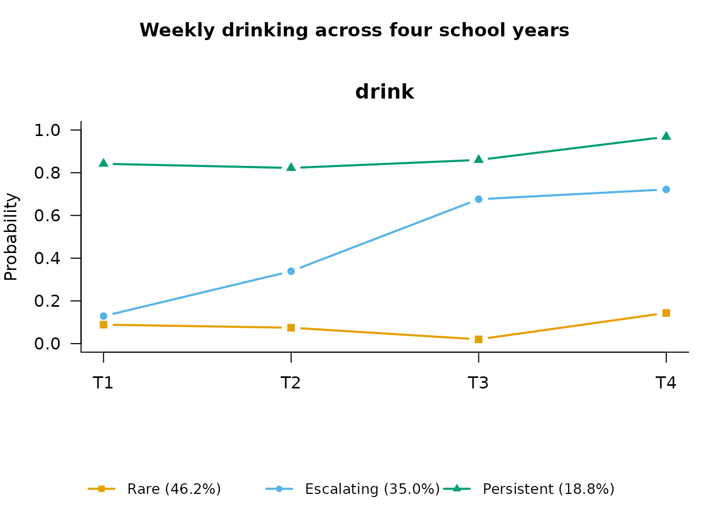

# Repeated-Measures LCA: Patterns of Change Over Time

``` r

library(mixtureEM)
```

Repeated-measures latent class analysis (RMLCA) treats the *whole
trajectory* of a repeated item as the thing to classify: each latent
class is a typical pattern of responses over time, with no growth-curve
shape imposed (Collins & Lanza, 2010, ch. 7). It is the natural first
longitudinal model when you suspect qualitatively different pathways —
say, “persistent”, “declining”, and “rare” — rather than variation
around one common curve.

## Simulated example: weekly drinking across four school years

We simulate a cohort of 900 students reporting weekly alcohol use
(yes/no) in each of four school years, generated from three known
trajectory classes so the model has a truth to recover:

- **Rare** (50%): low probability of use at every wave;
- **Escalating** (30%): probability rising steeply across waves;
- **Persistent** (20%): high probability throughout.

``` r

set.seed(2026)
n   <- 900
cls <- sample(1:3, n, replace = TRUE, prob = c(0.5, 0.3, 0.2))
p   <- rbind(
  c(0.08, 0.10, 0.12, 0.12),   # Rare
  c(0.15, 0.35, 0.60, 0.80),   # Escalating
  c(0.85, 0.85, 0.90, 0.90)    # Persistent
)
drink <- sapply(1:4, function(t) rbinom(n, 1, p[cls, t]))
colnames(drink) <- paste0("drink_y", 1:4)
head(drink)
#>      drink_y1 drink_y2 drink_y3 drink_y4
#> [1,]        0        0        1        1
#> [2,]        0        0        0        1
#> [3,]        0        0        0        0
#> [4,]        0        0        0        0
#> [5,]        0        0        1        1
#> [6,]        0        0        0        0
```

## How many trajectory classes?

[`compare_longitudinal()`](https://pdvalencia.github.io/mixtureEM/reference/compare_longitudinal.md)
fits a range of class counts (an RMLCA is fitted via
[`fit_rmlca()`](https://pdvalencia.github.io/mixtureEM/reference/fit_rmlca.md),
which needs to know how the columns map to occasions — here four waves
of one item) and prints the information criteria side by side:

``` r

selection <- compare_longitudinal(drink, k_range = 2:4, model = "rmlca",
                                  times = 4, n_init = 10)
#> Comparing RMLCA models across K = 2 to 4 ...
#>   Fitting 2-class model...
#>   Fitting 3-class model...
#>   Fitting 4-class model...
#> 
#> === Model Selection Summary ===
#>   Classes    LL Params  AIC  BIC SABIC Entropy Unreplicated
#> 1       2 -2001      9 4021 4064  4035  0.7261        FALSE
#> 2       3 -1981     14 3991 4058  4013  0.6456        FALSE
#> 3       4 -1980     19 3998 4089  4028  0.5864        FALSE
#> 
#> -> Best model according to BIC: 3
```

BIC correctly picks the three classes we generated.

## The three-class solution

``` r

fit <- fit_rmlca(drink, n_classes = 3, times = 4, n_init = 20,
                 random_state = 7)
fit
#> 
#> =========================================================
#>         REPEATED-MEASURES LATENT CLASS MODEL
#> =========================================================
#> Items x Occasions  : 1 x 4
#> Item parameters    : binary, estimated separately at each occasion
#> =========================================================
#>                   LATENT MIXTURE MODEL                   
#> =========================================================
#> Classes Estimated  : 3
#> Estimation Method  : 1-step
#> Converged          : TRUE (in 212 iterations)
#> ---------------------------------------------------------
#>   Log-Likelihood : -1981.32
#>   Parameters     : 14
#>   AIC            : 3990.64
#>   BIC            : 4057.88
#>   SABIC          : 4013.41
#>   Rel. Entropy   : 0.6457
#>   Best solution  : found by 20 of 20 starts
#> ---------------------------------------------------------
#> Class Weights (Sizes):
#>   Class 1: 46.18%
#>   Class 2: 35.03%
#>   Class 3: 18.79%
#> =========================================================
#> Type summary(model) for structural parameters or measurement_summary(model) for item parameters.
```

The item-response probabilities per wave — the trajectories themselves —
come from
[`measurement_summary()`](https://pdvalencia.github.io/mixtureEM/reference/measurement_summary.md),
and [`plot()`](https://rdrr.io/r/graphics/plot.default.html) draws them:

``` r

params <- measurement_summary(fit)
#> =========================================================
#>              MEASUREMENT MODEL PARAMETERS                
#> =========================================================
#> 
#> Categorical Probabilities: T1
#> Indicator            | Overall | Class 1 | Class 2 | Class 3
#> ------------------------------------------------------------ 
#> drink@T1             |   0.244 |   0.089 |   0.129 |   0.842
#> 
#> Categorical Probabilities: T2
#> Indicator            | Overall | Class 1 | Class 2 | Class 3
#> ------------------------------------------------------------ 
#> drink@T2             |   0.308 |   0.074 |   0.339 |   0.823
#> 
#> Categorical Probabilities: T3
#> Indicator            | Overall | Class 1 | Class 2 | Class 3
#> ------------------------------------------------------------ 
#> drink@T3             |   0.408 |   0.020 |   0.676 |   0.860
#> 
#> Categorical Probabilities: T4
#> Indicator            | Overall | Class 1 | Class 2 | Class 3
#> ------------------------------------------------------------ 
#> drink@T4             |   0.501 |   0.144 |   0.722 |   0.968
#> =========================================================
```

``` r

plot(fit, class_labels = c("Rare", "Escalating", "Persistent"),
     main = "Weekly drinking across four school years")
```



The recovered curves match the generating probabilities well: a flat low
class, a steeply rising class, and a flat high class, with sizes close
to the simulated 50/30/20 split.

## Who follows which pathway?

Predictors of trajectory-class membership use the same stepwise workflow
as any other mixtureEM model: hand the fitted model to
[`add_covariates()`](https://pdvalencia.github.io/mixtureEM/reference/add_covariates.md).
We simulate a covariate that genuinely raises the odds of the Escalating
pathway:

``` r

risk <- rnorm(n, mean = ifelse(cls == 2, 0.8, 0))
fit_cov <- add_covariates(fit, risk)
#> Using 'ML' bias correction (set `correction` to override).
results <- summary(fit_cov)
#> =========================================================
#>              STRUCTURAL MODEL SUMMARY                    
#> =========================================================
#> 
#> CATEGORICAL LATENT VARIABLE REGRESSION (CLASS PREDICTORS)
#> Reference Class: 1
#> Standard errors: Bakk-Oberski-Vermunt corrected (robust step 3, hessian step 1)
#> ---------------------------------------------------------
#>                               OR         [95% CI]         P-Value
#> 
#> Class 2 ON
#>   Intercept                0.606  [    0.286,     1.281]     0.190
#>   risk                     1.890  [    1.410,     2.534]    < .001
#> 
#> Class 3 ON
#>   Intercept                0.409  [    0.196,     0.854]     0.017
#>   risk                     0.982  [    0.719,     1.341]     0.907
#> 
#> OMNIBUS TEST PER COVARIATE (effect across all classes)
#> ---------------------------------------------------------
#>                          Wald Chi2   df  P-Value
#>   risk                      21.253    2    < .001
#>   Note: a non-significant test beside large coefficients can be the
#>         Hauck-Donner effect; confirm with wald_omnibus_test().
#> =========================================================
```

The escalating class shows the elevated odds ratio for `risk`, as
simulated; the persistent class does not.

## RMLCA or LTA?

RMLCA classifies whole trajectories; latent *transition* analysis (LTA)
instead models wave-to-wave movement between statuses. If your question
is “what pathways exist?”, RMLCA answers it directly; if it is “who
moves, when, and toward what?”, see the latent transition analysis
vignette
([`vignette("lta", package = "mixtureEM")`](https://pdvalencia.github.io/mixtureEM/articles/lta.md)).

## References

Collins, L. M., & Lanza, S. T. (2010). *Latent class and latent
transition analysis: With applications in the social, behavioral, and
health sciences*. Wiley.

Lanza, S. T., & Collins, L. M. (2006). A mixture model of discontinuous
development in heavy drinking from ages 18 to 30: The role of college
enrollment. *Journal of Studies on Alcohol*, *67*(4), 552–561.
<https://doi.org/10.15288/jsa.2006.67.552>
