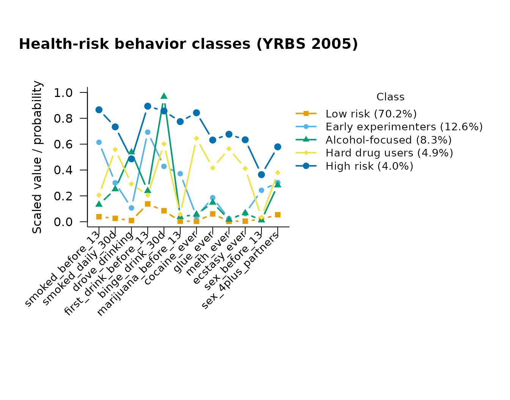

# LCA with Complex Survey Data

``` r

library(mixtureEM)
```

Large public-health and education surveys are almost never simple random
samples: cases carry *sampling weights* (they stand for different
numbers of people), and they arrive in *strata* and *clusters* (schools,
PSUs) whose members resemble each other. Ignoring the weights biases the
estimates; ignoring the design makes the standard errors too small.
mixtureEM handles both through the `weights`, `strata`, and `cluster`
arguments, available in every model.

## The data: 12 health-risk behaviors, YRBS 2005

The bundled `yrbs2005` dataset holds twelve dichotomous risk-behavior
items for 13,917 U.S. high-school students from the CDC’s 2005 Youth
Risk Behavior Survey, together with the survey’s weight, PSU, and
stratum variables
([`?yrbs2005`](https://pdvalencia.github.io/mixtureEM/reference/yrbs2005.md)).
Collins and Lanza (2010, ch. 2 and 4) built their textbook LCA
illustration on these items; we follow their five-class solution.

``` r

data(yrbs2005)
items <- yrbs2005[, 3:14]
names(items)
#>  [1] "smoked_before_13"      "smoked_daily_30d"      "drove_drinking"       
#>  [4] "first_drink_before_13" "binge_drink_30d"       "marijuana_before_13"  
#>  [7] "cocaine_ever"          "glue_ever"             "meth_ever"            
#> [10] "ecstasy_ever"          "sex_before_13"         "sex_4plus_partners"
```

The items contain missing responses; mixtureEM switches affected
indicators to a full-information (FIML) estimator automatically, and a
handful of cases missing on *every* item are dropped with a warning.

## A design-based five-class LCA

``` r

set.seed(1)
fit <- suppressWarnings(
  fit_mixture(items, n_classes = 5, measurement = "binary",
              weights = yrbs2005$weight,
              strata  = yrbs2005$stratum,
              cluster = yrbs2005$psu,
              n_init = 20, max_iter = 2000)
)
fit
#> =========================================================
#>                   LATENT MIXTURE MODEL                   
#> =========================================================
#> Classes Estimated  : 5
#> Estimation Method  : 1-step
#> Converged          : TRUE (in 486 iterations)
#> Cases Removed      : 3 of 13917 with no observed indicator (n = 13914 analysed)
#> Missing Data       : 7284 / 166968 cells (4.4%) in 12 items — FIML (MAR assumption)
#> ---------------------------------------------------------
#>   Log-Likelihood : -47814.65
#>   Parameters     : 64
#>   AIC            : 95757.29
#>   BIC            : 96239.89
#>   SABIC          : 96036.51
#>   Rel. Entropy   : 0.8339
#>   Best solution  : found by 7 of 20 starts
#> ---------------------------------------------------------
#> Class Weights (Sizes):
#>   Class 1: 70.12%
#>   Class 2: 12.67%
#>   Class 3: 8.26%
#>   Class 4: 4.93%
#>   Class 5: 4.02%
#> =========================================================
#> Type summary(model) for structural parameters or measurement_summary(model) for item parameters.
class_sizes(fit)
#>   class proportion n_expected    n_modal
#> 1     1 0.70118277  9756.2571 10136.8160
#> 2     2 0.12671398  1763.0983  1592.7332
#> 3     3 0.08258101  1149.0322   997.4884
#> 4     4 0.04927445   685.6046   639.3167
#> 5     5 0.04024779   560.0078   547.6457
```

The five classes reproduce the familiar YRBS typology — a large low-risk
class, substance-experimentation classes, and a small high-everything
class:

``` r

plot(fit, main = "Health-risk behavior classes (YRBS 2005)")
```



``` r

params <- measurement_summary(fit)
#> =========================================================
#>              MEASUREMENT MODEL PARAMETERS                
#> =========================================================
#> 
#> CATEGORICAL PROBABILITIES
#> Indicator             | Overall | Class 1 | Class 2 | Class 3 | Class 4 | Class 5
#> --------------------------------------------------------------------------------- 
#> smoked_before_13      |   0.160 |   0.039 |   0.615 |   0.130 |   0.207 |   0.871
#> smoked_daily_30d      |   0.134 |   0.026 |   0.302 |   0.251 |   0.561 |   0.737
#> drove_drinking        |   0.099 |   0.009 |   0.109 |   0.533 |   0.295 |   0.493
#> first_drink_before_13 |   0.256 |   0.138 |   0.696 |   0.236 |   0.208 |   0.891
#> binge_drink_30d       |   0.255 |   0.085 |   0.429 |   0.967 |   0.603 |   0.862
#> marijuana_before_13   |   0.087 |   0.005 |   0.370 |   0.037 |   0.060 |   0.781
#> cocaine_ever          |   0.076 |   0.003 |   0.042 |   0.055 |   0.645 |   0.845
#> glue_ever             |   0.124 |   0.060 |   0.186 |   0.147 |   0.417 |   0.636
#> meth_ever             |   0.062 |   0.003 |   0.024 |   0.016 |   0.565 |   0.680
#> ecstasy_ever          |   0.063 |   0.005 |   0.064 |   0.066 |   0.416 |   0.637
#> sex_before_13         |   0.062 |   0.020 |   0.245 |   0.011 |   0.035 |   0.376
#> sex_4plus_partners    |   0.143 |   0.054 |   0.306 |   0.282 |   0.382 |   0.588
#> 
#> Missing data: 7284 of 166968 cells (4.4%) across 12 items, handled via FIML (MAR assumption).
#> =========================================================
```

## Predictors under the survey design

The stored design travels with the fitted model, so the stepwise
covariate analysis is design-based too: the standard errors below are
linearized (sandwich) estimates that respect the strata and clusters.

``` r

fit_cov <- add_covariates(fit, yrbs2005[, c("grade", "sex")])
#> Using 'ML' bias correction (set `correction` to override).
#> 3 case(s) had been removed at fitting time for having no observed indicator; the matching rows of `predictors` were dropped.
results <- summary(fit_cov)
#> =========================================================
#>              STRUCTURAL MODEL SUMMARY                    
#> =========================================================
#> 
#> CATEGORICAL LATENT VARIABLE REGRESSION (CLASS PREDICTORS)
#> Reference Class: 1
#> Standard errors: Bakk-Oberski-Vermunt corrected (survey-linearized step 3, hessian step 1)
#> ---------------------------------------------------------
#>                               OR         [95% CI]         P-Value
#> 
#> Class 2 ON
#>   Intercept                0.180  [    0.146,     0.222]    < .001
#>   grade.10                 0.743  [    0.623,     0.886]    < .001
#>   grade.11                 0.574  [    0.449,     0.735]    < .001
#>   grade.12                 0.475  [    0.361,     0.626]    < .001
#>   sex.Male                 1.795  [    1.508,     2.136]    < .001
#> 
#> Class 3 ON
#>   Intercept                0.005  [    0.000,     0.086]    < .001
#>   grade.10                12.245  [    0.790,   189.862]     0.073
#>   grade.11                29.370  [    1.930,   446.951]     0.015
#>   grade.12                49.680  [    3.066,   804.995]     0.006
#>   sex.Male                 1.309  [    1.060,     1.616]     0.012
#> 
#> Class 4 ON
#>   Intercept                0.042  [    0.026,     0.067]    < .001
#>   grade.10                 1.669  [    0.868,     3.207]     0.124
#>   grade.11                 2.901  [    1.881,     4.475]    < .001
#>   grade.12                 2.730  [    1.752,     4.255]    < .001
#>   sex.Male                 0.709  [    0.563,     0.894]     0.004
#> 
#> Class 5 ON
#>   Intercept                0.041  [    0.030,     0.056]    < .001
#>   grade.10                 0.928  [    0.637,     1.351]     0.696
#>   grade.11                 0.771  [    0.519,     1.145]     0.197
#>   grade.12                 0.912  [    0.651,     1.276]     0.590
#>   sex.Male                 2.124  [    1.640,     2.752]    < .001
#> 
#> OMNIBUS TEST PER COVARIATE (effect across all classes)
#> ---------------------------------------------------------
#>                          Wald Chi2   df  P-Value
#>   grade                    327.962   12    < .001
#>   sex                       70.588    4    < .001
#>   Note: a non-significant test beside large coefficients can be the
#>         Hauck-Donner effect; confirm with wald_omnibus_test().
#> =========================================================
```

Note the `Standard errors:` line naming the estimator: with a cluster
sample, a model that ignored the design would report noticeably narrower
intervals — narrower than the data warrant.

## What the weights do and do not change

Two practical points that trip up survey LCA:

- **Weight scale.** Sampling weights are rescaled internally so that
  they sum to the number of observed cases; only their *relative* sizes
  matter, and the effective sample size in BIC stays the number of cases
  actually collected. Frequency weights (`weight_type = "frequency"`,
  where one row stands for that many identical cases) are used as-is.
- **Class enumeration.** Information criteria remain comparable across
  class counts under a fixed design, so
  [`compare_mixtures()`](https://pdvalencia.github.io/mixtureEM/reference/compare_mixtures.md)
  works unchanged — pass the same `weights`/`strata`/`cluster` to every
  candidate model.

## References

Collins, L. M., & Lanza, S. T. (2010). *Latent class and latent
transition analysis: With applications in the social, behavioral, and
health sciences*. Wiley.
