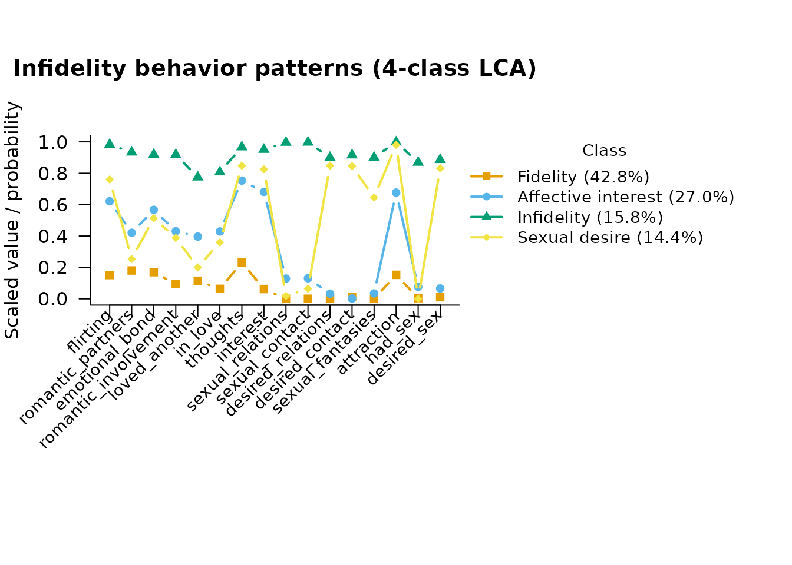

# Infidelity Behavior Patterns: LCA with Covariates and a Distal Outcome

``` r

library(mixtureEM)
```

## Background

This vignette walks through Ventura-León et al. (2025), *“Exploring
Infidelity Behavior Patterns in a Sample of Peruvian Young Adults: A
Latent Class Analysis,”* using the `ventura_leon` dataset bundled with
mixtureEM
([`?ventura_leon`](https://pdvalencia.github.io/mixtureEM/reference/ventura_leon.md)).

Four hundred Peruvian young adults (75.3% women, mean age 25.3) answered
16 binary items from the Multidimensional Infidelity Inventory-S
(MII-S), each asking whether they had engaged in a particular unfaithful
thought or behavior. The original study used latent class analysis (LCA)
to identify subgroups with distinct patterns, then related class
membership to sex, age, sexual orientation, and relationship duration.

We reproduce the class solution first, then improve on the original
covariate analysis: the paper assigned each respondent to their single
most likely class and ran chi-square/ANOVA tests on those labels, which
ignores classification uncertainty. mixtureEM’s
[`add_covariates()`](https://pdvalencia.github.io/mixtureEM/reference/add_covariates.md)
instead uses a bias-corrected multinomial logistic regression (Vermunt,
2010) that properly accounts for it.

See
[`?ventura_leon`](https://pdvalencia.github.io/mixtureEM/reference/ventura_leon.md)
for the full source and license note.

## The data

``` r

data(ventura_leon)
items <- ventura_leon[, 7:22]   # the 16 infidelity items
names(items)
#>  [1] "flirting"             "romantic_partners"    "emotional_bond"      
#>  [4] "romantic_involvement" "loved_another"        "in_love"             
#>  [7] "thoughts"             "interest"             "sexual_relations"    
#> [10] "sexual_contact"       "desired_relations"    "desired_contact"     
#> [13] "sexual_fantasies"     "attraction"           "had_sex"             
#> [16] "desired_sex"
```

The 16 items are already binary (0 = never endorsed, 1 = endorsed), with
short informative names; see
[`?ventura_leon`](https://pdvalencia.github.io/mixtureEM/reference/ventura_leon.md)
for each item’s exact wording.

## How many classes?

The paper compared 1- through 10-class solutions by BIC (their Table 2)
and selected 4 classes. We do the same here.

``` r

selection <- compare_mixtures(X = items, measurement = "binary",
                               k_range = 1:6, n_init = 20)
#> Running Model Selection across K = 1 to 6...
#> 
#> Fitting 1-class model...
#> Fitting 2-class model...
#> Fitting 3-class model...
#> Fitting 4-class model...
#> Fitting 5-class model...
#> Fitting 6-class model...
#> 
#> === Model Selection Summary ===
#>   Classes        LL Params      AIC      BIC    SABIC Entropy
#> 1       1 -3905.807     16 7843.615 7907.478 7856.709   1.000
#> 2       2 -2900.078     33 5866.157 5997.875 5893.164   0.948
#> 3       3 -2654.568     50 5409.136 5608.710 5450.056   0.934
#> 4       4 -2531.130     67 5196.260 5463.688 5251.093   0.905
#> 5       5 -2474.482     84 5116.963 5452.246 5185.709   0.928
#> 6       6 -2423.385    101 5048.771 5451.909 5131.429   0.925
#> 
#> -> Best model according to BIC: 6 classes
```

BIC keeps improving for a few classes past 4 (a common pattern in LCA,
where the BIC curve is often quite flat near its minimum); we follow the
paper in choosing 4 classes for interpretability, since it recovers a
very clean, well-separated typology (see below).

## Fitting the 4-class model

``` r

set.seed(1)
fit <- fit_mixture(items, n_classes = 4, measurement = "binary",
                    n_init = 30, max_iter = 2000)
fit
#> =========================================================
#>                   LATENT MIXTURE MODEL                   
#> =========================================================
#> Classes Estimated  : 4
#> Estimation Method  : 1-step
#> Converged          : TRUE (in 84 iterations)
#> ---------------------------------------------------------
#>   Log-Likelihood : -2531.13
#>   Rel. Entropy   : 0.9046
#>   Best solution  : found by 7 of 30 starts
#> ---------------------------------------------------------
#> Class Weights (Sizes):
#>   Class 1: 43.43%
#>   Class 2: 27.46%
#>   Class 3: 15.79%
#>   Class 4: 13.32%
#> =========================================================
#> Type summary(model) for structural parameters or measurement_summary(model) for item parameters.
```

### Comparing to the published solution

The paper’s four classes were: *Fidelity* (42.5%, low on everything),
*Affective interest* (27.2%, moderate on thought/attraction items),
*Infidelity* (15.7%, high on nearly every item), and *Sexual desire*
(14.4%, high on desire/attraction items but not overt behavior). Classes
are sorted by size, so
[`class_sizes()`](https://pdvalencia.github.io/mixtureEM/reference/class_sizes.md)
lines up with that ordering:

``` r

class_names <- c("Fidelity", "Affective interest", "Infidelity", "Sexual desire")
class_sizes(fit)
#>   class proportion n_expected n_modal
#> 1     1  0.4342541  173.70163     176
#> 2     2  0.2746087  109.84347     108
#> 3     3  0.1579380   63.17520      63
#> 4     4  0.1331992   53.27969      53
```

The item-response probabilities per class come from
[`measurement_summary()`](https://pdvalencia.github.io/mixtureEM/reference/measurement_summary.md),
which prints the full table and also returns it as a data frame for
further use:

``` r

params <- measurement_summary(fit)
#> =========================================================
#>              MEASUREMENT MODEL PARAMETERS                
#> =========================================================
#> 
#> CATEGORICAL PROBABILITIES
#> Indicator            | Class 1 | Class 2 | Class 3 | Class 4
#> ------------------------------------------------------------ 
#> flirting             |   0.154 |   0.638 |   0.982 |   0.754
#> romantic_partners    |   0.183 |   0.418 |   0.934 |   0.250
#> emotional_bond       |   0.172 |   0.582 |   0.920 |   0.491
#> romantic_involvement |   0.097 |   0.437 |   0.918 |   0.379
#> loved_another        |   0.118 |   0.386 |   0.775 |   0.208
#> in_love              |   0.066 |   0.432 |   0.807 |   0.356
#> thoughts             |   0.236 |   0.765 |   0.967 |   0.843
#> interest             |   0.070 |   0.674 |   0.951 |   0.858
#> sexual_relations     |   0.000 |   0.136 |   0.996 |   0.002
#> sexual_contact       |   0.000 |   0.133 |   0.997 |   0.064
#> desired_relations    |   0.003 |   0.043 |   0.901 |   0.897
#> desired_contact      |   0.012 |   0.029 |   0.916 |   0.862
#> sexual_fantasies     |   0.000 |   0.056 |   0.901 |   0.653
#> attraction           |   0.155 |   0.693 |   0.998 |   0.993
#> had_sex              |   0.004 |   0.076 |   0.869 |   0.001
#> desired_sex          |   0.010 |   0.076 |   0.887 |   0.879
#> 
#> At the boundary: sexual_relations in class 1; sexual_contact in class 1; sexual_fantasies in class 1; had_sex in class 4. These probabilities have run to 0 or 1, so the class is defined partly by an item every case in it gives the same answer to, and their standard errors are not interpretable.
#> =========================================================
```

Because the returned table is an ordinary data frame, follow-up
questions take one line — for example, which behaviors the third-largest
class endorses with high probability:

``` r

subset(params, class == 3 & estimate > 0.5)
#>    block   parameter                 item category class  estimate
#> 3   <NA> probability             flirting       NA     3 0.9822261
#> 7   <NA> probability    romantic_partners       NA     3 0.9339329
#> 11  <NA> probability       emotional_bond       NA     3 0.9199585
#> 15  <NA> probability romantic_involvement       NA     3 0.9180926
#> 19  <NA> probability        loved_another       NA     3 0.7750929
#> 23  <NA> probability              in_love       NA     3 0.8074870
#> 27  <NA> probability             thoughts       NA     3 0.9674325
#> 31  <NA> probability             interest       NA     3 0.9509822
#> 35  <NA> probability     sexual_relations       NA     3 0.9959057
#> 39  <NA> probability       sexual_contact       NA     3 0.9968190
#> 43  <NA> probability    desired_relations       NA     3 0.9011429
#> 47  <NA> probability      desired_contact       NA     3 0.9158309
#> 51  <NA> probability     sexual_fantasies       NA     3 0.9012937
#> 55  <NA> probability           attraction       NA     3 0.9982136
#> 59  <NA> probability              had_sex       NA     3 0.8685940
#> 63  <NA> probability          desired_sex       NA     3 0.8865954
```

``` r

plot(fit, class_labels = class_names,
     main = "Infidelity behavior patterns (4-class LCA)")
```



## Covariates: a stronger analysis than the original paper

The paper related class membership to sex, age, sexual orientation, and
relationship duration by assigning each respondent to their single most
likely class (the modal posterior) and then testing associations with
separate chi-square tests and an ANOVA — a “classify-and-analyze”
approach that treats class membership as if it were observed without
error, which biases the association estimates toward the null (Bakk et
al., 2014).

Instead, we hand the chosen model to
[`add_covariates()`](https://pdvalencia.github.io/mixtureEM/reference/add_covariates.md),
which runs the bias-adjusted three-step analysis (Vermunt, 2010) on the
*same* solution we just inspected — the measurement model is not
re-estimated, so the classes cannot shift under our feet:

``` r

covariates <- ventura_leon[, c("sex", "age", "sexual_orientation",
                                "relationship_duration")]
fit_cov <- add_covariates(fit, covariates)
#> Using 'ML' bias correction (set `correction` to override).
results <- summary(fit_cov)
#> =========================================================
#>              STRUCTURAL MODEL SUMMARY                    
#> =========================================================
#> 
#> CATEGORICAL LATENT VARIABLE REGRESSION (CLASS PREDICTORS)
#> Reference Class: 1
#> Standard errors: Bakk-Oberski-Vermunt corrected (robust step 3, hessian step 1)
#> ---------------------------------------------------------
#>                                       OR         [95% CI]         P-Value
#> 
#> Class 2 ON
#>   Intercept                        1.671  [    0.271,    10.317]     0.580
#>   sex.Female                       2.667  [    1.074,     6.621]     0.035
#>   age                              0.927  [    0.861,     0.999]     0.047
#>   sexual_orientation.Nothtrsxl     0.943  [    0.390,     2.280]     0.896
#>   relationship_duration.Long       1.059  [    0.488,     2.297]     0.885
#> 
#> Class 3 ON
#>   Intercept                        0.230  [    0.070,     0.751]     0.015
#>   sex.Female                       0.323  [    0.172,     0.607]    < .001
#>   age                              1.049  [    1.005,     1.095]     0.029
#>   sexual_orientation.Nothtrsxl     1.490  [    0.596,     3.725]     0.394
#>   relationship_duration.Long       0.599  [    0.250,     1.437]     0.251
#> 
#> Class 4 ON
#>   Intercept                        0.145  [    0.042,     0.505]     0.002
#>   sex.Female                       0.588  [    0.289,     1.196]     0.143
#>   age                              1.036  [    0.993,     1.080]     0.098
#>   sexual_orientation.Nothtrsxl     2.749  [    1.159,     6.520]     0.022
#>   relationship_duration.Long       1.194  [    0.546,     2.612]     0.657
#>   Abbreviated names:
#>     sexual_orientation.Nothtrsxl = sexual_orientation.Not heterosexual
#> 
#> OMNIBUS TEST PER COVARIATE (effect across all classes)
#> ---------------------------------------------------------
#>                           Wald Chi2   df  P-Value
#>   sex                        22.982    3    < .001
#>   age                        11.957    3     0.008
#>   sexual_orientation          6.443    3     0.092
#>   relationship_duration       1.990    3     0.575
#>   Note: a non-significant test beside large coefficients can be the
#>         Hauck-Donner effect; confirm with wald_omnibus_test().
#> =========================================================
```

The `Standard errors:` line records which variance estimator produced
the intervals. The default also carries the uncertainty in the step-1
class solution into the step-3 coefficients (Bakk et al., 2014):
treating the classes as if they had been observed rather than estimated
makes the intervals too narrow. See
[`?covariate_se`](https://pdvalencia.github.io/mixtureEM/reference/covariate_se.md).

[`summary()`](https://rdrr.io/r/base/summary.html) also returns its
tables invisibly, so the odds ratios are available as a data frame:

``` r

head(results$coefficients)
#>   class                                term    estimate         se          z
#> 1     2                           Intercept  0.51342828 0.92875356  0.5528143
#> 2     2                          sex.Female  0.98086743 0.46399330  2.1139689
#> 3     2                                 age -0.07548275 0.03801384 -1.9856646
#> 4     2 sexual_orientation.Not heterosexual -0.05872296 0.45037290 -0.1303874
#> 5     2          relationship_duration.Long  0.05729248 0.39509491  0.1450094
#> 6     3                           Intercept -1.47022394 0.60411635 -2.4336768
#>            p        OR   OR_lower   OR_upper
#> 1 0.58039056 1.6710101 0.27065003 10.3169199
#> 2 0.03451792 2.6667685 1.07405430  6.6213171
#> 3 0.04707057 0.9272957 0.86071668  0.9990249
#> 4 0.89625992 0.9429680 0.39006033  2.2796181
#> 5 0.88470345 1.0589655 0.48816903  2.2971713
#> 6 0.01494633 0.2298740 0.07034863  0.7511455
```

Reference class 1 is Fidelity (the largest class). Reading the odds
ratios against that reference:

- **Sex.** Women have higher odds of Affective interest relative to
  Fidelity, and much lower odds of Infidelity relative to Fidelity — in
  line with the paper’s finding that “men were more likely to belong to
  the sexual desire class and women to the emotional interest and
  fidelity classes.”
- **Age.** Older respondents have higher odds of Infidelity relative to
  Fidelity, matching the paper’s finding that age was significantly
  related to class membership.
- **Sexual orientation.** One row looks like a discovery the paper’s
  classify-and-analyze approach missed: non-heterosexual respondents
  have higher odds of Sexual desire relative to Fidelity (OR = 2.75, p =
  .022). But the omnibus test for sexual orientation — the one built to
  ask whether the covariate distinguishes *any* pair of classes at all —
  is not significant here either (Wald chi-square = 6.44, df = 3, p =
  .092), matching the paper’s own null result. With three pairwise
  contrasts tested, a single row below .05 is not strong evidence on its
  own; read the omnibus row first, and treat an isolated significant
  contrast beside a non-significant omnibus test as a hypothesis worth a
  better-powered look, not a confirmed finding.
- **Relationship duration.** Neither approach finds a significant
  association, consistent with the paper.

This is a good illustration of why mixtureEM applies a bias correction
whenever classes are related to external variables: the “obvious”
approach of classifying and then testing is only valid when
classification is (almost) perfect, which is rarely true in practice.

## A distal outcome: mean age by class

Covariates ask “who ends up in which class?”. The complementary question
— “how do the classes differ on some outcome?” — is a *distal outcome*
analysis, and it reuses the same fitted model through
[`add_outcome()`](https://pdvalencia.github.io/mixtureEM/reference/add_outcome.md).
Here we describe the classes by their mean age (the BCH correction is
the default for a continuous outcome; Bakk & Vermunt, 2016). Age already
entered the model as a covariate above, so treating it as a distal
outcome too does not answer a substantively new question — we reuse it
purely because it is a continuous variable already at hand, to keep the
example self-contained; a real distal-outcome analysis would pick a
variable the classes are actually expected to predict.

``` r

fit_age <- add_outcome(fit, ventura_leon$age)
#> Outcome treated as continuous (set `outcome_type` to override).
#> Using 'BCH' bias correction (set `correction` to override).
age_results <- summary(fit_age)
#> =========================================================
#>              STRUCTURAL MODEL SUMMARY                    
#> =========================================================
#> 
#> CONTINUOUS DISTAL OUTCOME (MEANS)
#> ---------------------------------------------------------
#> 
#> Omnibus test (class differences): Wald chi^2(3) = 17.84, p  < .001
#> 
#>                  Mean       [95% CI]        SE
#>   Class 1       25.235  [24.181, 26.289]     0.538
#>   Class 2       23.142  [22.007, 24.276]     0.579
#>   Class 3       27.554  [25.329, 29.780]     1.135
#>   Class 4       27.148  [24.897, 29.398]     1.148
#> =========================================================
age_results$outcome$means
#>   class     mean        se    lower    upper
#> 1     1 25.23505 0.5377852 24.18099 26.28911
#> 2     2 23.14177 0.5788384 22.00725 24.27630
#> 3     3 27.55414 1.1354995 25.32856 29.77972
#> 4     4 27.14763 1.1481233 24.89731 29.39795
```

The omnibus Wald test in the printed output asks whether the class means
differ at all, before the per-class table is read.

## References

Bakk, Z., Oberski, D. L., & Vermunt, J. K. (2014). Relating latent class
assignments to external variables: Standard errors for correct
inference. *Political Analysis*, *22*(4), 520–540.
<https://doi.org/10.1093/pan/mpu003>

Bakk, Z., & Vermunt, J. K. (2016). Robustness of stepwise latent class
modeling with continuous distal outcomes. *Structural Equation
Modeling*, *23*(1), 20–31.
<https://doi.org/10.1080/10705511.2014.955104>

Ventura-León, J., Reyes, A., Valencia, P. D., Tocto-Muñoz, S.,
Gamboa-Melgar, G., Ruiz-Castro, J., & Lino-Cruz, C. (2025). Exploring
infidelity behavior patterns in a sample of Peruvian young adults: A
latent class analysis. *Journal of Marital and Family Therapy*, *51*,
e70066. <https://doi.org/10.1111/jmft.70066>

Vermunt, J. K. (2010). Latent class modeling with covariates: Two
improved three-step approaches. *Political Analysis*, *18*(4), 450–469.
<https://doi.org/10.1093/pan/mpq025>
