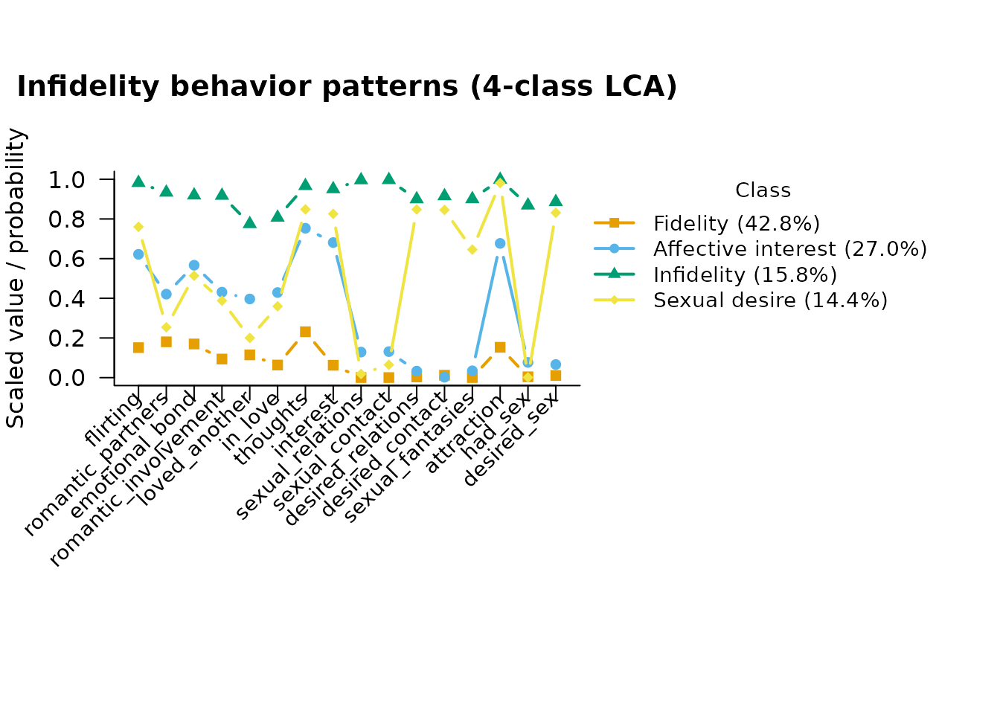

# Infidelity Behavior Patterns: LCA with Covariates

``` r

library(mixtureEM)
```

## Background

This vignette walks through Ventura-León et al. (2025), *“Exploring
Infidelity Behavior Patterns in a Sample of Peruvian Young Adults: A
Latent Class Analysis,”* using the `ventura_leon` dataset bundled with
mixtureEM
([`?ventura_leon`](https://pdvalencia.github.io/mixtureEM/reference/ventura_leon.md)).

Four hundred Peruvian young adults (75.3% women, mean age 25.3) answered
16 binary items from the Multidimensional Infidelity Inventory-S
(MII-S), each asking whether they had engaged in a particular unfaithful
thought or behavior. The original study used latent class analysis (LCA)
to identify subgroups with distinct patterns, then related class
membership to sex, age, sexual orientation, and relationship duration.

We reproduce the class solution first, then improve on the original
covariate analysis: the paper assigned each respondent to their single
most likely class and ran chi-square/ANOVA tests on those labels, which
ignores classification uncertainty. mixtureEM’s
[`add_covariates()`](https://pdvalencia.github.io/mixtureEM/reference/add_covariates.md)
instead uses a bias-corrected multinomial logistic regression (Vermunt,
2010) that properly accounts for it.

See
[`?ventura_leon`](https://pdvalencia.github.io/mixtureEM/reference/ventura_leon.md)
for the full source and license note.

## The data

``` r

data(ventura_leon)
items <- ventura_leon[, 7:22]   # the 16 infidelity items
names(items)
#>  [1] "flirting"             "romantic_partners"    "emotional_bond"      
#>  [4] "romantic_involvement" "loved_another"        "in_love"             
#>  [7] "thoughts"             "interest"             "sexual_relations"    
#> [10] "sexual_contact"       "desired_relations"    "desired_contact"     
#> [13] "sexual_fantasies"     "attraction"           "had_sex"             
#> [16] "desired_sex"
```

The 16 items are already binary (0 = never endorsed, 1 = endorsed), with
short informative names; see
[`?ventura_leon`](https://pdvalencia.github.io/mixtureEM/reference/ventura_leon.md)
for each item’s exact wording.

## How many classes?

The paper compared 1- through 10-class solutions by BIC (their Table 2)
and selected 4 classes. We do the same here.

``` r

selection <- compare_mixtures(X = items, measurement = "binary",
                               k_range = 1:6, n_init = 20)
#> Running Model Selection across K = 1 to 6...
#> 
#> Fitting 1-class model...
#> Fitting 2-class model...
#> Fitting 3-class model...
#> Fitting 4-class model...
#> Fitting 5-class model...
#> Fitting 6-class model...
#> 
#> === Model Selection Summary ===
#>   Classes        LL Params      AIC      BIC     CAIC      AWE     AIC3
#> 1       1 -3905.807     16 7843.615 7907.478 7923.478 8051.342 7859.615
#> 2       2 -2900.078     33 5866.156 5997.875 6030.875 6294.593 5899.156
#> 3       3 -2654.569     50 5409.138 5608.711 5658.711 6058.284 5459.138
#> 4       4 -2531.141     67 5196.282 5463.710 5530.710 6066.138 5263.282
#> 5       5 -2474.484     84 5116.968 5452.251 5536.251 6207.534 5200.968
#> 6       6 -2423.384    101 5048.769 5451.907 5552.907 6360.045 5149.769
#>        ICL    SABIC Entropy Unreplicated    BF   cmP
#> 1 7907.478 7856.709   1.000        FALSE 0.000 0.000
#> 2 6026.726 5893.163   0.948        FALSE 0.000 0.000
#> 3 5667.049 5450.057   0.934        FALSE 0.000 0.000
#> 4 5567.019 5251.115   0.907        FALSE 0.003 0.001
#> 5 5545.487 5185.713   0.928        FALSE 0.842 0.456
#> 6 5559.594 5131.427   0.925        FALSE    NA 0.542
#> 
#> -> Best model according to BIC: 6 classes
```

BIC keeps improving for a few classes past 4 (a common pattern in LCA,
where the BIC curve is often quite flat near its minimum); we follow the
paper in choosing 4 classes for interpretability, since it recovers a
very clean, well-separated typology (see below).

## Fitting the 4-class model

``` r

set.seed(1)
fit <- fit_mixture(items, n_classes = 4, measurement = "binary",
                    n_init = 30, max_iter = 2000)
fit
#> =========================================================
#>                   LATENT MIXTURE MODEL                   
#> =========================================================
#> Classes Estimated  : 4
#> Estimation Method  : 1-step
#> Converged          : TRUE (in 50 iterations)
#> ---------------------------------------------------------
#>   Log-Likelihood : -2531.14
#>   Parameters     : 67
#>   AIC            : 5196.28
#>   BIC            : 5463.71
#>   SABIC          : 5251.11
#>   Rel. Entropy   : 0.9068
#>   Best solution  : found by 26 of 30 starts
#> ---------------------------------------------------------
#> Class Weights (Sizes):
#>   Class 1: 42.77%
#>   Class 2: 26.98%
#>   Class 3: 15.81%
#>   Class 4: 14.43%
#> =========================================================
#> Type summary(model) for structural parameters or measurement_summary(model) for item parameters.
```

### Comparing to the published solution

The paper’s four classes were: *Fidelity* (42.5%, low on everything),
*Affective interest* (27.2%, moderate on thought/attraction items),
*Infidelity* (15.7%, high on nearly every item), and *Sexual desire*
(14.4%, high on desire/attraction items but not overt behavior). Classes
are sorted by size, so
[`class_sizes()`](https://pdvalencia.github.io/mixtureEM/reference/class_sizes.md)
lines up with that ordering:

``` r

class_names <- c("Fidelity", "Affective interest", "Infidelity", "Sexual desire")
class_sizes(fit)
#>   class proportion n_expected n_modal
#> 1     1  0.4277194  171.08777     173
#> 2     2  0.2698367  107.93470     106
#> 3     3  0.1581287   63.25147      63
#> 4     4  0.1443152   57.72607      58
```

The item-response probabilities per class come from
[`measurement_summary()`](https://pdvalencia.github.io/mixtureEM/reference/measurement_summary.md),
which prints the full table and also returns it as a data frame for
further use:

``` r

params <- measurement_summary(fit)
#> =========================================================
#>              MEASUREMENT MODEL PARAMETERS                
#> =========================================================
#> 
#> CATEGORICAL PROBABILITIES
#> Indicator            | Overall | Class 1 | Class 2 | Class 3 | Class 4
#> ---------------------------------------------------------------------- 
#> flirting             |   0.497 |   0.151 |   0.622 |   0.982 |   0.760
#> romantic_partners    |   0.375 |   0.180 |   0.421 |   0.934 |   0.254
#> emotional_bond       |   0.445 |   0.170 |   0.567 |   0.919 |   0.514
#> romantic_involvement |   0.357 |   0.094 |   0.431 |   0.918 |   0.388
#> loved_another        |   0.307 |   0.115 |   0.397 |   0.775 |   0.200
#> in_love              |   0.323 |   0.064 |   0.429 |   0.807 |   0.360
#> thoughts             |   0.578 |   0.231 |   0.753 |   0.967 |   0.848
#> interest             |   0.480 |   0.062 |   0.681 |   0.951 |   0.826
#> sexual_relations     |   0.195 |   0.000 |   0.129 |   0.996 |   0.018
#> sexual_contact       |   0.203 |   0.000 |   0.131 |   0.997 |   0.065
#> desired_relations    |   0.275 |   0.003 |   0.033 |   0.900 |   0.848
#> desired_contact      |   0.273 |   0.012 |   0.002 |   0.915 |   0.846
#> sexual_fantasies     |   0.245 |   0.000 |   0.034 |   0.900 |   0.646
#> attraction           |   0.547 |   0.153 |   0.677 |   0.998 |   0.981
#> had_sex              |   0.160 |   0.004 |   0.077 |   0.869 |   0.001
#> desired_sex          |   0.282 |   0.011 |   0.066 |   0.886 |   0.832
#> 
#> At the boundary: sexual_relations in class 1; sexual_contact in class 1; sexual_fantasies in class 1; had_sex in class 4. These probabilities have run to 0 or 1, so the class is defined partly by an item every case in it gives the same answer to, and their standard errors are not interpretable. There are two ways on: read it substantively, since an item every member of a class answers identically is often the finding rather than a fault; or, if that parameter needs a standard error, refit with a stronger prior than the default of 1 - `bayes_constants = list(categorical = 2)` - which holds the estimate off the edge at the cost of shrinking it slightly toward the item's marginal.
#> =========================================================
```

Because the returned table is an ordinary data frame, follow-up
questions take one line — for example, which behaviors the third-largest
class endorses with high probability:

``` r

subset(params, class == 3 & estimate > 0.5)
#>    block   parameter                 item category class  estimate overall
#> 3   <NA> probability             flirting       NA     3 0.9822482  0.4975
#> 7   <NA> probability    romantic_partners       NA     3 0.9336074  0.3750
#> 11  <NA> probability       emotional_bond       NA     3 0.9192670  0.4450
#> 15  <NA> probability romantic_involvement       NA     3 0.9177819  0.3575
#> 19  <NA> probability        loved_another       NA     3 0.7748600  0.3075
#> 23  <NA> probability              in_love       NA     3 0.8072820  0.3225
#> 27  <NA> probability             thoughts       NA     3 0.9668415  0.5775
#> 31  <NA> probability             interest       NA     3 0.9508159  0.4800
#> 35  <NA> probability     sexual_relations       NA     3 0.9958929  0.1950
#> 39  <NA> probability       sexual_contact       NA     3 0.9968210  0.2025
#> 43  <NA> probability    desired_relations       NA     3 0.9000180  0.2750
#> 47  <NA> probability      desired_contact       NA     3 0.9154729  0.2725
#> 51  <NA> probability     sexual_fantasies       NA     3 0.9004369  0.2450
#> 55  <NA> probability           attraction       NA     3 0.9982158  0.5475
#> 59  <NA> probability              had_sex       NA     3 0.8686610  0.1600
#> 63  <NA> probability          desired_sex       NA     3 0.8859579  0.2825
```

``` r

plot(fit, class_labels = class_names,
     main = "Infidelity behavior patterns (4-class LCA)")
```



## Covariates: a stronger analysis than the original paper

The paper related class membership to sex, age, sexual orientation, and
relationship duration by assigning each respondent to their single most
likely class (the modal posterior) and then testing associations with
separate chi-square tests and an ANOVA — a “classify-and-analyze”
approach that treats class membership as if it were observed without
error, which biases the association estimates toward the null (Bakk et
al., 2014).

Instead, we hand the chosen model to
[`add_covariates()`](https://pdvalencia.github.io/mixtureEM/reference/add_covariates.md),
which runs the bias-adjusted three-step analysis (Vermunt, 2010) on the
*same* solution we just inspected — the measurement model is not
re-estimated, so the classes cannot shift under our feet:

``` r

covariates <- ventura_leon[, c("sex", "age", "sexual_orientation",
                                "relationship_duration")]
fit_cov <- add_covariates(fit, covariates)
#> Using 'ML' bias correction (set `correction` to override).
results <- summary(fit_cov)
#> =========================================================
#>              STRUCTURAL MODEL SUMMARY                    
#> =========================================================
#> 
#> CATEGORICAL LATENT VARIABLE REGRESSION (CLASS PREDICTORS)
#> Reference Class: 1
#> Standard errors: Bakk-Oberski-Vermunt corrected (robust step 3, hessian step 1)
#> ---------------------------------------------------------
#>                                       OR         [95% CI]         P-Value
#> 
#> Class 2 ON
#>   Intercept                        1.395  [    0.241,     8.080]     0.710
#>   sex.Female                       2.752  [    1.120,     6.765]     0.027
#>   age                              0.933  [    0.868,     1.004]     0.062
#>   sexual_orientation.Nothtrsxl     0.892  [    0.362,     2.198]     0.804
#>   relationship_duration.Long       1.143  [    0.531,     2.459]     0.733
#> 
#> Class 3 ON
#>   Intercept                        0.239  [    0.073,     0.783]     0.018
#>   sex.Female                       0.329  [    0.175,     0.619]    < .001
#>   age                              1.048  [    1.004,     1.094]     0.034
#>   sexual_orientation.Nothtrsxl     1.469  [    0.589,     3.667]     0.410
#>   relationship_duration.Long       0.606  [    0.252,     1.460]     0.265
#> 
#> Class 4 ON
#>   Intercept                        0.184  [    0.056,     0.604]     0.005
#>   sex.Female                       0.630  [    0.317,     1.253]     0.188
#>   age                              1.030  [    0.988,     1.073]     0.163
#>   sexual_orientation.Nothtrsxl     2.669  [    1.162,     6.128]     0.021
#>   relationship_duration.Long       1.133  [    0.535,     2.399]     0.744
#>   Abbreviated names:
#>     sexual_orientation.Nothtrsxl = sexual_orientation.Not heterosexual
#> 
#> OMNIBUS TEST PER COVARIATE (effect across all classes)
#> ---------------------------------------------------------
#>                           Wald Chi2   df  P-Value
#>   sex                        23.157    3    < .001
#>   age                        10.872    3     0.012
#>   sexual_orientation          6.879    3     0.076
#>   relationship_duration       1.868    3     0.600
#>   Note: a non-significant test beside large coefficients can be the
#>         Hauck-Donner effect; confirm with wald_omnibus_test().
#> =========================================================
```

The `Standard errors:` line records which variance estimator produced
the intervals. The default also carries the uncertainty in the step-1
class solution into the step-3 coefficients (Bakk et al., 2014):
treating the classes as if they had been observed rather than estimated
makes the intervals too narrow. See
[`?covariate_se`](https://pdvalencia.github.io/mixtureEM/reference/covariate_se.md).

[`summary()`](https://rdrr.io/r/base/summary.html) also returns its
tables invisibly, so the odds ratios are available as a data frame:

``` r

head(results$coefficients)
#>   class                                term    estimate         se          z
#> 1     2                           Intercept  0.33306822 0.89607400  0.3716972
#> 2     2                          sex.Female  1.01245511 0.45885688  2.2064726
#> 3     2                                 age -0.06925868 0.03712243 -1.8656825
#> 4     2 sexual_orientation.Not heterosexual -0.11387298 0.45981302 -0.2476506
#> 5     2          relationship_duration.Long  0.13355860 0.39093526  0.3416387
#> 6     3                           Intercept -1.42969938 0.60473223 -2.3641859
#>            p        OR   OR_lower  OR_upper
#> 1 0.71011829 1.3952425 0.24093290 8.0798496
#> 2 0.02735093 2.7523501 1.11973900 6.7653541
#> 3 0.06208580 0.9330853 0.86760508 1.0035074
#> 4 0.80440474 0.8923713 0.36236384 2.1975883
#> 5 0.73262284 1.1428882 0.53116928 2.4590909
#> 6 0.01806975 0.2393809 0.07316965 0.7831553
```

Reference class 1 is Fidelity (the largest class). Reading the odds
ratios against that reference:

- **Sex.** Women have higher odds of Affective interest relative to
  Fidelity, and much lower odds of Infidelity relative to Fidelity — in
  line with the paper’s finding that “men were more likely to belong to
  the sexual desire class and women to the emotional interest and
  fidelity classes.”
- **Age.** Older respondents have higher odds of Infidelity relative to
  Fidelity, matching the paper’s finding that age was significantly
  related to class membership.
- **Sexual orientation.** One row looks like a discovery the paper’s
  classify-and-analyze approach missed: non-heterosexual respondents
  have higher odds of Sexual desire relative to Fidelity (OR = 2.74, p =
  .022). But the omnibus test for sexual orientation — the one built to
  ask whether the covariate distinguishes *any* pair of classes at all —
  is not significant here either (Wald chi-square = 6.40, df = 3, p =
  .094), matching the paper’s own null result. With three pairwise
  contrasts tested, a single row below .05 is not strong evidence on its
  own; read the omnibus row first, and treat an isolated significant
  contrast beside a non-significant omnibus test as a hypothesis worth a
  better-powered look, not a confirmed finding.
- **Relationship duration.** Neither approach finds a significant
  association, consistent with the paper.

This is a good illustration of why mixtureEM applies a bias correction
whenever classes are related to external variables: the “obvious”
approach of classifying and then testing is only valid when
classification is (almost) perfect, which is rarely true in practice.

## References

Bakk, Z., Oberski, D. L., & Vermunt, J. K. (2014). Relating latent class
assignments to external variables: Standard errors for correct
inference. *Political Analysis*, *22*(4), 520–540.
<https://doi.org/10.1093/pan/mpu003>

Ventura-León, J., Reyes, A., Valencia, P. D., Tocto-Muñoz, S.,
Gamboa-Melgar, G., Ruiz-Castro, J., & Lino-Cruz, C. (2025). Exploring
infidelity behavior patterns in a sample of Peruvian young adults: A
latent class analysis. *Journal of Marital and Family Therapy*, *51*,
e70066. <https://doi.org/10.1111/jmft.70066>

Vermunt, J. K. (2010). Latent class modeling with covariates: Two
improved three-step approaches. *Political Analysis*, *18*(4), 450–469.
<https://doi.org/10.1093/pan/mpq025>
